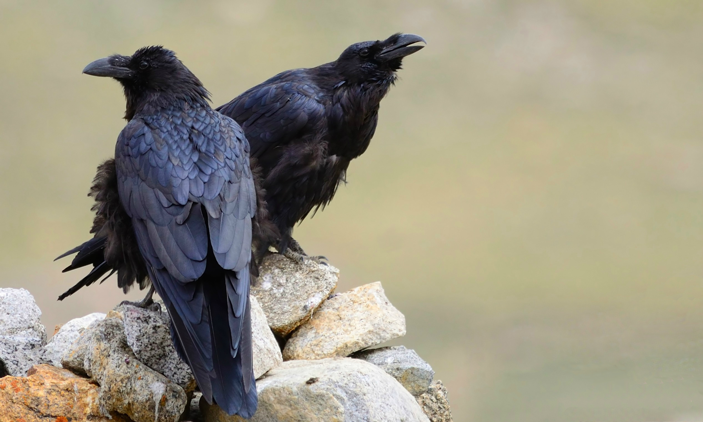

# 其他鸟类

## 隼形目 FALCONIFORMES

### 1. 隼科 FALCONIDAE

#### 白腿小隼 _Microhierax melanoleucos_



* 体长：16-18 cm
* 体重：55-75 g



* 生境：平原或低山的落叶、常绿林，尤其是旷地、林缘、河畔林地。海平面至1500米，通常低于1000米。
* 食物：大型昆虫，尤其是蝴蝶、蜻蜓、蚱蜢，以及小型鸟类，偶有小型哺乳动物、蜥蜴、地栖昆虫。
* 天敌：。

从视野开阔不受遮蔽的高处栖枝上守株待兔，发现猎物即在空中捕捉，或从花朵、叶片上捕捉。一般在空中进食，若猎物太大则回到栖枝上撕食。有时像典型隼一样俯冲并用后爪击杀大型猎物。



#### 红隼





















#### 食蝠隼 _Falco rufigularis_



* 体长：20-30 cm
* 体重：♂108-150 g；♀177-242 g



* 生境：热带湿润低地与亚高山森林，以及河畔树林、林地、稀树草原等。海平面至1700米。
* 食物：主要为鸟类、大型昆虫、蝙蝠，有时捕捉啮齿类和爬行类。随季节和地区变化，也取决于性别（个体大小）。
* 天敌：。

主要在晨昏捕食，天黑后依然持续。常在树顶守株待兔，追逐、俯冲、仰击经过的猎物。主要在空中攫取，有时从树林或灌丛的边缘捕捉，少数从地面或水中攫取。也在树冠或灌丛的低空快速巡航，惊吓猎物；或在高空翱翔，空中攫取大型昆虫或俯冲捕猎低处鸟类。常在飞行中食用小型猎物。



#### 燕隼 _Falco subbuteo_











text



* 体长：28-36 cm
* 体重：♂131-232 g；♀141-340 g

wip

#### 飞行

飞行时可见隼典型的尖翼，WIP

#### 叫声

叫声描述：



* 生境：开阔林地，如林缘、破碎林地、有树林的草原、河畔、灌丛地、有树木的沼泽、湿地。主要在海平面至1500米，有时达到2000-3000米。
* 食物：主要为昆虫，繁殖期和迁徙前转为小型鸟类。偶尔捕食小型哺乳动物，在开阔温带草原有时捕食爬行类。
* 天敌：。

主要在低空飞行寻找猎物，平飞、短暂俯冲或短暂U型飞行后攫取猎物；有时在栖枝上守株待兔，或在地面捕食昆虫。在飞行中食用小型猎物。有时劫掠其他小型猛禽的猎物。



#### 游隼 _Falco peregrinus_


您不可以创建拟游隼 _F. \(p.\) pelegrinoides_
















每1年相当于2人类年，y=2x+13



* 体长：35-51 cm
* 体重：♂410-1060 g；♀595-1600 g

中-大型隼，体态粗壮，翅长尖。冠深色，从深蓝灰色至暗黑褐色不等，从眼先向下延伸形成宽阔髭纹；有时颈侧亦深色，与髭纹连接形成完整“头盔”。背面深色，与冠一致或偏浅，遍布粗大横纹；初级飞羽颜色常略深。腹面从白色至红褐色不等，常有细而稀疏的横纹。眼周裸皮中黄色，眼暗褐色，喙铅灰色，远端灰黑色；蜡膜中黄色。足中黄色，爪黑色。  
“kreyenborgi”型冠与髭纹棕黄色杂灰黑纹，几无“头盔”，有浅色眉纹。背面浅灰色有深灰色横纹，初级飞羽暗灰色。腹面乳白色，几无纹。其余同上。  
亚成鸟WIP。眼周裸皮与蜡膜蓝灰色，足黄绿色。其余同成鸟。

#### 飞行

飞行时可见隼典型的尖翼，相对其他隼略阔。振翅快速、僵硬。

#### 叫声

叫声描述：



* 生境：各类温度下的各种生境，需要绝壁、高大树木等营巢地点，偏好开阔地带。通常海平面至1500米，有3000米繁殖和4000米迁徙的记录。
* 食物：几乎完全为鸟类；有时捕食兔类、啮齿类、蝙蝠扥哺乳动物，偶尔捕食两栖爬行类和昆虫，罕有食用鱼类和腐肉。猎物大小取决于性别（个体大小）。
* 天敌：。

全天均捕食，配偶常协同捕猎。在峭壁等高栖枝上守株待兔，或盘旋、翱翔寻找猎物。发现猎物后在空中追捕，必要时快速爬升或螺旋上升，通常以30-45°快速俯冲向目标，俯冲距离长短皆有。一般持空拳击打并以后爪钩拽猎物；若成功则抓取或随之落到地面，失败则重新爬升再次俯冲。有时不在俯冲时击打，而是重新爬升后从下侧攻击。有时追逐猎物。偶尔在低空至100米的高空缓慢巡航，惊起猎物。对于水面附近的鸟类，通过一系列短俯冲逼入水中使其力竭。







#### 猎隼 _Falco cherrug_



* 体长： cm
* 体重：

中-大型隼，

#### 飞行

飞行时可见隼典型的尖翼，略长圆。WIP

#### 叫声

叫声描述：







## 雀形目 PARSSERIFORMES

### 1. 鸦科 CORVIDAE

#### 红嘴蓝鹊 _Urocissa erythroryncha_



* 体长：53-68 cm
* 体重：♂145-192 g；♀106-155 g

轮廓，姿态，体貌特征。（头-背面-腹面）基本羽雄鸟；替换羽雄鸟。基本羽雌鸟，替换羽雌鸟。大裸皮；眼-喙-蜡膜-足-爪。  
亚成鸟。裸部。

#### 飞行

WIP

#### 叫声

叫声描述：







#### 喜鹊 _Pica pica_


您可以创建欧亚喜鹊复合种中的任何种/亚种，但不包括马格里布喜鹊 _P. mauritanica_和阿拉伯喜鹊 _P. asirensis_


text



* 体长：45-50 cm
* 体重：185-268 g

轮廓，姿态，体貌特征。（头-背面-腹面）基本羽雄鸟；替换羽雄鸟。基本羽雌鸟，替换羽雌鸟。大裸皮；眼-喙-蜡膜-足-爪。  
亚成鸟。裸部。

#### 飞行

WIP

#### 叫声

叫声描述：











#### 寒鸦 _Coloeus monedula_











#### 小嘴乌鸦 _Corvus corone_











#### 白颈鸦 _Corvus torquatus_











#### 渡鸦 _Corvus corax_













* 体长：58-69 cm
* 体重：585-2000 g

最大的鸦科鸟类。喙粗而长，喉部有披针状羽毛，头顶略成三角形。通体黑色有金属光泽。眼黑色，喙黑色，足灰黑色，爪黑色。

#### 飞行

翅明显长于其他鸦鹊而略成三角形，尾楔形。常翱翔飞行。

#### 叫声

多变。典型鸣叫粗粝沉闷，与乌鸦的嘹亮鸣叫有差异。











