# 开放鸟种


#### 此页所有的摄影作品都是未经编辑的原始图片，仅作为非商业科教用途。若您不希望您的作品出现在此处，请您联系工作人员，我们将立即移除。



您需要向工作人员提出申请才能扮演标注**\*星号\***的鸟种！


## 鹰形目 ACCIPITRIFORMES

鹰形目囊括了除隼以外的所有日行猛禽。鹰形目的成员形态多样，WIP

### 1. 鹗科 PANDIONIDAE

#### 鹗 _Pandion haliaetus_ sensu lato


您可以创建东方鹗 _P. \(h.\) cristatus_


text



* 体长：50-66 cm
* 体重：♂990-1800 g；♀1200-2050 g

轮廓，姿态，体貌特征。（头-背面-腹面）基本羽雄鸟；替换羽雄鸟。基本羽雌鸟，替换羽雌鸟。大裸皮；眼-喙-蜡膜-足-爪。  
亚成鸟。裸部。

#### 飞行

WIP

#### 叫声

叫声描述：



* 生境：清澈、流动缓慢的各类水体，偏好有遮蔽的海湾、河口、红树林、潟湖。
* 食物：几乎完全为浅水鱼类，通常重100-300 g，最大记录 2 kg. 基本不取食腐肉；在极其偶然的情况下捕捉其他小型动物和伤病动物。
* 天敌：WIP

在空中翱翔、盘旋、滑翔、短暂悬停寻找猎物，经过几次试探性俯冲后，伸爪向前、收拢翅膀，俯冲入水攫取鱼类，然后从水中直接向上复飞。



### 2. 鹰科 ACCIPTRIDAE

#### 黑翅鸢 _Elanus caeruleus_



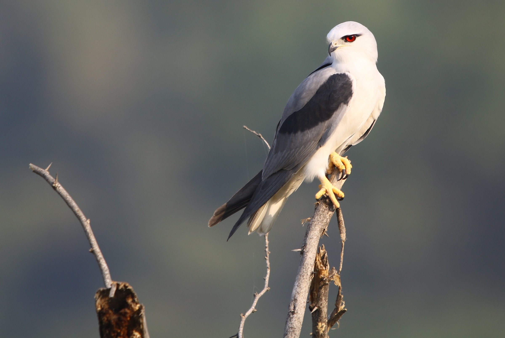







黑翅鸢是哈兰那的古老居民。近年来，随着伊苏里亚的征服，一些黑翅鸢迁移到了伊苏里亚。



* 体长：30-37 cm
* 体重：♂197-277 g；♀279-343 g

轮廓，姿态，体貌特征。（头-背面-腹面）基本羽雄鸟；替换羽雄鸟。基本羽雌鸟，替换羽雌鸟。大裸皮；眼-喙-蜡膜-足-爪。  
亚成鸟。裸部。

#### 飞行

WIP

#### 叫声

叫声描述：



* 生境：有稀少树木的开阔草原、草地，林缘、林间空地，河畔林地，临近的沙漠。
* 食物：绝大部分为小型哺乳动物，尤其是90 g左右的啮齿类；部分地区常捕食小型地栖鸟类。其他猎物如蝙蝠、昆虫、蛙、蜥蜴等。
* 天敌：WIP

晨昏捕猎。一种捕猎方式为在树枝、树桩等高处守株待兔。另一种典型方式为在空中悬停，间或滑翔或试探性俯冲，锁定猎物后即俯冲下伸爪攫取。有时如鹞般举翼低空巡航，惊起昆虫。







#### 蛇雕 _Spilornis cheela_

text



* 体长：50-74 cm
* 体重：420-1800 g

轮廓，姿态，体貌特征。（头-背面-腹面）基本羽雄鸟；替换羽雄鸟。基本羽雌鸟，替换羽雌鸟。大裸皮；眼-喙-蜡膜-足-爪。  
亚成鸟。裸部。

#### 飞行

WIP

#### 叫声

叫声描述：



* 生境：包括常绿-落叶、湿润-干燥、低地-山地、初生-次生等各类森林、林地；稀树草原、河谷、红树林沼泽。
* 食物：主要为树栖蛇类，亦捕食蜥蜴、蛙、蟹、鱼类和小型啮齿类，偶尔捕捉伤病鸟类。
* 天敌：。

在空地或河流附近的树上静止不动，守株待兔。



#### 白背兀鹫 _Gyps bengalensis_



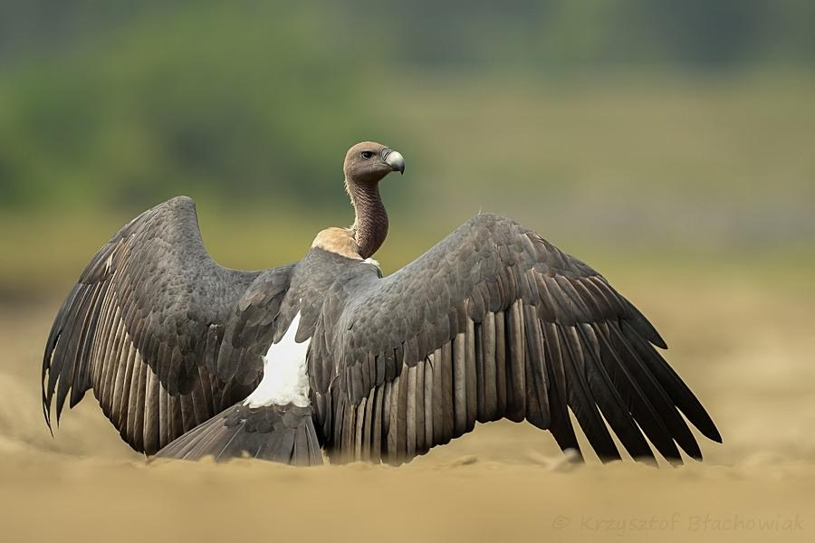







text



* 体长：76-93 cm
* 体重：3500-6000 g

轮廓，姿态，体貌特征。（头-背面-腹面）基本羽雄鸟；替换羽雄鸟。基本羽雌鸟，替换羽雌鸟。大裸皮；眼-喙-蜡膜-足-爪。  
亚成鸟。裸部。

#### 飞行

WIP

#### 叫声

叫声描述：



* 生境：
* 食物：
* 天敌：不详



#### 黑冠鹃隼 _Aviceda leuphotes_

text



* 体长：28-35 cm
* 体重：168-224 g

轮廓，姿态，体貌特征。（头-背面-腹面）基本羽雄鸟；替换羽雄鸟。基本羽雌鸟，替换羽雌鸟。大裸皮；眼-喙-蜡膜-足-爪。  
亚成鸟基本同成鸟，仅颜色略黯淡，且喉部有白色纵纹。

#### 飞行

WIP

#### 叫声

叫声描述：



* 生境：常绿或落叶林、竹林的林缘和开阔地，尤其是低山丘陵与溪流附近。
* 食物：大型昆虫、蜥蜴、树蛙；偶尔捕捉蝙蝠、小型地栖息哺乳类、小鸟。
* 天敌：。

黄昏或阴天活动。守株待兔，有时进行短暂的悬停，然后落到地面或在空中攫取猎物，亦在植被间穿梭捕猎。有时协同捕猎。



#### 丽鹰雕 _Spizaetus ornatus_







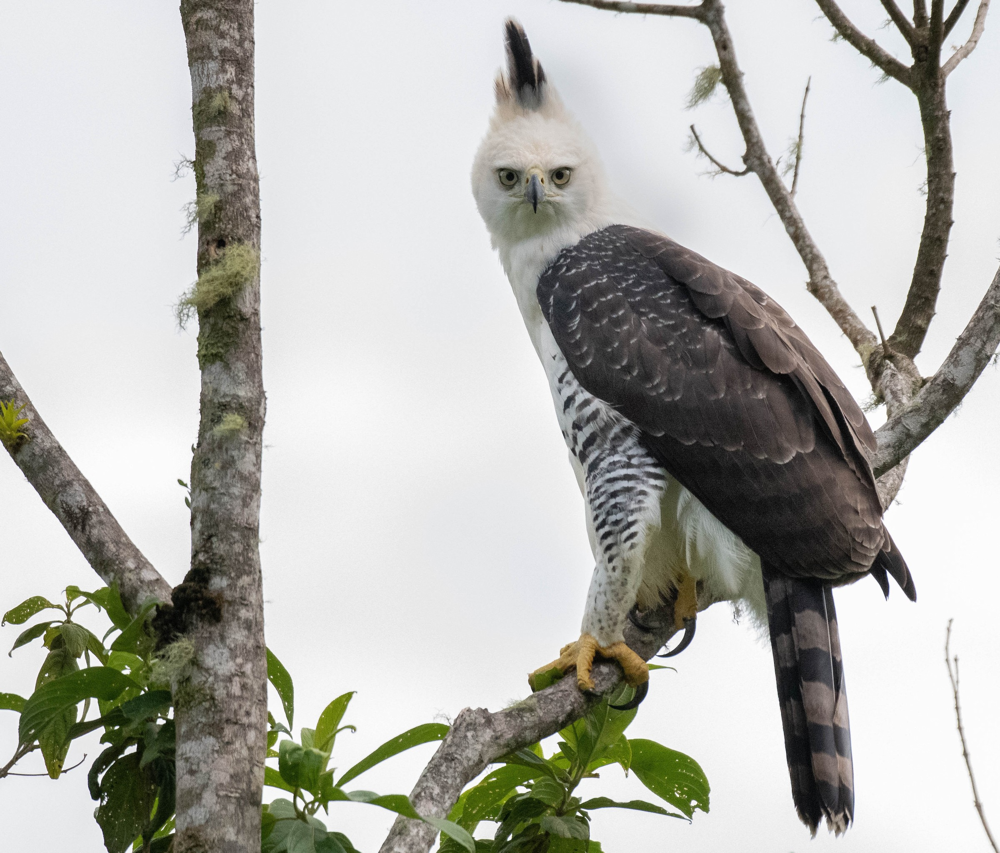



丽鹰雕一度生活在哈兰那的西南一隅，WIP



* 体长：56-67 cm
* 体重：♂906-1132 g；♀1200-1738 g

轮廓，姿态，体貌特征。（头-背面-腹面）基本羽雄鸟；替换羽雄鸟。基本羽雌鸟，替换羽雌鸟。大裸皮；眼-喙-蜡膜-足-爪。  
亚成鸟。

#### 飞行

WIP

#### 叫声

叫声描述：



* 生境：高大的热带、亚热带湿润森林，尤其是原生林；部分地区偏好林缘、河畔等空地。偶尔在较为低矮的沼泽森林。
* 食物：大型动物，主要为大型鸟类，亦包括哺乳类、大型蜥蜴等。
* 天敌：不详

在林间捕猎。一般守株待兔，在树枝间短距离切换，或隐藏在树冠下，俯冲捕猎地面或树上的猎物，或在树枝间追猎。



#### 林雕 _Ictinaetus malaiensis_



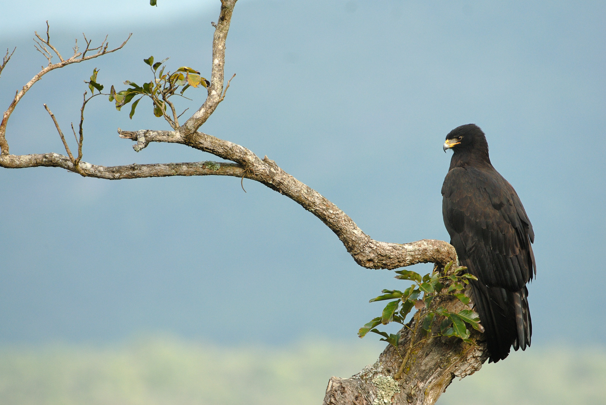







林雕是哈兰那王国古老的统治者，可考的历史就长达数百年——甚至有传言说他们是这片土地千年前就命定的君主。然而，命定的君主并非仁慈的君主。WIP



* 体长：65-80 cm
* 体重：1000-1600 g

。

#### 飞行

剪影似鸢。翼远端宽于近端。

#### 叫声

叫声描述：



* 生境：低山与高山的常绿林与湿润落叶林，尤其是森林河谷。
* 食物：特化的劫巢者，取食巢中的卵、幼鸟和亲鸟，也捕食鸟类、小哺乳类、蜥蜴、蛙、大型昆虫。
* 天敌：不详

配偶常成对捕猎。在接近树冠或草地或山洞洞口的空中缓慢翱翔盘旋，俯冲入植被或到地面，有时在树枝上攀援。时常将整个巢攫走取食。



#### 凤头鹰 _Accipiter trivirgatus_











哈兰那……



* 体长：30-46 cm
* 体重：224-450 g

。

#### 飞行

似鸢。WIP

#### 叫声

叫声描述：



* 生境：常绿或落叶林，包括湿润低地、低山与高山，偏好驳杂开阔地的林地。一般分布于海平面至1800米，偶尔达2400米。
* 食物：主要为小型鸟类、蜥蜴、小型哺乳类，亦有蛙、大型昆虫等，取决于个体大小。
* 天敌：不详

从隐蔽的栖枝上守株待兔，俯冲至地面或树枝捕猎，或在空中追逐。有时袭击洞穴蝙蝠。



#### 赤腹鹰 _Accipiter soloensis_















赤腹鹰体型娇小，text



* 体长：25-35 cm
* 体重：♂106-140；♀125-204 g

。

#### 飞行

WIP

#### 叫声

叫声描述：



* 生境：主要为低地和低山的开阔森林、林地，甚至灌丛，通常靠近沼泽。海平面至1500米，一般低于1000米。
* 食物：繁殖期以蛙类为主，越冬期以大型昆虫和小型鸟类为主。其他如蜥蜴，偶有小型哺乳动物、小鱼、虾蟹。
* 天敌：不详

主要在栖枝上守株待兔，在地面或浅水中捕杀猎物；也在湿地或开阔林地的低空飞行、滑翔或盘旋寻找猎物。偶尔悬停。



#### 苍鹰 _Accipiter gentilis_


您可以创建美洲苍鹰 _A. \(g.\) atricapillus_
















WIP



* 体长：46-63 cm
* 体重：♂517-1110 g；♀758-2200 g

大型鹰，体态粗壮，翅长圆，跗跖与足强壮。有白色眉纹，耳羽纯色或有细纹；背面灰褐色至灰白色至蓝黑色，腹面灰白色有深色细横纹，有时间杂深色羽轴形成的纵纹。美洲种群腹面横纹常细腻如蠕纹。眼浅黄色至暗红色。喙铅灰色，远端黑色；蜡膜中黄色。足中黄色，爪黑色。  
亚成鸟wip。

#### 飞行

飞行时可见森林猛禽典型的圆翼。WIP

#### 叫声

叫声描述：



* 生境：高大森林或林地，主要是针叶林，亦包括混交林、阔叶林；偏好林缘、空地、溪流等开阔地带，或破碎化森林、有树木的温带草原。冬季亚成鸟常出现于开阔灌丛。海平面至3000米，常垂直迁徙。
* 食物：主要为中型鸟类和哺乳动物，包括其他猛禽；有时捕食蜥蜴。罕有甲虫、腐肉。
* 天敌：

从隐蔽的栖枝守株待兔；或沿着林缘等较为隐蔽的地带巡航，追踪猎物后追逐捕猎。或在高处翱翔、滑翔，随后俯冲。可在空中、地面或树上猎杀猎物。



* 求偶：
* 繁殖周期：1年1次
* 巢：
* 窝卵数：
* 孵化期：
* 丰羽期：



#### 雀鹰 _Accipiter nisus_















text



* 体长：28-40 cm
* 体重：♂105-196 g；♀185-350 g



* 生境：各种类型的林地，偏好针叶或混交林，周边需要有可供捕猎的开阔地。常在溪流边。海平面至4500米。
* 食物：几乎完全为小型鸟类，尤其是地面觅食的群居鸟类，田鼠丰富时亦大量捕食田鼠；其他食物类型则极为罕见，如小型哺乳类、蜥蜴、昆虫、腐肉。有时捕捉群飞的鞘翅目昆虫。
* 天敌：WIP

在一连串隐蔽的栖枝间守株待兔偷袭，或沿灌丛、溪流低空巡航，伸爪攫取沿途栖止或惊飞的小鸟。亦在空中、树丛或地面追捕小鸟。偶尔翱翔后俯冲捕猎。常反复造访猎物丰富的地点。



#### 白腹海雕



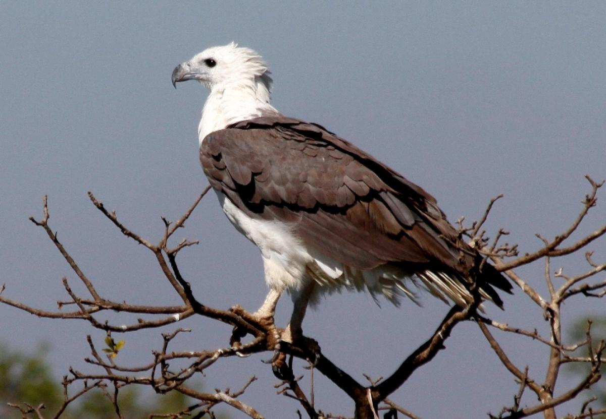









* 体长：70-85 cm
* 体重：







#### 玉带海雕 _Haliaeetus leucoryphus_



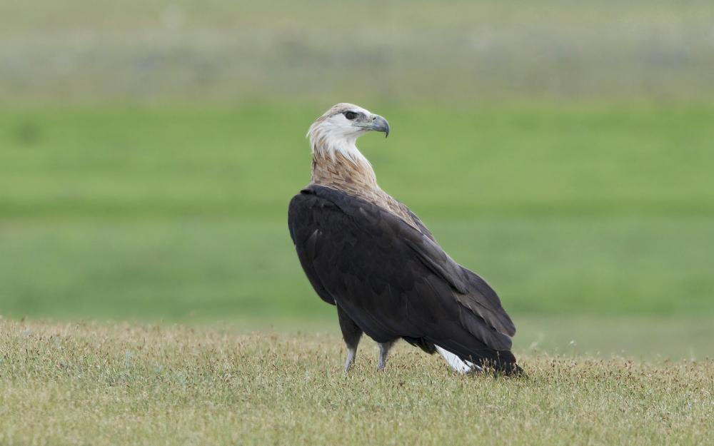







我们不知道哈兰那的玉带海雕从何而来。有传言说，他们其实是很久以前伊苏尔的遗民。

伊苏尔的玉带海雕WIP

年龄和计算公式。



* 体长：72-84 cm
* 体重：♂ 2000-3300 g，♀ 2100-3700 g

大而纤细的海雕，喙相对其他海雕略短，颈部有披针形羽。常挺直站立。头颈米黄色，背面略沾黄棕色，向腹面逐渐过渡为深色。背中褐色，向翼侧逐渐变深；腹面棕色，向后逐渐变深。翼、尾黑褐色，尾近基部贯穿一条宽阔白色横带。眼褐色至黄灰色。喙铅灰色，远端灰黑色；蜡膜淡灰色，偶沾黄色。足灰白色至淡黄色，爪黑色。  
第一年通体褐色，羽缘黄褐色。翼下大覆羽、腋羽米黄色，形成强烈的浅色对角线，初级飞羽近端有甚大的米黄色窗。尾无横带。眼暗褐色。其余似成鸟。随年龄增长，头颈颜色逐渐变浅（尤其喉部），与暗褐色的颊形成强烈反差，尾羽逐渐出现带杂色的白色横带。5-6年彻底换为成羽。

#### 飞行

飞行时可见雕典型的“门板”翼，但相对略窄。飞行轻盈灵活；翱翔时双翼平举。尾扇形略长。

#### 叫声

嘶哑尖锐的kyow-kyow-kyow或kok kok kok；似鸡的有节奏咯咯声。



* 生境：位于干旱地区或温带草原的淡水生境，如大小湖泊、河流、各类湿地，很少见于海岸。一般生活于低地，迁徙时可穿越6000米的高山。
* 食物：以大型鱼类和水鸟为主，亦有旱獭等兽类、两栖爬行类，以及腐肉。
* 天敌：不详。

在水面附近攫取鱼类，不钻入水中。冲入水鸟群中将其驱散，选择其中一只，反复俯冲逼迫其潜入水中，或将其踩入水下，使其力竭或窒息。狩猎成功后携带猎物飞走，常能携带比自身更重的猎物。常盗寄生其他掠食性鸟类，如鹗、白尾鹞、鸥类等，追逐、抢夺其猎物，甚至盗寄生鳄鱼。



* 求偶：极为吵闹。其余不详。
* 繁殖周期：1年1次
* 巢：一般在15-35  m的树上营巢，偶尔利用石缝、芦苇丛，离水较近。用树枝构筑巨型鸟巢，内衬绿色植物。反复利用旧巢。
* 窝卵数：2-3
* 孵化期：约40天
* 丰羽期：70-105天

留鸟、候鸟均有，冬季水域冻结时则向南迁徙，无游荡性。幼鸟离巢后扩散。



#### 灰脸鵟鹰 _Butastur indicus_













* 体长：39-48 cm
* 体重：♂375-433 g







## 鸮形目 STRIGIFORMES

鸮形目的成员统称“猫头鹰”，均为掠食性鸟类。猫头鹰的眼睛并列前视，且多半具有由羽毛构成的“脸蛋”，即面盘，许多猫头鹰的头顶有耳状簇羽。大部分猫头鹰为夜行性动物，但也有一些猫头鹰在晨昏甚至白昼活动。 猫头鹰的大小多变，但色彩一般为暗淡的保护色，雌雄色彩相近或相同。大部分猫头鹰的羽毛极其柔软，可以吸收飞行的噪声；飞羽边缘有梳齿状结构，可以将气流打碎，防止飞行时发出响声。夜行性猫头鹰往往具有非常明显的面盘，用于收集声音；一些夜行性猫头鹰的耳上下不对称，可以更好地定位声音的来源。猫头鹰的眼球为柱状，无法转动，作为补偿其颈部极为灵活，可以完成270°的旋转。 猫头鹰为单配制鸟类，一部分终生结对，一部分每年更换新配偶。所有的猫头鹰都不搭建复杂的鸟巢，而是利用石缝、树洞、草窠、人类建筑物或其他鸟类的旧巢繁殖。 

### 1. 草鸮科 TYTONIDAE

#### 乌草鸮 _Tyto tenebricosa_



* 体长：37-43 cm
* 体重：♂500-700 g；♀750-1160 g

相较其他草鸮头和眼甚大而尾甚小。面盘灰色，眼周黑色有时扩散到整个面盘。通体极深的黑褐色，布有白色小斑点，下腹灰白色但站立时不显。眼黑色，喙粉灰色，足灰色，爪灰黑色。

#### 飞行

WIP

#### 叫声

发出“扔炸弹”般下降的鸣声，或是电流般的zrrrrrr声，以及类似仓鸮的嘶叫和咂嘴声等。



* 生境：茂密的雨林、云雾森林和湿润桉树林，需要有树洞等营巢场所，偏好山谷老林。 
* 食物：主要为树栖哺乳动物，大小均有，也有小鸟等其他动物
* 天敌：不详。

昼伏夜出，偶尔黄昏活动。少数在树上捕杀猎物的草鸮，实际上几乎完全在树上捕猎而避开旷地。







#### 仓鸮 _Tyto alba_


您可以创建仓鸮复合种中的任何种/亚种








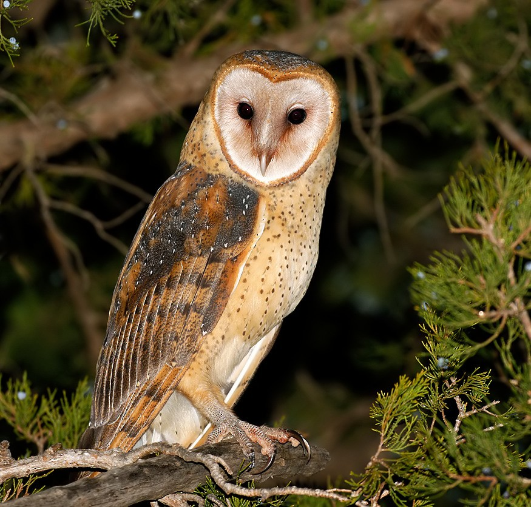









* 体长：22-44 cm
* 体重：250-700 g

羽色多变；同一种群内部雌性往往颜色较深且斑点较多，可能与性选择有关。除面盘外常通体覆盖白色和黑色的小斑点。浅色类型面盘白色，背面浅黄褐色带灰色蠕纹，腹面白色；深色类型面盘灰褐色，背面暗橙色带褐灰色或灰黑色蠕纹，腹面灰白色或黄褐色。其间有各种中间类型，黑白小斑点的数量和密度也随种群不同而不同。眼周深色。眼黑色，喙粉色，足粉黄色至灰粉色，爪褐灰色。

#### 飞行

WIP

#### 叫声

叫声描述：



* 生境：各类较为开阔且有稀疏树木的温暖生境，包括草原、湿地、灌丛旷野、开阔林地、河谷峡谷、沙漠等等；脂肪贮存能力差，不耐寒，不能利用寒冷生境。
* 食物：绝大多数为小型啮齿类，偶尔捕捉小鸟、蝙蝠等其他小动物。
* 天敌：。

昼伏夜出，晨昏偶见，偶尔白天飞行。在开阔地低空巡航或守株待兔；可以在完全无光的条件下利用听力捕猎。少数非繁殖期依然使用鸟巢休息的鸟类。







#### 东方草鸮 _Tyto longimembris_



* 体长：♂32-36 cm；♀35-42 cm
* 体重：♂250-375 g；♀320-582 g

整体轮廓较长，翅和足特长。面盘略长，从纯白色到棕褐色不等，年轻的鸟颜色较深；眼相对小，眼周黑色。背面鲜艳皮黄色有黑色斑块，覆盖黑白小斑点，腹面皮黄色至黄白色，部分个体覆盖黑色小斑点。眼黑色，喙粉色，足粉色，常因泥土呈褐色，爪黑褐色。

#### 飞行

飞行时足明显拖于尾后。常在草滩上空缓慢飞行、滑行或悬停。

#### 叫声

叫声描述：



* 生境：海拔1500米以下的灌丛、高草地、开阔草地、稀树草原、草滩湿地，包括农田，偶见于树林。
* 食物：几乎完全为小型啮齿动物，偶尔捕食蛙、蛇等。
* 天敌：。

昼伏夜出，白天在深草中休息，受惊则飞出一段距离，然后再次躲入草丛。不采取守株待兔的捕猎方式，而是在低空巡航，利用视觉和听觉寻觅草丛中的猎物。







#### 

### 2. 鸱鸮科 STRIGIDAE

#### 东方角鸮 _Otus sunia_







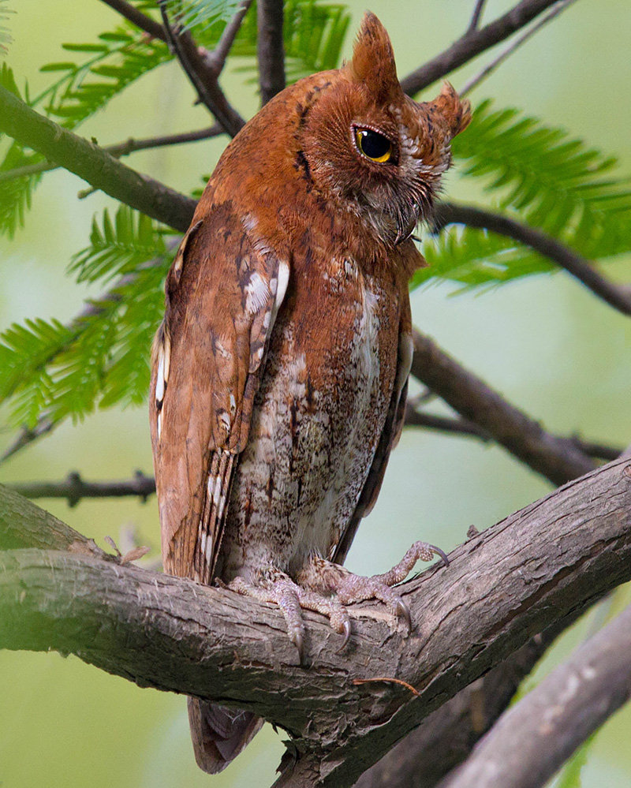





* 体长： 17-21 cm
* 体重： 75-95 g

小型猫头鹰，外貌符合经典的“猫头鹰”形象，耳状簇羽明显。有灰色型和红色型。灰色型遍布棕灰色均匀蠕纹，部分羽轴黑色，其腹部羽轴尤粗大，眉纹、肩羽远端和下腹白色。红色型以鲜艳砖红色取代棕灰色，背部羽轴略浅，其余同灰色型。眼浅黄色，喙黑灰色，足粉灰色被羽，爪灰色。

#### 飞行

1

#### 叫声

反复发出有节奏的空洞kru-krukru或kro-krokro三声（部分种群为四声），有时带颤音。







#### 雕鸮 _Bubo bubo_

#### 黄脚渔鸮 _Ketupa flavipes_











#### 花头鸺鹠 _Glaucidium passerinum_

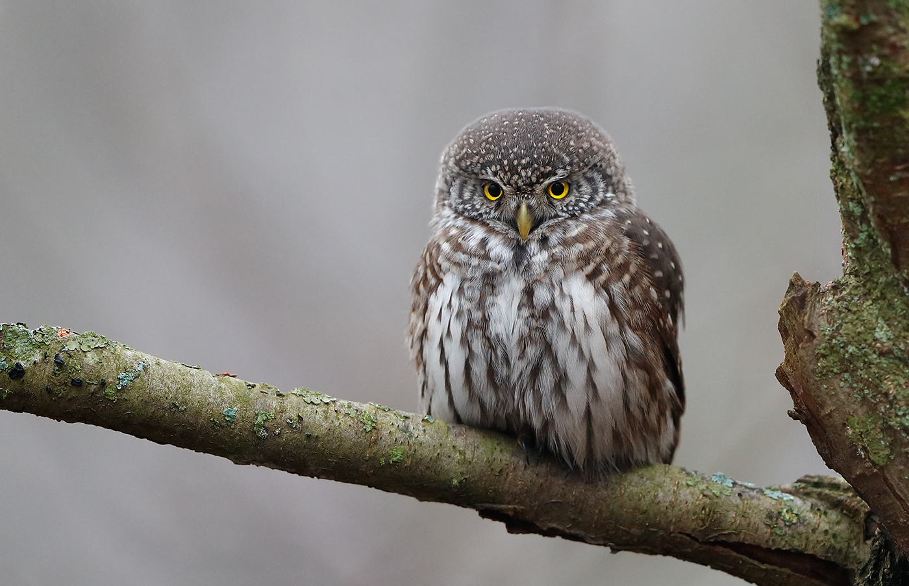



* 体长：15-19 cm
* 体重：♂47-72 g；♀67-83 g

轮廓，姿态，体貌特征。（头-背面-腹面）基本羽雄鸟；替换羽雄鸟。基本羽雌鸟，替换羽雌鸟。大裸皮；眼-喙-蜡膜-足-爪。  
亚成鸟。裸部。

#### 飞行

WIP

#### 叫声

叫声描述：



* 生境：开阔针叶林、混交林。
* 食物：以 田鼠为主的小型哺乳类、小型鸟类。
* 天敌：WIP

text



#### 斑头鸺鹠 _Glaucidium cuculoides_



* 体长：22-25 cm
* 体重：♂150-176 g；♀约240 g

轮廓，姿态，体貌特征。（头-背面-腹面）基本羽雄鸟；替换羽雄鸟。基本羽雌鸟，替换羽雌鸟。大裸皮；眼-喙-蜡膜-足-爪。  
亚成鸟。裸部。

#### 飞行

WIP

#### 叫声

叫声描述：



* 生境：开阔的亚高山或高山松-栎林、低地亚热带常绿林。一般低于2100米，有时至2700米。
* 食物：以甲虫、蝗虫等大型昆虫为主，有时捕食小型哺乳类、蛙类、蜥蜴和小型鸟类。
* 天敌：

基本为日行动物。



#### 纵纹腹小鸮 _Athene noctua_

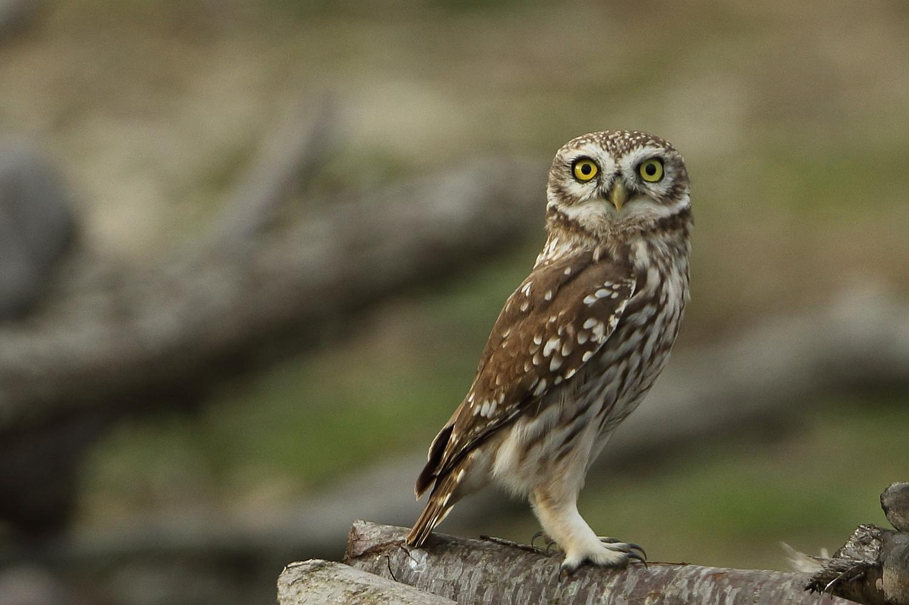



* 体长：22-25 cm
* 体重：♂150-176 g；♀约240 g

轮廓，姿态，体貌特征。（头-背面-腹面）基本羽雄鸟；替换羽雄鸟。基本羽雌鸟，替换羽雌鸟。大裸皮；眼-喙-蜡膜-足-爪。  
亚成鸟。裸部。

#### 飞行

WIP

#### 叫声

叫声描述：







#### 北鹰鸮 _Ninox japonica_



* 体长：29-33 cm
* 体重：♂平均167.5 g；♀平均168.2 g

轮廓，姿态，体貌特征。（头-背面-腹面）基本羽雄鸟；替换羽雄鸟。基本羽雌鸟，替换羽雌鸟。大裸皮；眼-喙-蜡膜-足-爪。  
亚成鸟。裸部。

#### 飞行

WIP

#### 叫声

叫声描述：



* 生境：偏好有高大树木的低地阔叶落叶或常绿林，常在林缘活动。海平面至海拔1700米。
* 食物：几乎完全为无脊椎动物，尤其是甲虫、蝗虫和蛾。有时捕食蛙类、蜥蜴、鼠类、小型蝙蝠等。
* 天敌：wip



#### 短耳鸮 _Asio flammeus_

#### 长耳鸮 _Asio otus_











## 隼形目 FALCONIFORMES

### 1. 隼科 FALCONIDAE

#### 白腿小隼 _Microhierax melanoleucos_



* 体长：16-18 cm
* 体重：55-75 g



* 生境：平原或低山的落叶、常绿林，尤其是旷地、林缘、河畔林地。海平面至1500米，通常低于1000米。
* 食物：大型昆虫，尤其是蝴蝶、蜻蜓、蚱蜢，以及小型鸟类，偶有小型哺乳动物、蜥蜴、地栖昆虫。
* 天敌：。

从视野开阔不受遮蔽的高处栖枝上守株待兔，发现猎物即在空中捕捉，或从花朵、叶片上捕捉。一般在空中进食，若猎物太大则回到栖枝上撕食。有时像典型隼一样俯冲并用后爪击杀大型猎物。



#### 食蝠隼 _Falco rufigularis_



* 体长：20-30 cm
* 体重：♂108-150 g；♀177-242 g



* 生境：热带湿润低地与亚高山森林，以及河畔树林、林地、稀树草原等。海平面至1700米。
* 食物：主要为鸟类、大型昆虫、蝙蝠，有时捕捉啮齿类和爬行类。随季节和地区变化，也取决于性别（个体大小）。
* 天敌：。

主要在晨昏捕食，天黑后依然持续。常在树顶守株待兔，追逐、俯冲、仰击经过的猎物。主要在空中攫取，有时从树林或灌丛的边缘捕捉，少数从地面或水中攫取。也在树冠或灌丛的低空快速巡航，惊吓猎物；或在高空翱翔，空中攫取大型昆虫或俯冲捕猎低处鸟类。常在飞行中食用小型猎物。



#### 燕隼 _Falco subbuteo_



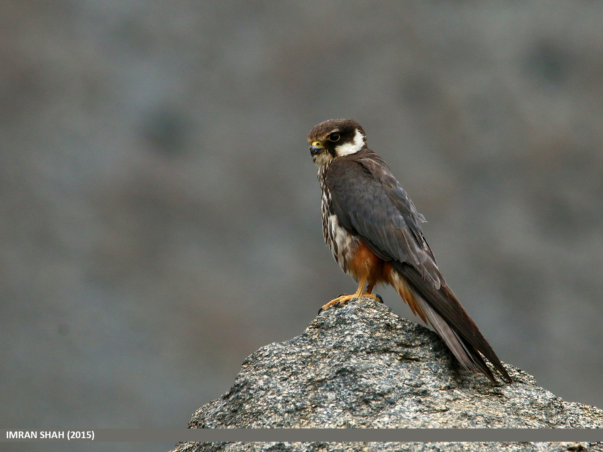







text



* 体长：28-36 cm
* 体重：♂131-232 g；♀141-340 g

wip

#### 飞行

飞行时可见隼典型的尖翼，WIP

#### 叫声

叫声描述：



* 生境：开阔林地，如林缘、破碎林地、有树林的草原、河畔、灌丛地、有树木的沼泽、湿地。主要在海平面至1500米，有时达到2000-3000米。
* 食物：主要为昆虫，繁殖期和迁徙前转为小型鸟类。偶尔捕食小型哺乳动物，在开阔温带草原有时捕食爬行类。
* 天敌：。

主要在低空飞行寻找猎物，平飞、短暂俯冲或短暂U型飞行后攫取猎物；有时在栖枝上守株待兔，或在地面捕食昆虫。在飞行中食用小型猎物。有时劫掠其他小型猛禽的猎物。



#### 游隼 _Falco peregrinus_


您不可以创建拟游隼 _F. \(p.\) pelegrinoides_








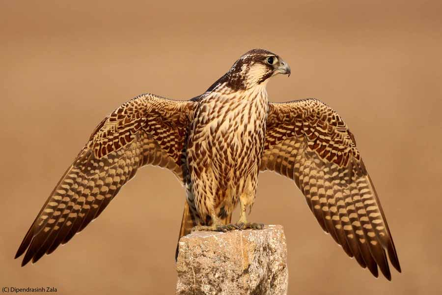









* 体长：35-51 cm
* 体重：♂410-1060 g；♀595-1600 g

中-大型隼，体态粗壮，翅长尖。冠深色，从深蓝灰色至暗黑褐色不等，从眼先向下延伸形成宽阔髭纹；有时颈侧亦深色，与髭纹连接形成完整“头盔”。背面深色，与冠一致或偏浅，遍布粗大横纹；初级飞羽颜色常略深。腹面从白色至红褐色不等，常有细而稀疏的横纹。眼周裸皮中黄色，眼暗褐色，喙铅灰色，远端灰黑色；蜡膜中黄色。足中黄色，爪黑色。  
“kreyenborgi”型冠与髭纹棕黄色杂灰黑纹，几无“头盔”，有浅色眉纹。背面浅灰色有深灰色横纹，初级飞羽暗灰色。腹面乳白色，几无纹。其余同上。  
亚成鸟WIP。眼周裸皮与蜡膜蓝灰色，足黄绿色。其余同成鸟。

#### 飞行

飞行时可见隼典型的尖翼，相对其他隼略阔。WIP

#### 叫声

叫声描述：



* 生境：各类温度下的各种生境，需要绝壁、高大树木等营巢地点，偏好开阔地带。通常海平面至1500米，有3000米繁殖和4000米迁徙的记录。
* 食物：几乎完全为鸟类；有时捕食兔类、啮齿类、蝙蝠扥哺乳动物，偶尔捕食两栖爬行类和昆虫，罕有食用鱼类和腐肉。猎物大小取决于性别（个体大小）。
* 天敌：。

全天均捕食，配偶常协同捕猎。在峭壁等高栖枝上守株待兔，或盘旋、翱翔寻找猎物。发现猎物后在空中追捕，必要时快速爬升或螺旋上升，通常以30-45°快速俯冲向目标，俯冲距离长短皆有。一般持空拳击打并以后爪钩拽猎物；若成功则抓取或随之落到地面，失败则重新爬升再次俯冲。有时不在俯冲时击打，而是重新爬升后从下侧攻击。有时追逐猎物。偶尔在低空至100米的高空缓慢巡航，惊起猎物。对于水面附近的鸟类，通过一系列短俯冲逼入水中使其力竭。







#### 猎隼 _Falco cherrug_











## 雀形目 PARSSERIFORMES

### 1. 鸦科 CORVIDAE

#### 红嘴蓝鹊 _Urocissa erythroryncha_



* 体长：53-68 cm
* 体重：♂145-192 g；♀106-155 g

轮廓，姿态，体貌特征。（头-背面-腹面）基本羽雄鸟；替换羽雄鸟。基本羽雌鸟，替换羽雌鸟。大裸皮；眼-喙-蜡膜-足-爪。  
亚成鸟。裸部。

#### 飞行

WIP

#### 叫声

叫声描述：







#### 喜鹊 _Pica pica sensu latiore_


您可以创建欧亚喜鹊复合种中的任何种/亚种，但不包括马格里布喜鹊 _P. mauritanica_和阿拉伯喜鹊 _P. asirensis_


text



* 体长：45-50 cm
* 体重：185-268 g

轮廓，姿态，体貌特征。（头-背面-腹面）基本羽雄鸟；替换羽雄鸟。基本羽雌鸟，替换羽雌鸟。大裸皮；眼-喙-蜡膜-足-爪。  
亚成鸟。裸部。

#### 飞行

WIP

#### 叫声

叫声描述：











#### 小嘴乌鸦 _Corvus corone_











#### 渡鸦 _Corvus corax_













* 体长：58-69 cm
* 体重：585-2000 g

最大的鸦科鸟类。喙粗而长，喉部有披针状羽毛，头顶略成三角形。通体黑色有金属光泽。眼黑色，喙黑色，足灰黑色，爪黑色。

#### 飞行

翅明显长于其他鸦鹊而略成三角形，尾楔形。常翱翔飞行。

#### 叫声

多变。WIP











