# 鹰形目

鹰形目是日行猛禽的主要类群，俗称“鹰”，绝大多数为掠食性鸟类。鹰形目的成员形态多样，但都具有钩状的喙和敏锐的双目视觉；大多数成员的的眉骨突出，能够遮挡强光。掠食性较强的鹰形目鸟类还有强健的足、粗壮的II趾和高度弯曲的爪，用于攫取、制伏、杀死猎物。鹰形目的大小、形态、色彩多变，绝大多数雌大于雄，且某些类群的雌雄色彩显著不同。许多鹰形目鸟类的外侧初级飞羽末端收缩，飞行时可见“手指”样缺刻，称为“翼指”。不少鹰形目鸟类，尤其是大型成员，擅长利用上升热气流翱翔飞行，可以几个小时不振翅。绝大多数鹰形目鸟类为日行性动物，部分晨昏活跃。

## 1. 鹗科

### 鹗 _Pandion haliaetus_


您可以创建东方鹗 _P. \(h.\) cristatus_


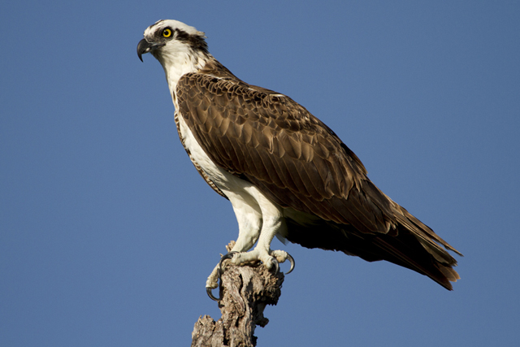

鹗逐水而居，不论是南方的哈兰那还是北方的伊苏尔，只要有江河湖海的地方就有他们的身影。他们绝大多数是不怎么受尊敬的渔民，常常在水滨聚居形成大型渔村。WIP

每1年相当于1.5人类年，y=1.5x+13.5



* 体长：50-66 cm
* 体重：♂ 990-1800 g，♀ 1200-2050 g

中型猛禽。头较圆，喙短而强烈下弯，翅狭而甚长，尾短，足被刺状鳞片，爪长而强烈弯曲。头白色，有暗褐色过眼纹延伸至颈，冠有暗色纵纹。腹面白色，胸部有暗色带，翼下覆羽有暗色斑纹；背面褐色。雌鸟的胸带较为宽阔，翼下覆羽暗色较多。眼黄色。喙黑色；蜡膜蓝灰色。足灰白色，爪黑色。  
亚成鸟羽缘浅色，其余似成鸟。

### 飞行

飞行时翼微弓，成浅M形。翼指5枚。

### 鸣声

叫声描述：



* 生境：清澈、流动缓慢的各类水体，偏好有遮蔽的海湾、河口、红树林、潟湖。
* 食物：几乎完全为浅水鱼类，通常重100-300 g，最大记录 2 kg. 基本不取食腐肉；在极其偶然的情况下捕捉其他小型动物和伤病动物。

在空中翱翔、盘旋、滑翔、短暂悬停寻找猎物，经过几次试探性俯冲后，伸爪向前、收拢翅膀，俯冲入水攫取鱼类，然后从水中直接向上复飞。



## 2. 鹰科

### 黑翅鸢 _Elanus caeruleus_



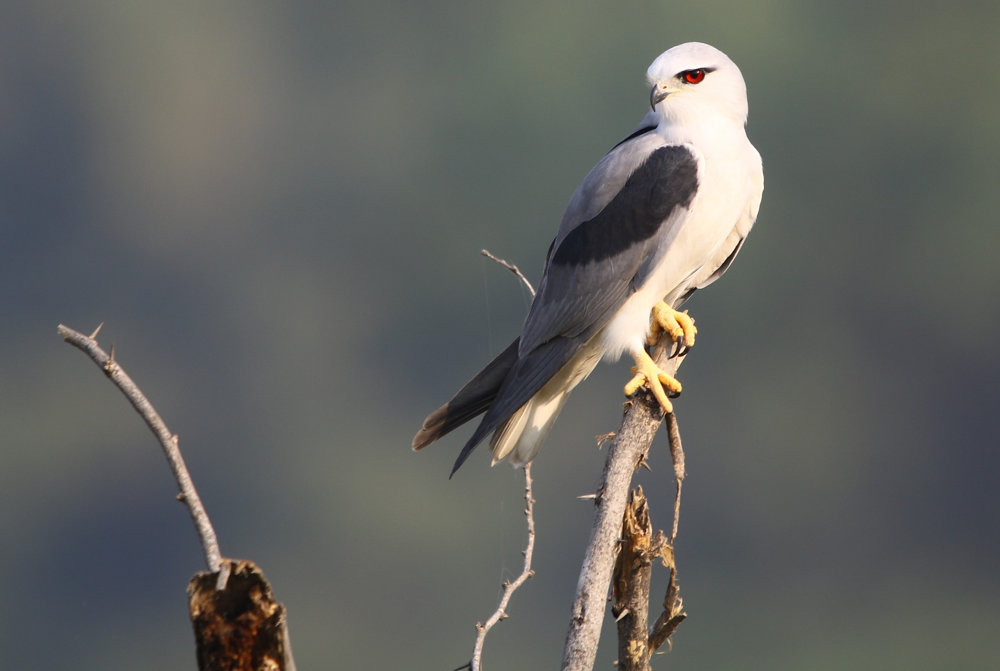



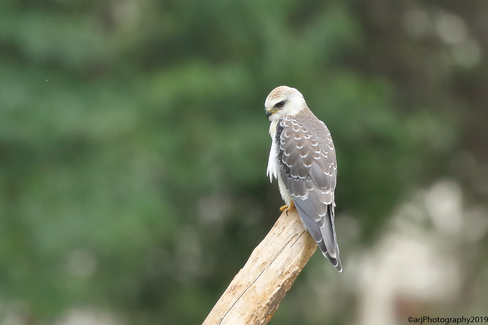



Lorem ipsum

每1年相当于2人类年，y=2x+13



* 体长：30-37 cm
* 体重：♂ 197-277 g，♀ 219-343 g

中型猛禽。翅窄而尖。头白色，冠、后颈浅灰色，眼周黑色。大部分翼上覆羽黑色、外侧尾羽白色，其余背面灰色。飞羽翼下灰黑色有白色羽缘，其余腹面白色。眼红色。喙灰黑色；蜡膜乳黄色。足中黄色，爪灰黑色。  
亚成鸟冠、后颈密布褐色纵纹。背面灰色带褐色调和醒目的浅色羽缘。胸前有一道较粗的土黄色环，向胁部延伸为细纵纹。眼黄褐色。其余似成鸟。

### 飞行

常悬停。WIP

### 鸣声

叫声描述：



* 生境：有稀少树木的开阔草原、草地，林缘、林间空地，河畔林地，临近的沙漠。
* 食物：绝大部分为小型哺乳动物，尤其是90 g左右的啮齿类；部分地区常捕食小型地栖鸟类。其他猎物如蝙蝠、昆虫、蛙、蜥蜴等。
* 天敌：WIP

晨昏捕猎。一种捕猎方式为在树枝、树桩等高处守株待兔。另一种典型方式为在空中悬停，间或滑翔或试探性俯冲，锁定猎物后即俯冲下伸爪攫取。有时如鹞般举翼低空巡航，惊起昆虫。







### 蛇雕 _Spilornis cheela_



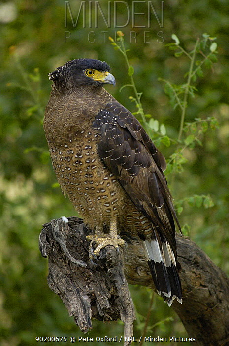



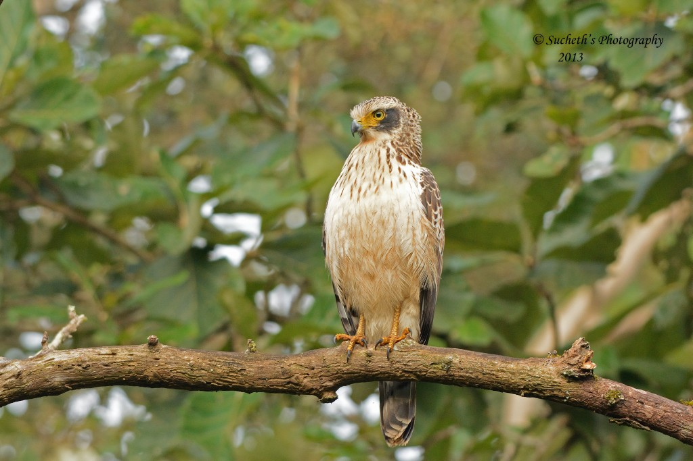



Lorem ipsum

每1年相当于1.5人类年，y=1.5x+13.5



* 体长：50-74 cm
* 体重：420-1800 g

有蓬松的羽冠，显得头部较大。冠深褐色，冠末端有白色斑纹，面部色彩或浅。通体被白色斑点。背面棕褐色至暗褐色，腹面灰黄色、赤褐色或深褐色。飞羽腹面和尾羽有数道宽阔的黑褐色和米白色横带。眼先裸露黄色。眼黄色至浅橙色。喙蓝灰色，远端或为灰黑色；蜡膜黄色。足浅黄色至中黄色，爪黑色。  
浅色亚成鸟通体米白色，颊或为深褐色。背面被深褐色斑纹。上胸或有深褐色纵纹，向下过渡为黄棕色。其余似成鸟。深色亚成鸟似成鸟，但飞羽和尾羽的白色横带不如成鸟粗重。

### 飞行

飞行时翼上扬成U型。

### 鸣声

叫声描述：



* 生境：包括常绿-落叶、湿润-干燥、低地-山地、初生-次生等各类森林、林地；稀树草原、河谷、红树林沼泽。
* 食物：主要为树栖蛇类，亦捕食蜥蜴、蛙、蟹、鱼类和小型啮齿类，偶尔捕捉伤病鸟类。
* 天敌：。

在空地或河流附近的树上静止不动，守株待兔。



### 白背兀鹫 _Gyps bengalensis_



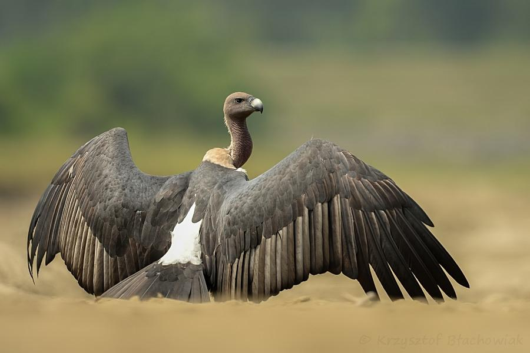



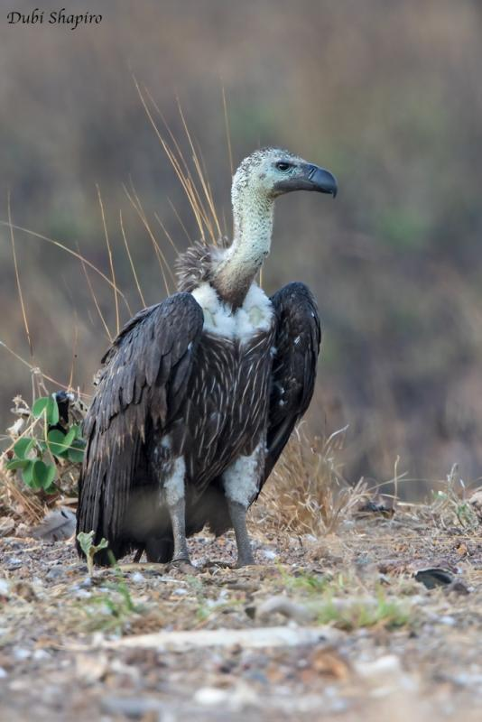



Lorem ipsum

每1年相当于1人类年，y=x+14



* 体长：76-93 cm
* 体重：3500-6000 g

巨大的食腐鸟类，头颈裸露，仅被纤细羽毛。头颈皮肤暗紫红色，羽毛灰白色，颈部有一个灰白色环。体羽黑色，腰与翼下覆羽白色。眼黑色。喙蓝灰色，远端黑色；蜡膜黑色。足暗灰色，爪灰黑色。  
亚成鸟头颈皮肤米黄色，颈部羽毛环褐色。体羽黑褐色，遍布浅黄色纵纹，无白腰与白色翼下覆羽。其余似成鸟。

### 飞行

WIP

### 鸣声

叫声描述：



* 生境：
* 食物：
* 天敌：不详



### 黑冠鹃隼 _Aviceda leuphotes_

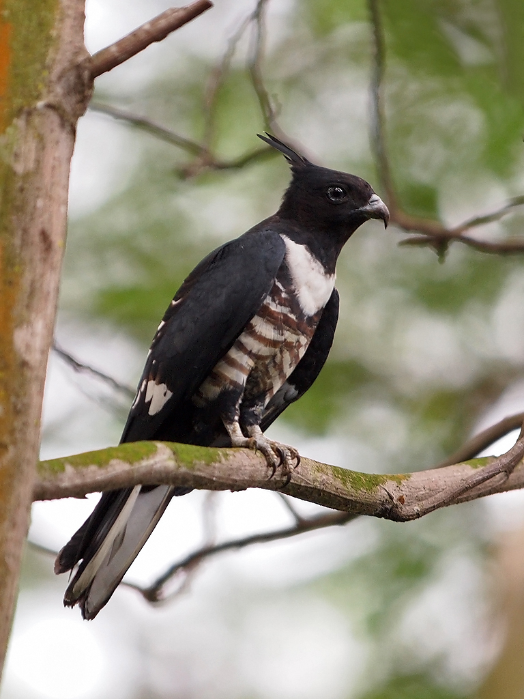

Lorem ipsum

每1年相当于2人类年，y=2x+13



* 体长：28-35 cm
* 体重：168-224 g

头顶有一突出的羽冠。头黑色，背面基本为黑色，肩羽有白色斑块，次级飞羽以暗栗色为主。胸白色，下有一黑色带，然后转为米白色与暗栗色横纹；翼下覆羽、腿、臀黑色，飞羽腹面灰白色。眼黑褐色。喙灰色；蜡膜灰色。足灰色，爪黑色。  
亚成鸟基本同成鸟，仅颜色略黯淡，且喉部有白色纵纹。

### 飞行

WIP

### 鸣声

叫声描述：



* 生境：常绿或落叶林、竹林的林缘和开阔地，尤其是低山丘陵与溪流附近。
* 食物：大型昆虫、蜥蜴、树蛙；偶尔捕捉蝙蝠、小型地栖息哺乳类、小鸟。
* 天敌：。

黄昏或阴天活动。守株待兔，有时进行短暂的悬停，然后落到地面或在空中攫取猎物，亦在植被间穿梭捕猎。有时协同捕猎。



### 丽鹰雕 _Spizaetus ornatus_



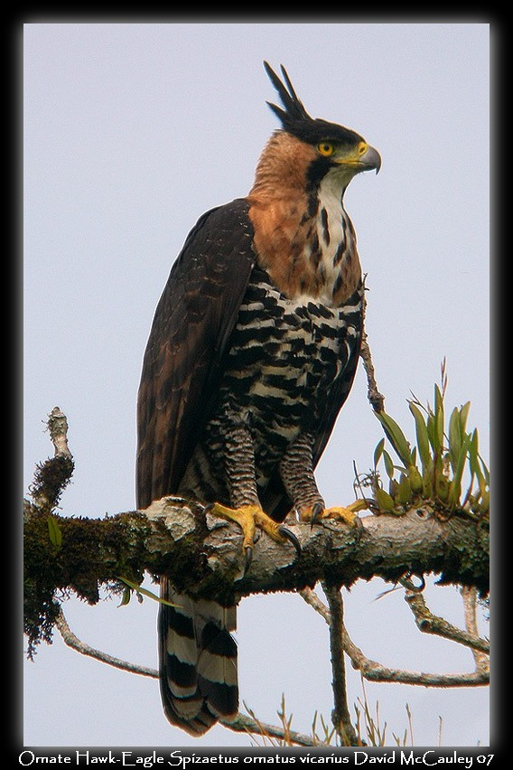



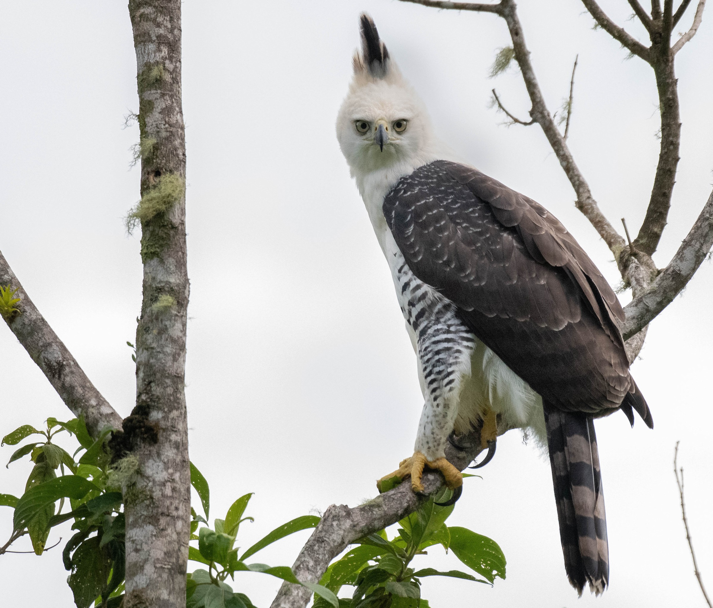



Lorem ipsum

每1年相当于1人类年，y=x+14



* 体长：56-67 cm
* 体重：♂906-1132 g，♀1200-1738 g

头顶有一突出的羽冠。冠黑色，头与颈侧栗色，眼先灰色，喉白色，有黑色髭纹。背面黑褐色，羽缘白色。腹面白色被黑色横斑。眼琥珀色。喙铅灰色，远端黑色；蜡膜黄色。足黄色，爪黑色。  
亚成鸟羽冠暗色，头颈与腹面纯白色，胁部与腿部被黑色横斑。其余似成鸟。

### 飞行

飞行时可见宽阔的圆形翼。

### 鸣声

WIP



* 生境：高大的热带、亚热带湿润森林，尤其是原生林；部分地区偏好林缘、河畔等空地。偶尔在较为低矮的沼泽森林。
* 食物：大型动物，主要为大型鸟类，亦包括哺乳类、大型蜥蜴等。
* 天敌：不详

在林间捕猎。一般守株待兔，在树枝间短距离切换，或隐藏在树冠下，俯冲捕猎地面或树上的猎物，或在树枝间追猎。



### 林雕 _Ictinaetus malaiensis_



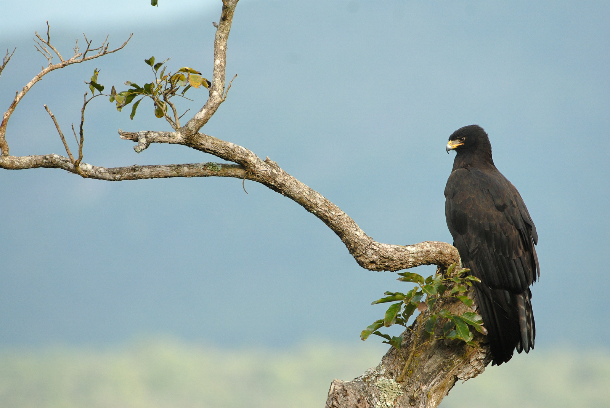



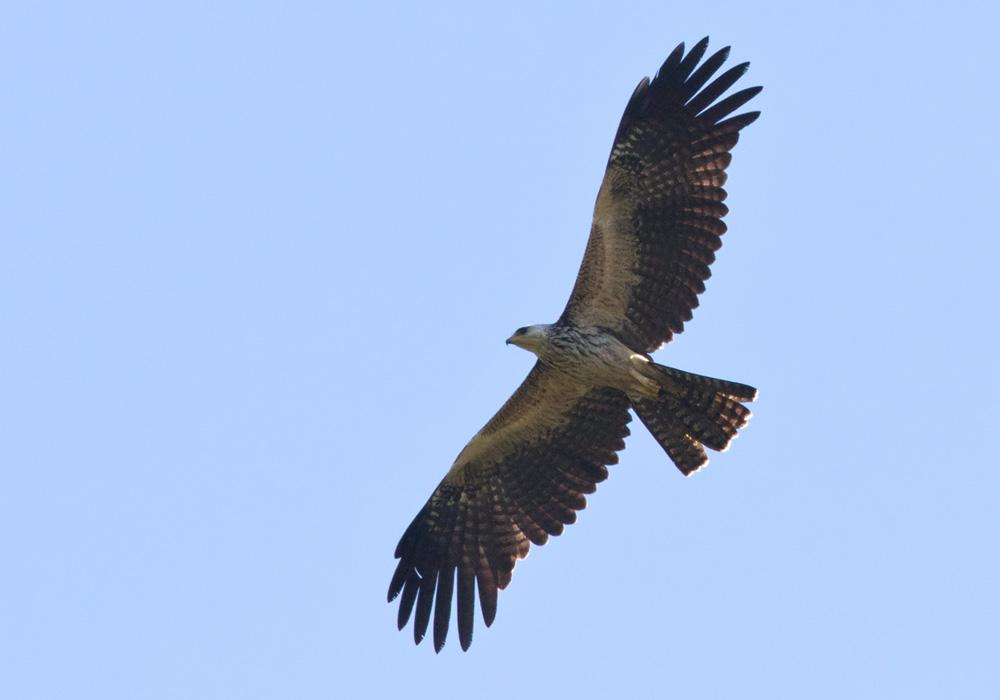



Lorem

每1年相当于1人类年，y=x+14



* 体长：65-80 cm
* 体重：1000-1600 g

翼、尾甚长，跗跖被羽。通体暗褐黑色，眼先灰白色，尾上覆羽棕色，尾有棕色条纹，翼下有模糊的浅色条纹。眼暗褐色。蜡膜黄色；喙铅灰色，远端灰黑色。足黄色，爪黑色。  
浅色型亚成鸟除飞羽、尾羽外通体米黄色被黑褐色纵纹，翼上覆羽羽缘棕色；深色型亚成鸟则遍染深棕色。翼和尾的条纹更清晰，其余似成鸟。

### 飞行

飞行时可见雕典型的“门板”翼，远端宽于近端，翼指极长。振翅深而缓慢；常翱翔飞行，翱翔时双翼平举或微弓起；觅食时则双翼上举，缓慢盘旋，几乎不振翅。

### 鸣声

叫声描述：



* 生境：低山与高山的常绿林与湿润落叶林，尤其是森林河谷。
* 食物：特化的劫巢者，取食巢中的卵、幼鸟和亲鸟，也捕食鸟类、小哺乳类、蜥蜴、蛙、大型昆虫。
* 天敌：不详

配偶常成对捕猎。在接近树冠或草地或山洞洞口的空中缓慢翱翔盘旋，俯冲入植被或到地面，有时在树枝上攀援。时常将整个巢攫走取食。



### 白肩雕 _Aquila heliaca_



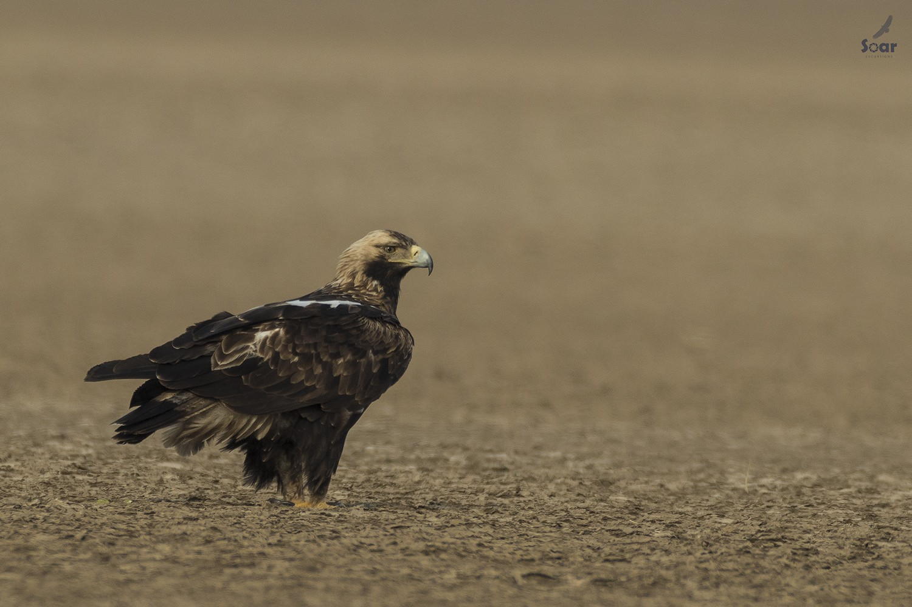



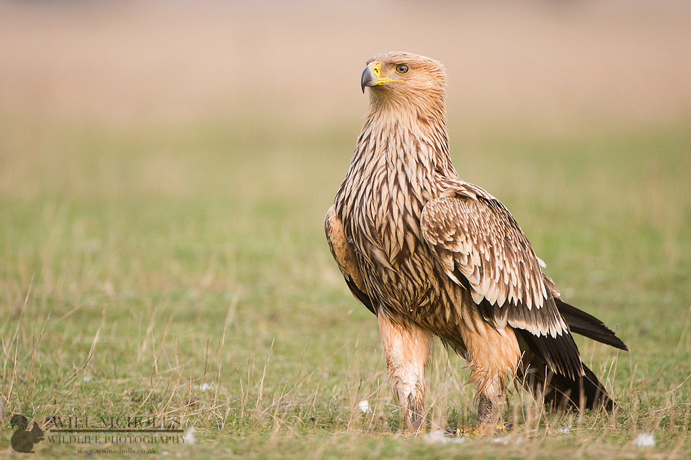



Lorem ipsum

每1年相当于1人类年，y=x+14



* 体长：72-84 cm
* 体重：♂ 2450-2720 g，♀ 3160-4530 g

大型雕。冠后侧与后颈米黄色。通体暗褐色，肩羽有白斑。翼下有模糊的横斑。尾浅灰色被暗色横纹，末端为一宽阔的暗褐色带。眼黄褐色。喙灰色，远端黑色；蜡膜黄色。足黄色，爪黑色。  
亚成鸟褐色密被沙黄色纵纹，飞羽、尾羽暗褐色末端白色，初级飞羽近腕部浅色。其余似成鸟。

### 飞行

飞行时可见雕典型的“门板”翼。尾甚方。振翅深而有力；常翱翔飞行，翱翔时双翼平举或略成浅V形。

### 鸣声

text



* 生境：有零星树木的温带草原、森林-草原、开阔林地、河谷、半沙漠，通常靠近湿地。海平面至1800米，迁徙时可穿越3900米的高山。
* 食物：中小型哺乳动物、鸟类、龟等爬行类，偶尔捕食鱼类、甲虫；腐肉。
* 天敌：

几乎完全在地面捕捉猎物。好利用障碍物突袭猎物；在低处栖枝上守株待兔，短暂地俯冲到地面，或在低空翱翔后俯冲。徒步觅食昆虫。偶尔盗寄生其他猛禽，尤其是越冬时。配偶常协同狩猎。



### 凤头鹰 _Accipiter trivirgatus_



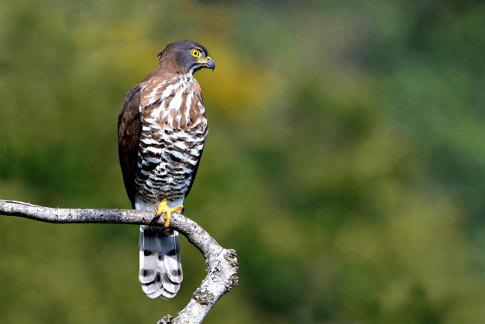



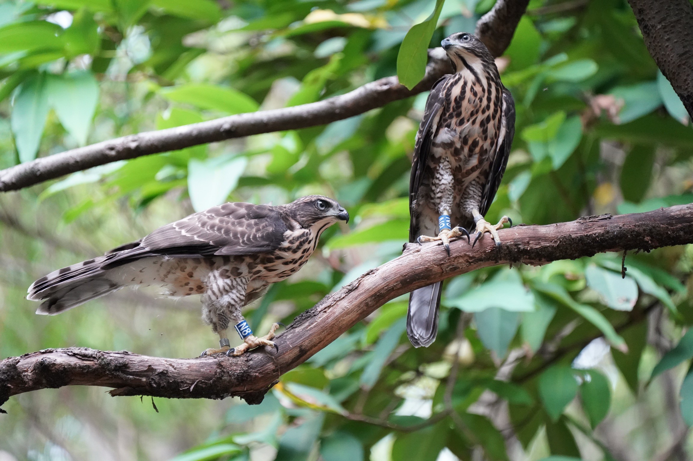



Lorem ipsum

每1年相当于2人类年，y=2x+13



* 体长：30-46 cm
* 体重：224-450 g

体态粗壮，头后有短羽冠。雄鸟头深灰色，喉白色，喉两侧有黑色纵纹，喉中线粗重黑色。背面褐色或灰褐色。腹面白色，胸有粗大褐色纵纹，在腹部变为横纹。飞羽和尾羽具深色横带。雌鸟似雄鸟，但头部更褐、背面更浅、胸红色调更淡。眼黄色至浅橙色。喙灰色，远端黑色；蜡膜黄绿色至黄色。足黄色至橙黄色，爪黑色。  
亚成鸟WIP。

### 飞行

飞行时可见森林猛禽典型的圆翼，翼后缘强烈凸出成半圆形。飞行时白色蓬松的尾下覆羽常散开。常翱翔飞行。

### 鸣声

叫声描述：



* 生境：常绿或落叶林，包括湿润低地、低山与高山，偏好驳杂开阔地的林地。一般分布于海平面至1800米，偶尔达2400米。
* 食物：主要为小型鸟类、蜥蜴、小型哺乳类，亦有蛙、大型昆虫等，取决于个体大小。
* 天敌：不详

从隐蔽的栖枝上守株待兔，俯冲至地面或树枝捕猎，或在空中追逐。有时袭击洞穴蝙蝠。



### 赤腹鹰 _Accipiter soloensis_



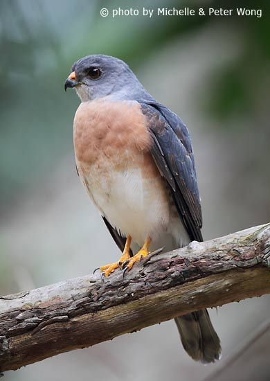



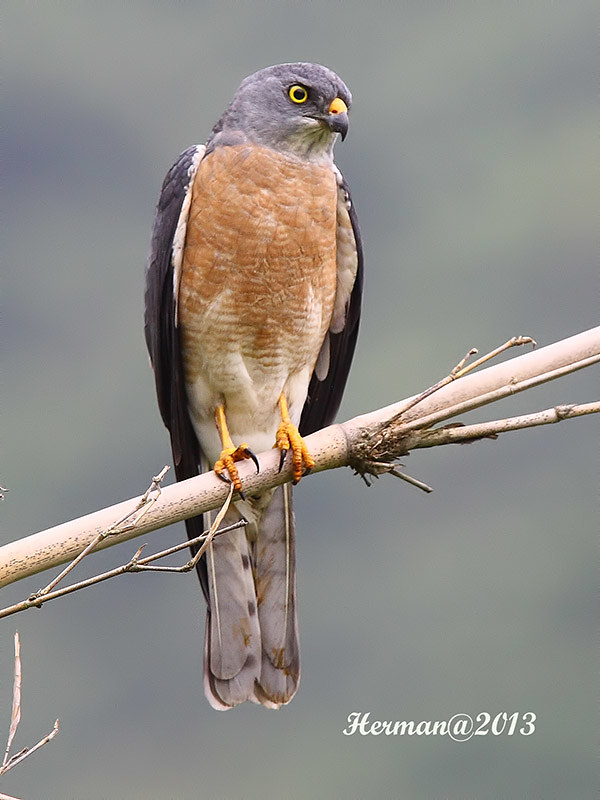



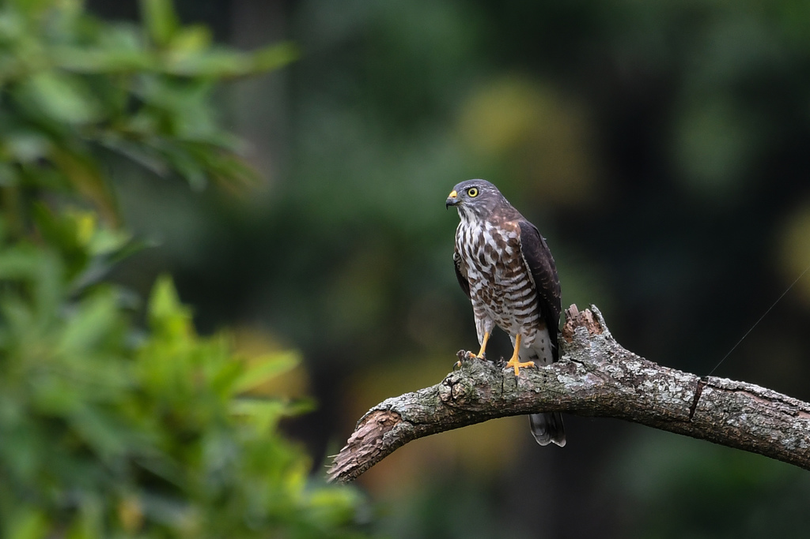



Lorem ipsum

每1年相当于2人类年，y=2x+13



* 体长：25-35 cm
* 体重：♂106-140，♀125-204 g

小型猛禽。蜡膜隆起。雄鸟头颈与背面石板灰色，初级飞羽外侧数枚黑色。胸与上腹橙红色，下腹白色。翼指黑色，飞羽与尾羽具深色横带。眼暗褐色至暗红色。蜡膜橙黄色；喙深灰色。足橙黄色，爪黑色。雌鸟似雄鸟，但背面更褐，胸腹部有较明显的横纹，且眼为黄色。  
亚成鸟WIP。

### 飞行

WIP

### 鸣声

叫声描述：



* 生境：主要为低地和低山的开阔森林、林地，甚至灌丛，通常靠近沼泽。海平面至1500米，一般低于1000米。
* 食物：繁殖期以蛙类为主，越冬期以大型昆虫和小型鸟类为主。其他如蜥蜴，偶有小型哺乳动物、小鱼、虾蟹。
* 天敌：不详

主要在栖枝上守株待兔，在地面或浅水中捕杀猎物；也在湿地或开阔林地的低空飞行、滑翔或盘旋寻找猎物。偶尔悬停。



### 苍鹰 _Accipiter gentilis_


您可以创建美洲苍鹰 _A. \(g.\) atricapillus_




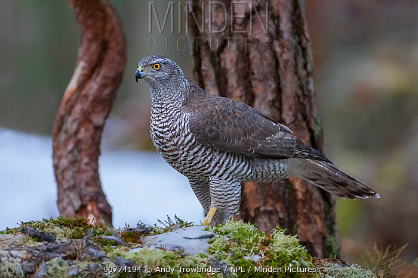



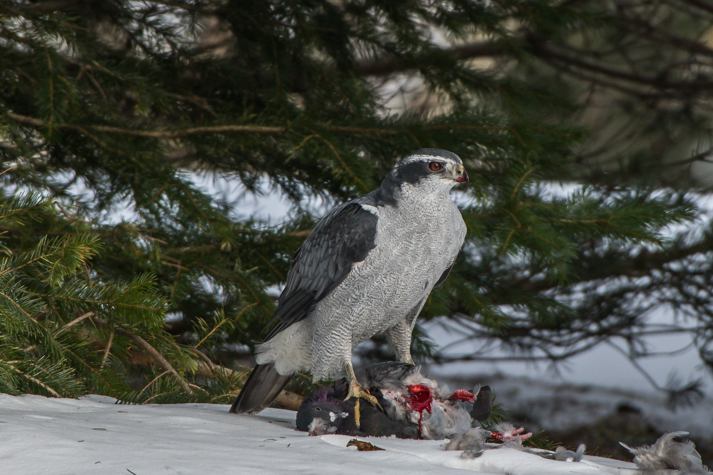



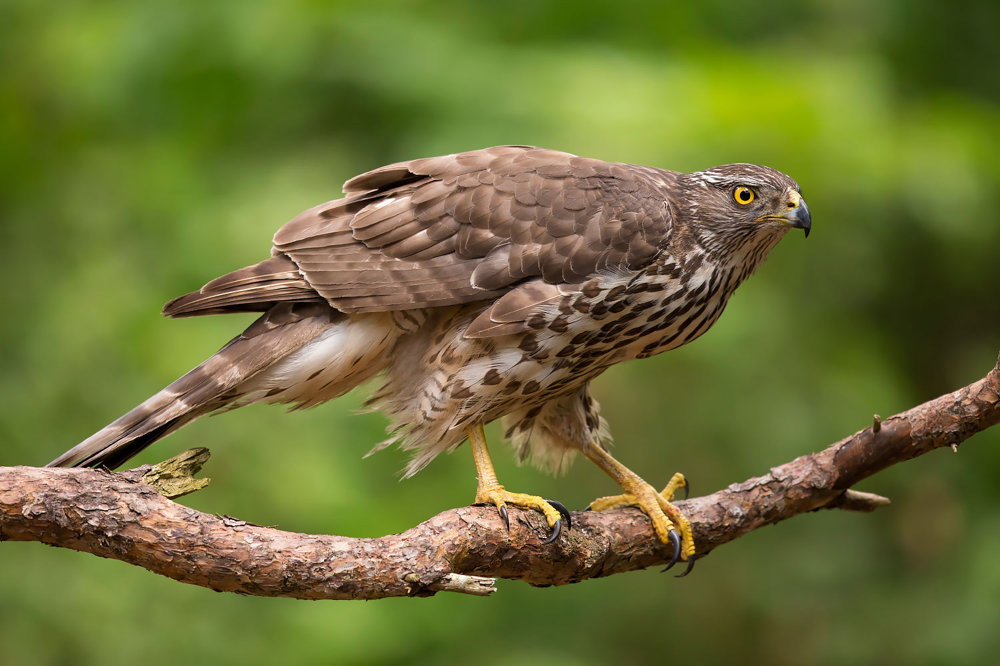



Lorem ipsum

每1年相当于2人类年，y=2x+13



* 体长：46-63 cm
* 体重：♂517-1110 g，♀758-2200 g

大型鹰，体态粗壮。翅长圆，跗跖与足强壮。有白色眉纹，耳羽纯色或有细纹。背面灰白色至灰褐色至蓝黑色，飞羽、尾羽有深色横带；腹面白色有暗色细横纹，有时间杂深色羽轴形成的纵纹。美洲种群腹面横纹常细腻如蠕纹。飞羽和尾羽具深色横带。眼浅黄色至暗红色。喙铅灰色，远端黑色；蜡膜中黄色。足中黄色，爪黑色。  
亚成鸟背面灰褐色、黄褐色至黑褐色。腹面白色至红棕色被褐色纵纹。眼浅黄绿色至橙黄色。其余似成鸟。

### 飞行

飞行时可见森林猛禽典型的圆翼，尾收拢时稍凸出。有时展开白色蓬松的尾下覆羽。常翱翔飞行。

### 鸣声

叫声描述：



* 生境：高大森林或林地，主要是针叶林，亦包括混交林、阔叶林；偏好林缘、空地、溪流等开阔地带，或破碎化森林、有树木的温带草原。冬季亚成鸟常出现于开阔灌丛。海平面至3000米，常垂直迁徙。
* 食物：主要为中型鸟类和哺乳动物，包括其他猛禽；有时捕食蜥蜴。罕有甲虫、腐肉。
* 天敌：

从隐蔽的栖枝守株待兔；或沿着林缘等较为隐蔽的地带巡航，追踪猎物后追逐捕猎。或在高处翱翔、滑翔，随后俯冲。可在空中、地面或树上猎杀猎物。



* 求偶：
* 繁殖周期：1年1次
* 巢：
* 窝卵数：
* 孵化期：
* 丰羽期：



### 雀鹰 _Accipiter nisus_







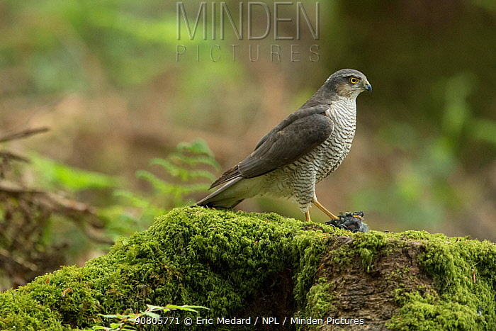



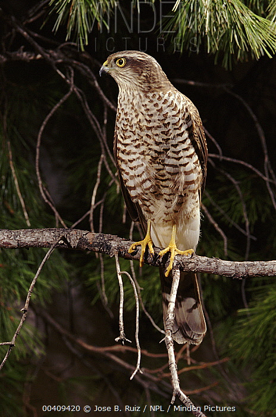



Lorem ipsum

每1年相当于2人类年，y=2x+13



* 体长：28-40 cm
* 体重：♂105-196 g，♀185-350 g

小型鹰。雄鸟冠与背面铅灰色，有时有浅色眉纹，飞羽、尾羽有深色横带；颊砖红色，腹面白色有砖红色细横纹，胁有大片砖红色。雌鸟冠与背面灰色常沾褐色，颊无醒目砖红色，喉密布细纹，腹面砖红色被灰褐色至深灰色取代，其余似雄鸟。眼浅黄色至橙色，雌鸟一般为黄色。喙铅灰色，远端黑色；蜡膜中黄色。足中黄色，爪黑色。  
亚成鸟冠与背面黄褐色，眉纹较显著。腹面白色，有黄褐色粗横纹，在胸部变为心形。眼黄色。其余似成鸟。

### 飞行

飞行时可见森林猛禽典型的圆翼，尾甚长。

### 鸣声

鸣声描述：



* 生境：各种类型的林地，偏好针叶或混交林，周边需要有可供捕猎的开阔地。常在溪流边。海平面至4500米。
* 食物：几乎完全为小型鸟类，尤其是地面觅食的群居鸟类，田鼠丰富时亦大量捕食田鼠；其他食物类型则极为罕见，如小型哺乳类、蜥蜴、昆虫、腐肉。有时捕捉群飞的鞘翅目昆虫。
* 天敌：WIP

在一连串隐蔽的栖枝间守株待兔偷袭，或沿灌丛、溪流低空巡航，伸爪攫取沿途栖止或惊飞的小鸟。亦在空中、树丛或地面追捕小鸟。偶尔翱翔后俯冲捕猎。常反复造访猎物丰富的地点。



### 白尾鹞 _Circus cyaneus_


您不可以创建北美鹞 _C. \(c.\) hudsonius_




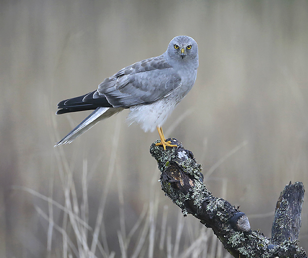



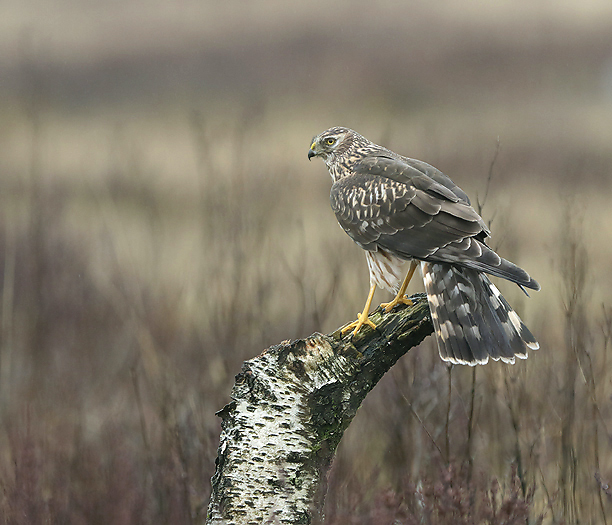



Lorem ipsum

每1年相当于2人类年，y=2x+13



* 体长：42-50 cm
* 体重：♂300-400 g，♀370-708 g

中型猛禽，翅甚长，面部羽毛形成面盘。雄鸟头、背面、胸石板灰，腰洁白，初级飞羽外侧数枚黑色；其余腹面白色。雌鸟体羽米黄色，通体被褐色斑纹，飞羽和尾羽具清晰的深色横带。眼浅黄色。喙铅灰色，远端黑色；蜡膜中黄色。足中黄色，爪黑色。  
亚成鸟WIP

### 飞行

飞行时可见森林猛禽典型的圆翼，尾甚长。

### 鸣声

鸣声描述：



* 生境：
* 食物：
* 天敌：



### 赤鸢 _Milvus milvus_

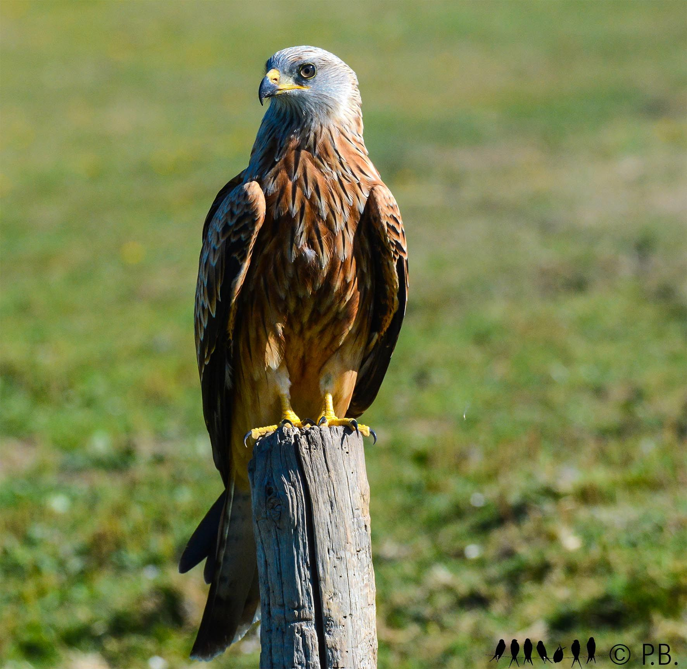

Lorem ipsum

每1年相当于2人类年，y=2x+13



* 体长：60-72 cm
* 体重：♂757-1220 g，♀960 -1600 g

纤细的猛禽。

### 飞行

飞行时可见森林猛禽典型的圆翼，尾甚长。

### 鸣声

鸣声描述：



* 生境：草地、低矮灌丛、湿地等开阔地。在阔叶林为主的开阔林地、低山，以及稀树草原、破碎林地、山地混交林或针叶林营巢。海平面至600 m，山区有时能达到2500 m的高度。
* 食物：较为多样，依食物的丰富程度、地区和个体差异而有所不同。主要为腐肉，以及小型哺乳类、小鸟（包括卵和幼鸟）、两栖爬行类、蝗虫等大型昆虫。
* 天敌：

一般在空中觅食。翱翔或低空滑翔，偶尔短暂悬停，然后俯冲惊起猎物或盘旋下落至腐肉附近。有时在栖枝上守株待兔、在空中捕食昆虫、徒步寻找昆虫，或盗寄生其他鸟类。



### 白腹海雕 _Haliaeetus leucogaster_







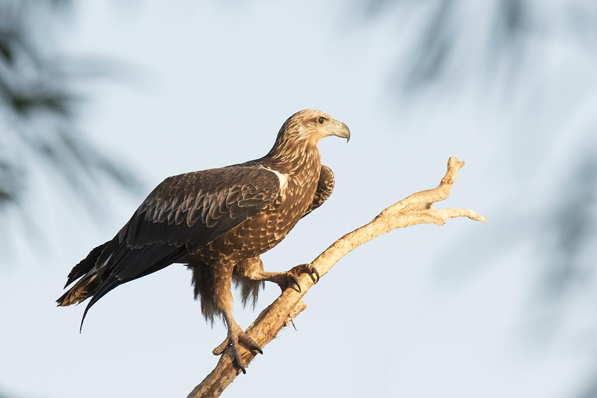



Lorem ipsum

每1年相当于1人类年，y=x+14



* 体长：70-85 cm
* 体重：♂1800-2900 g，♀2500-3900 g

大型海雕。背面石板灰色，初级飞羽染黑色。头颈、胸腹、臀、翼下覆羽白色，飞羽腹面黑色。尾白色，近基部贯穿一条宽阔黑色横带。眼褐色。喙铅灰色，远端灰黑色；蜡膜淡灰色。足苍白色，爪黑色。  
亚成鸟WIP。

### 飞行

飞行时可见森林猛禽典型的圆翼，尾甚长。

### 鸣声

鸣声描述：







### \*玉带海雕 _Haliaeetus leucoryphus_



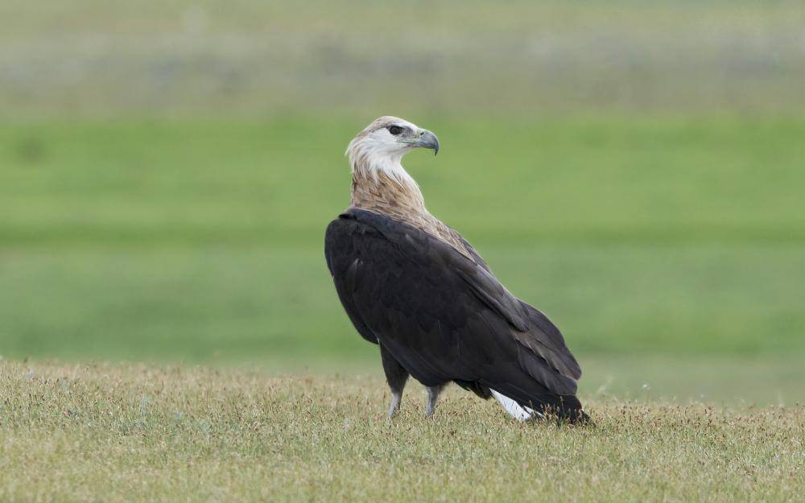



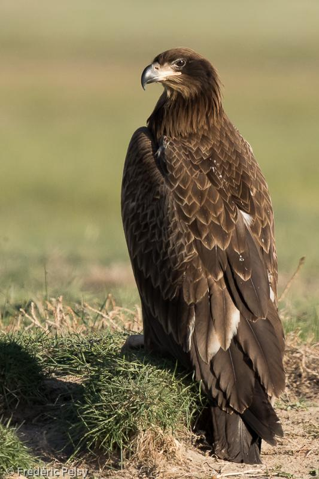



玉带海雕是哈兰那帝国古老的贵族之一。他们与北方的伊苏尔联盟有着不少来往，乃至时常在夏季前往伊苏尔——这也使得哈兰那与伊苏尔的战争爆发后，他们遭到了许多的猜疑。

每1年相当于1人类年，y=x+14



* 体长：72-84 cm
* 体重：♂ 2000-3300 g，♀ 2100-3700 g

大而纤细的海雕。喙相对其他海雕略短，颈部有披针形羽。常挺直站立。头颈米黄色，后颈略沾黄棕色，向腹面逐渐过渡为深色。背中褐色，向翼侧逐渐变深；腹面棕色，向后逐渐变深。翼、尾黑褐色，尾近基部贯穿一条宽阔白色横带。眼褐色至黄灰色。喙铅灰色，远端灰黑色；蜡膜淡灰色，偶沾黄色。足灰白色至淡黄色，爪黑色。  
第一年通体褐色，羽缘黄褐色。翼下大覆羽、腋羽米黄色，形成强烈的浅色对角线，初级飞羽近端有甚大的米黄色窗。尾无横带。眼暗褐色。其余似成鸟。随年龄增长，头颈颜色逐渐变浅（尤其喉部），与暗褐色的颊形成强烈反差，尾羽逐渐出现带杂色的白色横带。5-6年彻底换为成羽。

### 飞行

飞行时可见雕典型的“门板”翼，但相对略窄。飞行轻盈灵活；翱翔时双翼平举。尾扇形略长。

### 鸣声

嘶哑尖锐的kyow-kyow-kyow或kok kok kok；似鸡的有节奏咯咯声。



* 生境：位于干旱地区或温带草原的淡水生境，如大小湖泊、河流、各类湿地，很少见于海岸。一般生活于低地，迁徙时可穿越6000米的高山。
* 食物：以大型鱼类和水鸟为主，亦有旱獭等兽类、两栖爬行类，以及腐肉。
* 天敌：不详。

在水面附近飞捕鱼类，不钻入水中。冲入水鸟群中将其驱散，反复俯冲逼迫其潜入水中，或将其踩入水下，使其力竭或窒息。狩猎成功后携带猎物飞走，常能携带比自身更重的猎物。常盗寄生其他掠食性鸟类，如鹗、白尾鹞、鸥等，甚至盗寄生鳄鱼。



* 求偶：极为吵闹。其余不详。
* 繁殖周期：1年1次
* 巢：一般在15-35  m的树上营巢，偶尔利用石缝、芦苇丛，离水较近。用树枝构筑巨型鸟巢，内衬绿色植物。反复利用旧巢。
* 窝卵数：2-3
* 孵化期：约40天
* 丰羽期：70-105天

留鸟、候鸟均有，冬季水域冻结时则向南迁徙，无游荡性。幼鸟离巢后扩散。



### 白尾海雕 _Haliaeetus albicilla_



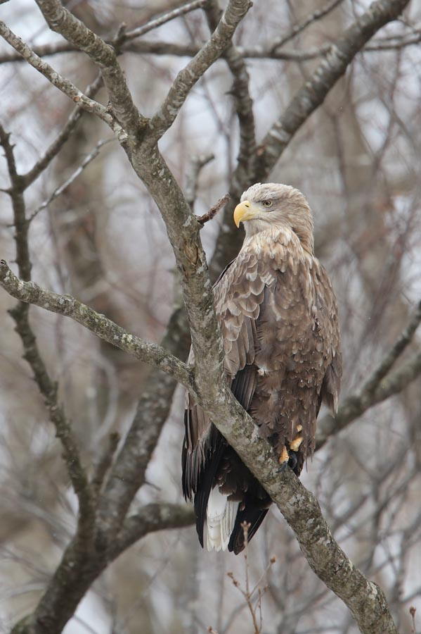



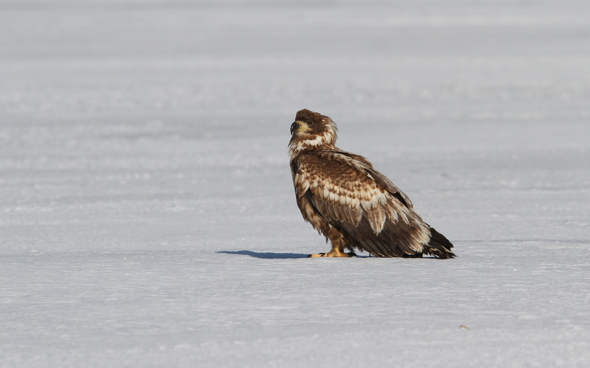



Lorem ipsum

每1年相当于1人类年，y=x+14



* 体长：74-92 cm
* 体重：♂ 3100-5400 g，♀ 3700-6900 g

大而粗壮的海雕。喙较为粗壮，颈部有披针形羽。头颈为驳杂的淡黄色，向后均匀过渡为深褐色。尾白色。眼淡黄色。喙浅黄色；蜡膜淡黄色。足淡黄色，爪黑色。  
亚成鸟WIP

### 飞行

飞行时可见雕典型的“门板”翼 。振翅浅而僵硬。尾长而略成楔形。振翅极为缓慢，常翱翔飞行，翱翔时双翼平举。

### 鸣声

。



* 生境：多样的近水生境，一般海拔较低。在海滨栖息于岩岸、海滨悬崖、海岛、河口、海滨湿地；在内陆栖息于安静的林地，毗邻湖泊、河流、沼泽等淡水湿地，需要大型树木营巢。
* 食物：多样、机会主义。主要为浅水鱼类、水鸟（包括卵和雏鸟），有时捕食兔类等哺乳动物。亦普遍取食腐肉。
* 天敌：

在水面附近飞捕鱼类，偶尔钻入水中；有时涉水捕鱼。擅长突袭水面上的鸟类，反复俯冲逼迫其潜入水中，使其力竭。在水中捕获大型猎物时则用翅膀划水拖到岸上。常盗寄生鹗、鸬鹚、鸥等鸟类，甚至水獭。配偶常协同狩猎。



### 灰脸鵟鹰 _Butastur indicus_



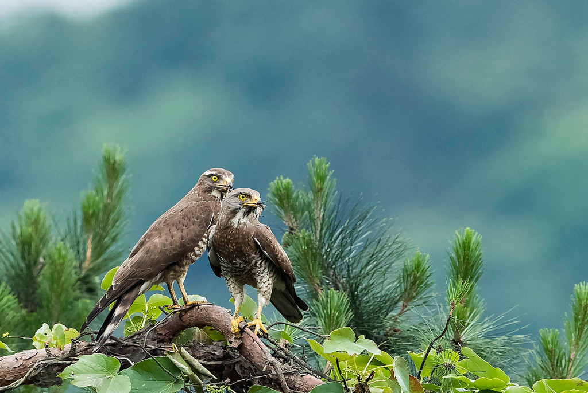



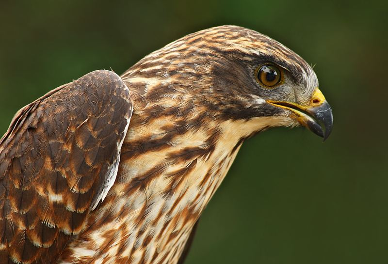



Lorem ipsum

每1年相当于2人类年，y=2x+1



* 体长：39-48 cm
* 体重：♂375-433 g

### 飞行

飞行时可见独特的狭长梯形翼。振翅缓慢。



* 生境：毗邻开阔地的混交林或阔叶林，尤其是在河流、沼泽附近，一般在山脚下。越冬时也出现在树木较稀疏的地带。海平面至2000 m.
* 食物：取决于生境湿润程度，一般为蛙、蜥蜴，或大型昆虫。亦捕食小蛇、蟹、啮齿类。
* 天敌：

主要晨昏狩猎。从视野开阔的栖枝上守株待兔，俯冲到地面捕获猎物。



