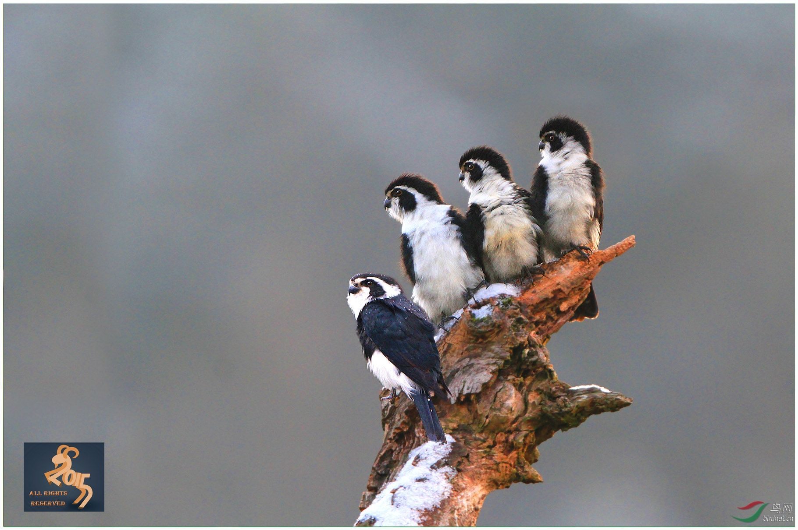

# 隼形目

隼形目是日行猛禽的主要类群之一，具有钩状的喙和敏锐的双目视觉；眉骨突出，能够遮挡强光。掠食性较强的隼形目鸟类还有强健的足、较长的II趾和高度弯曲的爪，用于攫取、制伏、杀死猎物。隼形目隼科的成员为中小型掠食性鸟类，雌大于雄，色彩多变，且某些类群的雌雄色彩差异较大。其中，隼属成员通称“隼”，喙下缘有齿状结构，用于快速杀死猎物；绝大多数隼具有尖形翼，擅长高速、灵活飞行。隼形目鸟类大多为日行性动物，部分晨昏和夜晚亦活跃。

## 1. 隼科

### 白腿小隼 _Microhierax melanoleucos_

Lorem ipsum

每1年相当于4人类年，y=4x+11



* 体长：16-18 cm
* 体重：55-75 g

极小的猛禽，体态短圆。喙短小。冠、后颈、眼周、颊黑色，眉纹、喉白色。背面、胁蓝黑色，翼、尾羽有白点；腹面白色。眼黑色。蜡膜灰绿色；喙铅灰色，远端黑灰色。足暗灰色，爪黑色。

### 飞行

飞行时可见短三角形的翼。飞行有力、振翅迅速，有时长距离滑翔。

### 鸣声

略带颤音的吱吱尖叫，以及低音调的喳喳声。激怒时发出嘶声。



* 生境：平原或低山的落叶、常绿林，尤其是旷地、林缘、河畔林地。海平面至1500米，通常低于1000米。
* 食物：大型昆虫，尤其是蝴蝶、蜻蜓、蚱蜢，以及小型鸟类，偶有小型哺乳动物、蜥蜴、地栖昆虫。
* 天敌：WIP

从视野开阔不受遮蔽的高处栖枝上守株待兔，发现猎物即在空中捕捉，或从花朵、叶片上捕捉。一般在空中进食，若猎物太大则回到栖枝上撕食。有时像典型隼一样俯冲并用后爪击杀大型猎物。



### 红隼 _Falco tinnunculus_











Lorem ipsum

每1年相当于3人类年，y=3x+12



* 体长：27-35 cm
* 体重：♂ 136-252 g，♀ 154-314 g

小而纤细的猛禽。雄鸟头部蓝灰色。背面赤褐色被黑色斑点，尾羽蓝灰色，部分种群有淡横纹；胸腹浅橙色至橙红色布黑色斑点，翼下白色被黑斑。雌鸟冠赤褐色密布黑色纵纹。冠与背面赤褐色密布黑色粗横纹；胸腹浅橙色至橙红色布粗大黑色纵纹，翼下白色被黑斑。雌雄皆具黑色髭纹、黑色飞羽，尾羽次端皆具宽阔黑带。眼周裸皮与蜡膜黄色，眼暗褐色。喙铅灰色，远端黑灰色。足明黄色，爪黑灰色。  
亚成鸟似雌鸟，但黑色纵纹更粗大；蜡膜绿色。

### 飞行

振翅轻快、机械。常在空中散开尾羽悬停觅食，如遇强风甚至能不振翅停于空中。

### 鸣声

WIP



* 生境：类型多样，包括各种海拔的温带草原、半沙漠、苔原、林缘、沼泽、草地，避开密林和平缓的沙漠。
* 食物：主要为啮齿类、幼兔等小型哺乳动物（尤其是田鼠）、小鸟、蜥蜴、昆虫，也捕食蚯蚓、两栖类，偶尔捕食鱼类、螺类或取食腐肉。在猎物缺乏的情况下会取食水果等植物。
* 天敌：WIP

主要在白天捕食，有时晨昏捕食，偶尔夜间。典型的捕食行为为在空中逆风悬停，垂下并展开尾羽，同时扫视四周，发现猎物即俯冲捕食；强风下几乎不振翅即可悬停。其他捕食方式如守株待兔、短距离追逐飞鸟。一般在地面捕获猎物，亦有在空中捕获；小猎物直接食用，大型猎物则带回栖枝食用。会贮藏食物。



### 食蝠隼 _Falco rufigularis_

Lorem ipsum

每1年相当于3人类年，y=3x+12



* 体长：20-30 cm
* 体重：♂108-150 g；♀177-242 g

轮廓，姿态，体貌特征。（头-背面-腹面）基本羽雄鸟；替换羽雄鸟。基本羽雌鸟，替换羽雌鸟。大裸皮；眼-喙-蜡膜-足-爪。  
亚成鸟。



* 生境：热带湿润低地与亚高山森林，以及河畔树林、林地、稀树草原等。海平面至1700米。
* 食物：主要为鸟类、大型昆虫、蝙蝠，有时捕捉啮齿类和爬行类。
* 天敌：WIP

主要在晨昏捕食，天黑后依然持续。常在树顶守株待兔，追逐、俯冲、仰击经过的猎物。主要在空中攫取，有时从树林或灌丛的边缘捕捉，少数从地面或水中攫取。也在树冠或灌丛的低空快速巡航，惊吓猎物；或在高空翱翔，空中攫取大型昆虫或俯冲捕猎低处鸟类。有时盗寄生其他猛禽，如猫头鹰。常在飞行中食用小型猎物。



### 燕隼 _Falco subbuteo_











text

每1年相当于3人类年，y=3x+12



* 体长：28-36 cm
* 体重：♂131-232 g；♀141-340 g

轮廓，姿态，体貌特征。（头-背面-腹面）基本羽雄鸟；替换羽雄鸟。基本羽雌鸟，替换羽雌鸟。大裸皮；眼-喙-蜡膜-足-爪。  
亚成鸟。

### 飞行

飞行时可见隼典型的尖翼，甚窄。飞行迅速、敏捷，振翅有力。常在空中巡航觅食昆虫。

### 鸣声

叫声描述：



* 生境：开阔林地，如林缘、破碎林地、有树林的草原、河畔、灌丛地、有树木的沼泽、湿地。主要在海平面至1500米，有时达到2000-3000米。
* 食物：主要为昆虫，繁殖期和迁徙前转为小型鸟类。偶尔捕食小型哺乳动物，在开阔温带草原有时捕食爬行类。
* 天敌：WIP

主要在低空飞行寻找猎物，平飞、短暂俯冲或短暂U型飞行后攫取猎物；有时在栖枝上守株待兔，或在地面捕食昆虫。在飞行中食用小型猎物。有时劫掠其他小型猛禽的猎物。



### 游隼 _Falco peregrinus_


您不可以创建拟游隼 _F. \(p.\) pelegrinoides_
















Lorem ipsum

每1年相当于2人类年，y=2x+13



* 体长：35-51 cm
* 体重：♂410-1060 g；♀595-1600 g

中-大型隼，体态粗壮。翅长尖，足爪强健。冠深色，从深蓝灰色至暗黑褐色不等，从眼先向下延伸形成宽阔髭纹；有时颈侧亦深色，与髭纹连接形成完整“头盔”。背面深色，与冠一致或偏浅，遍布模糊的横纹；初级飞羽颜色常略深。腹面从白色至红褐色不等，常有细而稀疏的横纹。眼周裸皮中黄色，眼暗褐色。喙铅灰色，远端灰黑色；蜡膜中黄色。足中黄色；爪黑色。  
“kreyenborgi”色型冠与髭纹棕黄色杂灰黑纹，几无“头盔”，有浅色眉纹。背面浅灰色有深灰色横纹，初级飞羽暗灰色。腹面乳白色，几无纹。其余同上。  
亚成鸟头部斑纹模式多变，有时有浅色眉纹和后颈斑块，背面暗褐色，羽缘皮黄色，腹面浅黄褐色遍布浓重褐色斑纹。眼周裸皮与蜡膜蓝灰色，足黄绿色。其余同成鸟。

### 飞行

飞行时可见隼典型的尖翼，相对其他隼略阔。振翅快速、僵硬。

### 叫声

叫声描述：



* 生境：各类温度下的各种生境，需要绝壁、高大树木等营巢地点，偏好开阔地带。通常海平面至1500米，有3000米繁殖和4000米迁徙的记录。
* 食物：几乎完全为鸟类；有时捕食兔类、啮齿类、蝙蝠扥哺乳动物，偶尔捕食两栖爬行类和昆虫，罕有食用鱼类和腐肉。猎物大小取决于性别（个体大小）。
* 天敌：WIP

全天均捕食，配偶常协同捕猎。在峭壁等高栖枝上守株待兔，或盘旋、翱翔寻找猎物。发现猎物后在空中追捕，必要时快速爬升或螺旋上升，通常以30-45°快速俯冲向目标，俯冲距离长短皆有。一般持空拳击打并以后爪钩拽猎物；若成功则抓取或随之落到地面，失败则重新爬升再次俯冲。有时不在俯冲时击打，而是重新爬升后从下侧攻击。有时追逐猎物。偶尔在低空至100米的高空缓慢巡航，惊起猎物。对于水面附近的鸟类，通过一系列短俯冲逼入水中使其力竭。有时徒步捕捉昆虫。







### 猎隼 _Falco cherrug_











Lorem ipsum

每1年相当于2人类年，y=2x+13



* 体长： 47-57 cm
* 体重：♂ 730-950 g，♀ 970-1300 g

中-大型隼，体态略长圆。翅长尖，足爪强健。指名亚种头浅色布褐色细纵纹，有浅色眉纹，后颈有浅色斑块，耳羽褐色，髭纹细。背面纯棕褐色，羽缘浅黄褐色，初级飞羽末端色略深；初级飞羽和尾羽有浅色小斑点。腹面白色，被向后逐渐变大的水滴样褐色斑点。青藏亚种髭纹粗黑，冠、背面赤褐色，密布均匀的黑色横纹，羽缘不黄。腹面白色，下腹被黑色斑点，向后逐渐变为横斑。其余亚种羽色为不同程度介于其间的过渡。眼周裸皮中黄色，眼暗褐色。喙铅灰色，远端灰黑色；蜡膜中黄色。足中黄色；爪黑色。  
"altaicus"色型体色甚深，某些亚成鸟几乎纯黑。其余同上。  
亚成鸟无赤色调，底色常偏深，腹面遍布粗大纵纹；眼周裸皮、足灰蓝色。其余似成鸟。

### 飞行

飞行时可见隼典型的尖翼，略长圆。振翅幅度略小。

### 鸣声

叫描述：



* 生境：开阔、干燥的旷野，有悬崖或零星的高大树木，偏爱森林-草原、草原、半沙漠、平原草地、湿地，有时河畔森林、毗邻开阔地的密林。喜好有一定海拔高度的地区，偏好有悬崖和峡谷的高原山地。海平面至4700米。
* 食物：最主要的食物为小型哺乳类，尤其是啮齿类和兔类，以及鸟类；亦有爬行类，罕有甲虫、两栖类等。
* 天敌：WIP

在高处停栖，寻找猎物，直接低空突袭；或在低空巡航，发现空中的猎物后加速追逐。有时在空中悬停、盘旋，然后俯冲攻击。一般在地面或近地面捕捉猎物，但鸟类也会在低空中捕捉。在空中食用小型猎物，将大型猎物带回栖枝食用。偶尔徒步捕捉甲虫。



