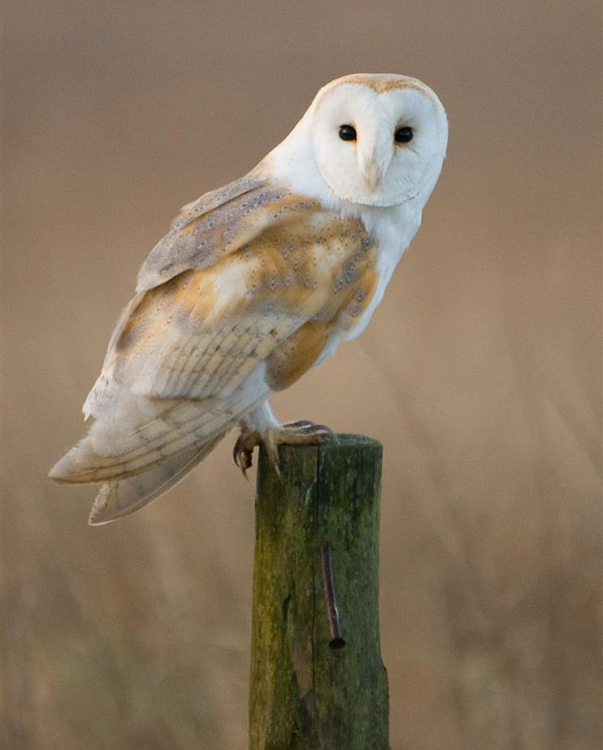

# 鸮形目

鸮形目的成员通称“猫头鹰”，均为掠食性鸟类。猫头鹰的眼睛并列前视，且多半具有由羽毛构成的“脸蛋”，即面盘，许多猫头鹰的头顶有耳状簇羽。大部分猫头鹰为夜行性动物，但也有一些在晨昏甚至白昼活动。 猫头鹰的大小多变，雌大于雄，色彩一般为暗淡的保护色，雌雄色彩相近或相同。大部分猫头鹰的羽毛极其柔软，可以吸收飞行的噪声；飞羽边缘有梳齿状结构，可以将气流打碎，防止飞行时发出响声。夜行性猫头鹰往往具有非常明显的面盘，用于收集声音；一些夜行性猫头鹰的耳上下不对称，可以更好地定位声音的来源。猫头鹰的眼球为柱状，无法转动，作为补偿其颈部极为灵活，可以完成270°的旋转。 

## 1. 草鸮科

### 乌草鸮 _Tyto tenebricosa_

每1年相当于2人类年，y=2x+13



* 体长：37-43 cm
* 体重：♂500-700 g；♀750-1160 g

面盘短圆心形，头和眼甚大而尾甚小。面盘灰色，眼周黑色，有时扩散到整个面盘。通体极深的黑褐色，布有白色小斑点；下腹灰白色。翼、尾有深色横斑。眼黑色。喙粉灰色。足灰色，爪灰黑色。

### 飞行

典型森林猛禽的短圆翼。飞行时足常拖下，长于尾。

### 鸣声

发出“扔炸弹”般下降的哨声，或是电流般的zrrrrrr声，以及类似仓鸮的嘶叫和咂嘴声等。



* 生境：茂密的雨林、云雾森林和湿润桉树林，需要有树洞等营巢场所，偏好山谷老林。 
* 食物：主要为树栖哺乳动物，大小均有，也有小鸟等其他动物
* 天敌：不详。

主要在晚上狩猎，偶尔黄昏活动。少数在树上捕杀猎物的草鸮，实际上几乎完全在树上狩猎而避开旷地。







### 仓鸮 _Tyto alba_


您可以创建仓鸮复合种中的任何种/亚种
















哈兰那……

每1年相当于3人类年，y=3x+12



* 体长：22-44 cm
* 体重：250-700 g

面盘心形。羽色多变；同一种群内部雌性往往颜色较深且斑点较多。除面盘外常通体覆盖白色和黑色的小斑点。浅色类型面盘白色，背面浅黄褐色带灰色蠕纹，腹面白色。深色类型面盘灰褐色，背面暗橙色带褐灰色或灰黑色蠕纹，腹面灰白色或黄褐色。其间有各种过渡状态的中间类型，黑白小斑点的数量和密度也依次不同。眼周深色。眼黑色。喙粉色。足粉黄色至灰粉色，爪褐灰色。

### 飞行

翼长圆。飞行轻盈，有时不规律。飞行时足常拖下，不长于尾。

### 鸣声

叫声描述：



* 生境：各类较为开阔且有稀疏树木的温暖生境，包括草原、湿地、灌丛旷野、开阔林地、河谷峡谷、沙漠等等；脂肪贮存能力差，不耐寒，不能利用寒冷生境。
* 食物：绝大多数为小型啮齿类，偶尔捕捉小鸟、蝙蝠等其他小动物。
* 天敌：。

主要在晚上狩猎，晨昏有时活跃，极偶尔白天活动。在开阔地低空巡航或守株待兔；可以在完全无光的条件下利用听力捕猎。







### 东方草鸮 _Tyto longimembris_

每1年相当于3人类年，y=3x+12



* 体长：♂32-36 cm；♀35-42 cm
* 体重：♂250-375 g；♀320-582 g

整体轮廓较长。翅和足特长，面盘略长，眼略小。面盘从纯白色到栗褐色不等，年轻的鸟颜色较深，眼周黑色。背面鲜艳皮黄色有黑色斑块，覆盖黑白小斑点。腹面皮黄色至黄白色，部分个体覆盖黑色小斑点。眼黑色。喙粉色。足粉色，爪黑褐色。

### 飞行

飞行时足常拖下，明显长于尾。常在草滩上空缓慢飞行、滑行或悬停。

### 鸣声

似仓鸮。



* 生境：海拔1500米以下的灌丛、高草地、开阔草地、稀树草原、草滩湿地，包括农田，偶见于树林。
* 食物：几乎完全为小型啮齿动物，偶尔捕食蛙、蛇等。
* 天敌：。

不采取守株待兔的捕猎方式，而是在低空巡航，利用视觉和听觉寻觅草丛中的猎物。







## 2. 鸱鸮科

### 领角鸮 _Otus lettia_

每1年相当于4人类年，y=4x+11



* 体长：23-25 cm
* 体重：108-170 g

小型猫头鹰，外貌符合经典的“猫头鹰”形象，耳状簇羽明显。

轮廓，姿态，体貌特征。（头-背面-腹面）基本羽雄鸟；替换羽雄鸟。基本羽雌鸟，替换羽雌鸟。大裸皮；眼-喙-蜡膜-足-爪。  
亚成鸟。







### 东方角鸮 _Otus sunia_











每1年相当于4人类年，y=4x+11



* 体长： 17-21 cm
* 体重： 75-95 g

小型猫头鹰，外貌符合经典的“猫头鹰”形象，耳状簇羽明显。有灰色型和红色型。灰色型遍布棕灰色均匀蠕纹，部分羽轴黑色，其腹部羽轴尤粗大，眉纹、肩羽远端和下腹白色。红色型以鲜艳砖红色取代棕灰色，背部羽轴略浅，其余同灰色型。眼浅黄色。喙黑灰色。足粉灰色；爪灰色。

### 飞行

1

### 鸣声

反复发出有节奏的空洞kru-krukru或kro-krokro三声（部分种群为四声），有时带颤音。







### 雕鸮 _Bubo bubo_



* 体长：58-71 cm
* 体重：1550-2800 g；♀2280-4200 g

大型猛禽，躯干似桶状，耳状簇羽极为明显，外貌符合经典的“猫头鹰”形象。色彩极其多变，从浅乳白到暗灰褐色均有。面盘明显，有或无深色外缘，耳状簇羽有浓郁黑色；眉突出，显得表情凶恶。背面布深浅粗细不均的蠕纹，羽轴色深，呈拖纵纹的黑色斑点或单纯黑色纵纹样，肩羽外缘或略为浅色；喉浅色，颈下侧常有洁白斑块，胸腹密布鱼骨样斑纹，缀有上密下疏的粗大黑色纵纹。眼中黄色至橙红色。喙灰黑色。足密被羽，爪黑色。

### 飞行

振翅轻柔，飞行迅速，长距离飞行时常滑翔；偶尔翱翔飞行。

### 鸣声

雄鸟鸣唱为低沉、模糊的“乌误”，雌鸟鸣唱似雄鸟，但音调更高、两个音节分界更清晰；告警为嘶哑如丑角奸笑的“嘿嘿嘿”和咂嘴声。







### 黄脚渔鸮 _Ketupa flavipes_



* 体长：48-58 cm
* 体重：1800-2200 g

大型猫头鹰，外貌符合经典的“猫头鹰”形象，耳状簇羽明显。

轮廓，姿态，体貌特征。（头-背面-腹面）基本羽雄鸟；替换羽雄鸟。基本羽雌鸟，替换羽雌鸟。大裸皮；眼-喙-蜡膜-足-爪。  
亚成鸟。裸部。

### 飞行

WIP

### 鸣声

叫声描述：







### 灰林鸮 _Strix nivicolum_

每1年相当于2人类年，y=2x+13



* 体长：35-40 cm
* 体重：375-392 g

体型“矮胖”，面盘明显，形似切开的苹果，无耳状簇羽。

轮廓，姿态，体貌特征。（头-背面-腹面）基本羽雄鸟；替换羽雄鸟。基本羽雌鸟，替换羽雌鸟。大裸皮；眼-喙-蜡膜-足-爪。  
亚成鸟。裸部。

### 飞行

WIP

### 鸣声

叫声描述：







### 花头鸺鹠 _Glaucidium passerinum_

每1年相当于4人类年，y=4x+11



* 体长：15-19 cm
* 体重：♂47-72 g；♀67-83 g

轮廓，姿态，体貌特征。（头-背面-腹面）基本羽雄鸟；替换羽雄鸟。基本羽雌鸟，替换羽雌鸟。大裸皮；眼-喙-蜡膜-足-爪。

### 飞行

WIP

### 鸣声

叫声描述：



* 生境：开阔针叶林、混交林。
* 食物：以田鼠为主的小型哺乳类、小型鸟类。
* 天敌：WIP

text



### 斑头鸺鹠 _Glaucidium cuculoides_

斑头鸺鹠是哈兰那的森林里最常见的居民之一。

每1年相当于4人类年，y=4x+11



* 体长：22-25 cm
* 体重：♂150-176 g；♀约240 g

轮廓，姿态，体貌特征。（头-背面-腹面）基本羽雄鸟；替换羽雄鸟。基本羽雌鸟，替换羽雌鸟。大裸皮；眼-喙-蜡膜-足-爪。  
亚成鸟。裸部。

### 飞行

WIP

### 鸣声

叫声描述：



* 生境：开阔的亚高山或高山松-栎林、低地亚热带常绿林。一般低于2100米，有时至2700米。
* 食物：以甲虫、蝗虫等大型昆虫为主，有时捕食小型哺乳类、蛙类、蜥蜴和小型鸟类。
* 天敌：

基本为日行动物。



### 纵纹腹小鸮 _Athene noctua_

每1年相当于4人类年，y=4x+11



* 体长：22-25 cm
* 体重：♂150-176 g；♀约240 g

轮廓，姿态，体貌特征。（头-背面-腹面）基本羽雄鸟；替换羽雄鸟。基本羽雌鸟，替换羽雌鸟。大裸皮；眼-喙-蜡膜-足-爪。

### 飞行

WIP

### 鸣声

叫声描述：







### 短耳鸮 _Asio flammeus_



* 体长：
* 体重：

轮廓，姿态，体貌特征。（头-背面-腹面）基本羽雄鸟；替换羽雄鸟。基本羽雌鸟，替换羽雌鸟。大裸皮；眼-喙-蜡膜-足-爪。  
亚成鸟。







### 长耳鸮 _Asio otus_



* 体长：
* 体重：

轮廓，姿态，体貌特征。（头-背面-腹面）基本羽雄鸟；替换羽雄鸟。基本羽雌鸟，替换羽雌鸟。大裸皮；眼-喙-蜡膜-足-爪。  
亚成鸟。







