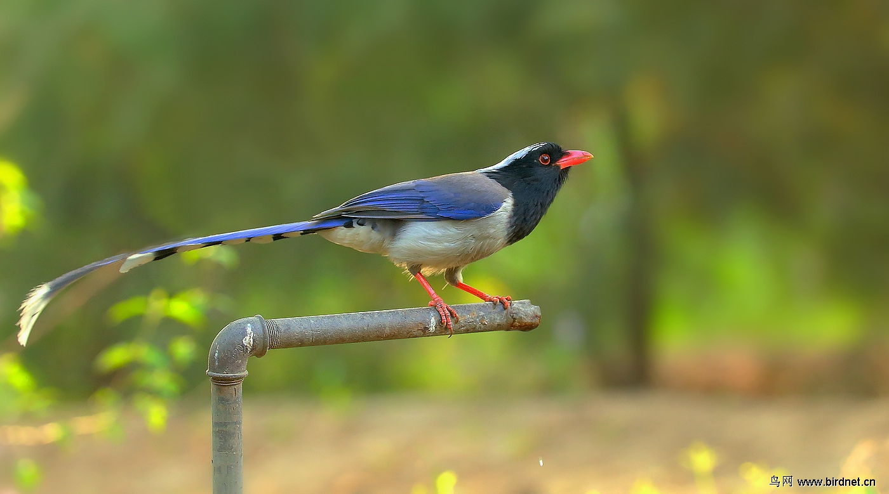
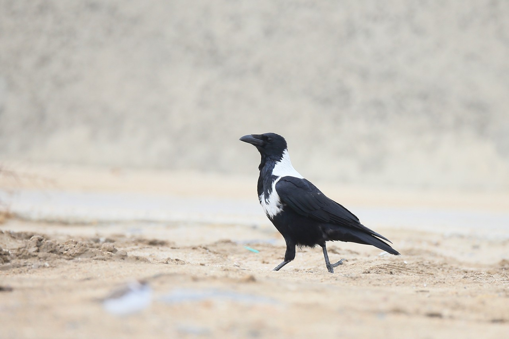

# 雀形目

雀形目是现生鸟类中最为繁盛的类群。VOLAMUS目前仅开放鸦科部分鸟类。

## 1. 鸦科

### 红嘴蓝鹊 _Urocissa erythroryncha_

红嘴蓝鹊



* 体长：53-68 cm
* 体重：♂145-192 g；♀106-155 g

纤细鹊类，具极长的楔形尾。头、颈、上胸黑色，冠蓝白色并延伸至后颈。背蓝灰色，翼、尾宝蓝色，飞羽外缘白色，尾上覆羽末端黑色，尾羽末端白色，次端黑色。腹面白色。眼橙色。喙红色，上喙基部被羽。足红色；爪褐色。  
亚成鸟。裸部。

### 飞行

WIP

### 鸣声

叫声描述：



* 生境：
* 食物：
* 天敌：



### 喜鹊 _Pica pica_


您可以创建欧亚喜鹊复合种中的任何种/亚种，但不包括马格里布喜鹊 _P. mauritanica_和阿拉伯喜鹊 _P. asirensis_


喜鹊生活在几乎任何地方。WIP



* 体长：45-50 cm
* 体重：185-268 g

黑白分明的醒目鸟类，尾长楔形。头、颈、上胸黑色。背黑色，肩羽洁白，初级飞羽白色有黑色外缘，除初级飞羽外翼上金属蓝色，尾金属绿色。腹洁白，除初级飞羽外翼下黑色，臀黑色。眼黑色。喙灰黑色，上喙基部被羽。足灰色，爪黑色。

### 飞行

WIP

### 鸣声

多变。典型鸣叫为沙哑的“喳喳”。



* 生境：
* 食物：
* 天敌：







### 寒鸦 _Coloeus monedula_



* 体长： cm
* 体重： g

轮廓紧凑，喙粗短。（头-背面-腹面）大裸皮；眼-喙-蜡膜-足-爪。  
亚成鸟。裸部。

### 飞行

WIP

### 叫声

典型鸣叫为







### 

### 小嘴乌鸦 _Corvus corone_



* 体长： cm
* 体重： g

大型鸟类。通体黑色有金属光泽。眼黑色。喙黑色，上喙基部被羽。足灰色；爪黑色。

### 飞行

翅圆钝，有翼指；尾扇形。振翅平缓、节奏均匀，飞行路线笔直。

### 叫声

典型鸣叫为沙哑凄厉的“啊、啊”。







### 白颈鸦 _Corvus torquatus_



* 体长：50-55 cm
* 体重：347-512 g

大型鸟类，似小嘴乌鸦。后颈白色，向下胸延伸为一条闭合白环；其余通体黑色有金属光泽。眼黑色。喙黑色，上喙基部被羽。足灰色；爪黑色。  
亚成鸟“白颈”常带污浊灰色或褐色斑，羽毛无金属光泽，其余同成鸟。

### 飞行

WIP

### 鸣声

WIP







### 渡鸦 _Corvus corax_



* 体长：58-69 cm
* 体重：585-2000 g

最大的鸦科鸟类。喙粗而长，喉部有披针状羽毛，头顶略成三角形。通体黑色有金属光泽。眼黑色。喙黑色，上喙基部被羽。足灰色；爪黑色。

### 飞行

翅明显长于其他鸦鹊而略成长三角形，有翼指；尾楔形。常翱翔飞行。

### 叫声

极为多变。典型鸣叫粗粝沉闷，与乌鸦的嘹亮鸣叫有差异。











