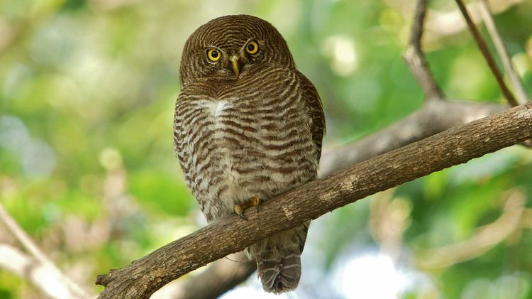

## 鸮形目 STRIGIFORMES

鸮形目的成员统称“猫头鹰”，均为掠食性鸟类。猫头鹰的眼睛并列前视，且多半具有由羽毛构成的“脸蛋”，即面盘，许多猫头鹰的头顶有耳状簇羽。大部分猫头鹰为夜行性动物，但也有一些猫头鹰在晨昏甚至白昼活动。 猫头鹰的大小多变，但色彩一般为暗淡的保护色，雌雄色彩相近或相同。大部分猫头鹰的羽毛极其柔软，可以吸收飞行的噪声；飞羽边缘有梳齿状结构，可以将气流打碎，防止飞行时发出响声。夜行性猫头鹰往往具有非常明显的面盘，用于收集声音；一些夜行性猫头鹰的耳上下不对称，可以更好地定位声音的来源。猫头鹰的眼球为柱状，无法转动，作为补偿其颈部极为灵活，可以完成270°的旋转。 猫头鹰为单配制鸟类，一部分终生结对，一部分每年更换新配偶。所有的猫头鹰都不搭建复杂的鸟巢，而是利用石缝、树洞、草窠、人类建筑物或其他鸟类的旧巢繁殖。 

### 1. 草鸮科 TYTONIDAE

#### 乌草鸮 _Tyto tenebricosa_



* 体长：37-43 cm
* 体重：♂500-700 g；♀750-1160 g

相较其他草鸮头和眼甚大而尾甚小。面盘灰色，眼周黑色有时扩散到整个面盘。通体极深的黑褐色，布有白色小斑点，下腹灰白色但站立时不显。眼黑色，喙粉灰色，足灰色，爪灰黑色。

#### 飞行

WIP

#### 叫声

发出“扔炸弹”般下降的鸣声，或是电流般的zrrrrrr声，以及类似仓鸮的嘶叫和咂嘴声等。



* 生境：茂密的雨林、云雾森林和湿润桉树林，需要有树洞等营巢场所，偏好山谷老林。 
* 食物：主要为树栖哺乳动物，大小均有，也有小鸟等其他动物
* 天敌：不详。

昼伏夜出，偶尔黄昏活动。少数在树上捕杀猎物的草鸮，实际上几乎完全在树上捕猎而避开旷地。







#### 仓鸮 _Tyto alba_


您可以创建仓鸮复合种中的任何种/亚种


















* 体长：22-44 cm
* 体重：250-700 g

羽色多变；同一种群内部雌性往往颜色较深且斑点较多，可能与性选择有关。除面盘外常通体覆盖白色和黑色的小斑点。浅色类型面盘白色，背面浅黄褐色带灰色蠕纹，腹面白色；深色类型面盘灰褐色，背面暗橙色带褐灰色或灰黑色蠕纹，腹面灰白色或黄褐色。其间有各种中间类型，黑白小斑点的数量和密度也随种群不同而不同。眼周深色。眼黑色，喙粉色，足粉黄色至灰粉色，爪褐灰色。

#### 飞行

WIP

#### 叫声

叫声描述：



* 生境：各类较为开阔且有稀疏树木的温暖生境，包括草原、湿地、灌丛旷野、开阔林地、河谷峡谷、沙漠等等；脂肪贮存能力差，不耐寒，不能利用寒冷生境。
* 食物：绝大多数为小型啮齿类，偶尔捕捉小鸟、蝙蝠等其他小动物。
* 天敌：。

昼伏夜出，晨昏偶见，偶尔白天飞行。在开阔地低空巡航或守株待兔；可以在完全无光的条件下利用听力捕猎。少数非繁殖期依然使用鸟巢休息的鸟类。







#### 东方草鸮 _Tyto longimembris_



* 体长：♂32-36 cm；♀35-42 cm
* 体重：♂250-375 g；♀320-582 g

整体轮廓较长，翅和足特长。面盘略长，从纯白色到棕褐色不等，年轻的鸟颜色较深；眼相对小，眼周黑色。背面鲜艳皮黄色有黑色斑块，覆盖黑白小斑点，腹面皮黄色至黄白色，部分个体覆盖黑色小斑点。眼黑色，喙粉色，足粉色，常因泥土呈褐色，爪黑褐色。

#### 飞行

飞行时足明显拖于尾后。常在草滩上空缓慢飞行、滑行或悬停。

#### 叫声

叫声描述：



* 生境：海拔1500米以下的灌丛、高草地、开阔草地、稀树草原、草滩湿地，包括农田，偶见于树林。
* 食物：几乎完全为小型啮齿动物，偶尔捕食蛙、蛇等。
* 天敌：。

昼伏夜出，白天在深草中休息，受惊则飞出一段距离，然后再次躲入草丛。不采取守株待兔的捕猎方式，而是在低空巡航，利用视觉和听觉寻觅草丛中的猎物。







#### 

### 2. 鸱鸮科 STRIGIDAE

#### 东方角鸮 _Otus sunia_













* 体长： 17-21 cm
* 体重： 75-95 g

小型猫头鹰，外貌符合经典的“猫头鹰”形象，耳状簇羽明显。有灰色型和红色型。灰色型遍布棕灰色均匀蠕纹，部分羽轴黑色，其腹部羽轴尤粗大，眉纹、肩羽远端和下腹白色。红色型以鲜艳砖红色取代棕灰色，背部羽轴略浅，其余同灰色型。眼浅黄色，喙黑灰色，足粉灰色被羽，爪灰色。

#### 飞行

1

#### 叫声

反复发出有节奏的空洞kru-krukru或kro-krokro三声（部分种群为四声），有时带颤音。







#### 雕鸮 _Bubo bubo_

#### 黄脚渔鸮 _Ketupa flavipes_











#### 花头鸺鹠 _Glaucidium passerinum_



* 体长：15-19 cm
* 体重：♂47-72 g；♀67-83 g

轮廓，姿态，体貌特征。（头-背面-腹面）基本羽雄鸟；替换羽雄鸟。基本羽雌鸟，替换羽雌鸟。大裸皮；眼-喙-蜡膜-足-爪。  
亚成鸟。裸部。

#### 飞行

WIP

#### 叫声

叫声描述：



* 生境：开阔针叶林、混交林。
* 食物：以 田鼠为主的小型哺乳类、小型鸟类。
* 天敌：WIP

text



#### 斑头鸺鹠 _Glaucidium cuculoides_



* 体长：22-25 cm
* 体重：♂150-176 g；♀约240 g

轮廓，姿态，体貌特征。（头-背面-腹面）基本羽雄鸟；替换羽雄鸟。基本羽雌鸟，替换羽雌鸟。大裸皮；眼-喙-蜡膜-足-爪。  
亚成鸟。裸部。

#### 飞行

WIP

#### 叫声

叫声描述：



* 生境：开阔的亚高山或高山松-栎林、低地亚热带常绿林。一般低于2100米，有时至2700米。
* 食物：以甲虫、蝗虫等大型昆虫为主，有时捕食小型哺乳类、蛙类、蜥蜴和小型鸟类。
* 天敌：

基本为日行动物。



#### 纵纹腹小鸮 _Athene noctua_



* 体长：22-25 cm
* 体重：♂150-176 g；♀约240 g

轮廓，姿态，体貌特征。（头-背面-腹面）基本羽雄鸟；替换羽雄鸟。基本羽雌鸟，替换羽雌鸟。大裸皮；眼-喙-蜡膜-足-爪。  
亚成鸟。裸部。

#### 飞行

WIP

#### 叫声

叫声描述：







#### 北鹰鸮 _Ninox japonica_



* 体长：29-33 cm
* 体重：♂平均167.5 g；♀平均168.2 g

轮廓，姿态，体貌特征。（头-背面-腹面）基本羽雄鸟；替换羽雄鸟。基本羽雌鸟，替换羽雌鸟。大裸皮；眼-喙-蜡膜-足-爪。  
亚成鸟。裸部。

#### 飞行

WIP

#### 叫声

叫声描述：



* 生境：偏好有高大树木的低地阔叶落叶或常绿林，常在林缘活动。海平面至海拔1700米。
* 食物：几乎完全为无脊椎动物，尤其是甲虫、蝗虫和蛾。有时捕食蛙类、蜥蜴、鼠类、小型蝙蝠等。
* 天敌：wip



#### 短耳鸮 _Asio flammeus_

#### 长耳鸮 _Asio otus_










