## 鹰形目 ACCIPITRIFORMES

鹰形目囊括了除隼以外的所有日行猛禽。鹰形目的成员形态多样，WIP

### 1. 鹗科 PANDIONIDAE

#### 鹗 _Pandion haliaetus_ sensu lato


您可以创建东方鹗 _P. \(h.\) cristatus_


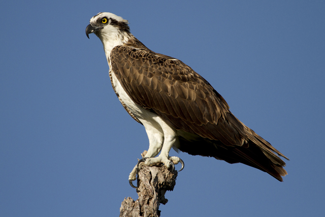

text



* 体长：50-66 cm
* 体重：♂990-1800 g；♀1200-2050 g

轮廓，姿态，体貌特征。（头-背面-腹面）基本羽雄鸟；替换羽雄鸟。基本羽雌鸟，替换羽雌鸟。大裸皮；眼-喙-蜡膜-足-爪。  
亚成鸟。裸部。

#### 飞行

WIP

#### 叫声

叫声描述：



* 生境：清澈、流动缓慢的各类水体，偏好有遮蔽的海湾、河口、红树林、潟湖。
* 食物：几乎完全为浅水鱼类，通常重100-300 g，最大记录 2 kg. 基本不取食腐肉；在极其偶然的情况下捕捉其他小型动物和伤病动物。
* 天敌：WIP

在空中翱翔、盘旋、滑翔、短暂悬停寻找猎物，经过几次试探性俯冲后，伸爪向前、收拢翅膀，俯冲入水攫取鱼类，然后从水中直接向上复飞。



### 2. 鹰科 ACCIPTRIDAE

#### 黑翅鸢 _Elanus caeruleus_



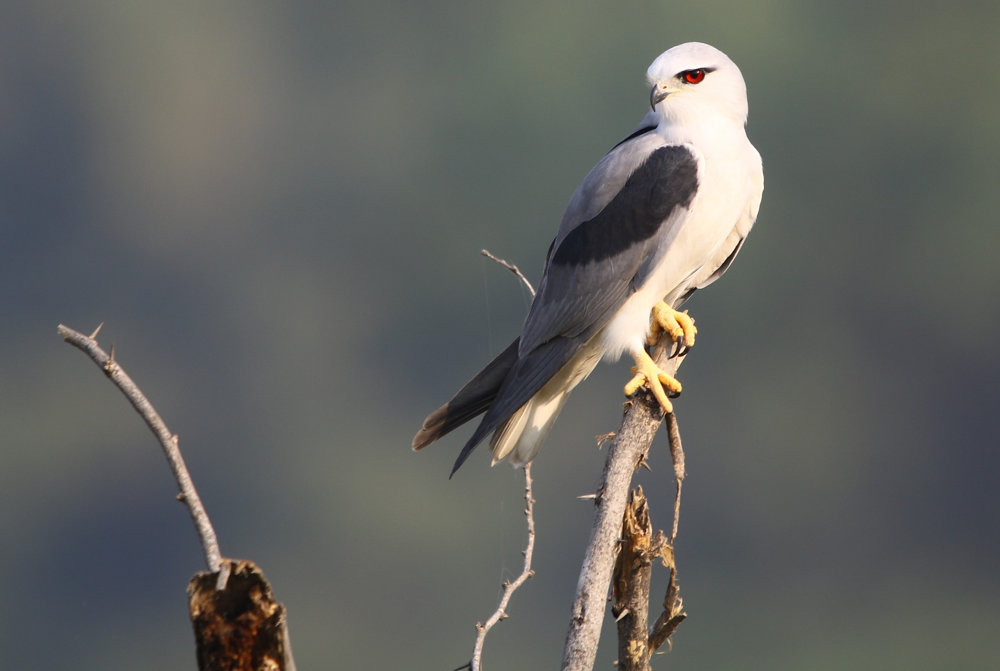



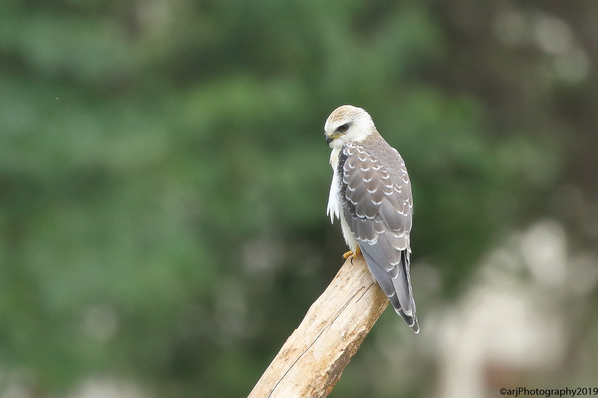



黑翅鸢是哈兰那的古老居民。近年来，随着伊苏里亚的征服，一些黑翅鸢迁移到了伊苏里亚。



* 体长：30-37 cm
* 体重：♂197-277 g；♀279-343 g

轮廓，姿态，体貌特征。（头-背面-腹面）基本羽雄鸟；替换羽雄鸟。基本羽雌鸟，替换羽雌鸟。大裸皮；眼-喙-蜡膜-足-爪。  
亚成鸟。裸部。

#### 飞行

WIP

#### 叫声

叫声描述：



* 生境：有稀少树木的开阔草原、草地，林缘、林间空地，河畔林地，临近的沙漠。
* 食物：绝大部分为小型哺乳动物，尤其是90 g左右的啮齿类；部分地区常捕食小型地栖鸟类。其他猎物如蝙蝠、昆虫、蛙、蜥蜴等。
* 天敌：WIP

晨昏捕猎。一种捕猎方式为在树枝、树桩等高处守株待兔。另一种典型方式为在空中悬停，间或滑翔或试探性俯冲，锁定猎物后即俯冲下伸爪攫取。有时如鹞般举翼低空巡航，惊起昆虫。







#### 蛇雕 _Spilornis cheela_

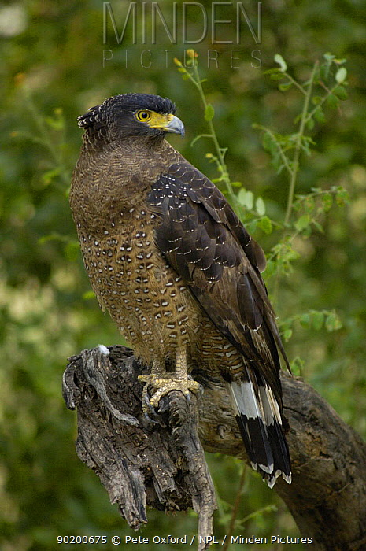

text



* 体长：50-74 cm
* 体重：420-1800 g

轮廓，姿态，体貌特征。（头-背面-腹面）基本羽雄鸟；替换羽雄鸟。基本羽雌鸟，替换羽雌鸟。大裸皮；眼-喙-蜡膜-足-爪。  
亚成鸟。裸部。

#### 飞行

WIP

#### 叫声

叫声描述：



* 生境：包括常绿-落叶、湿润-干燥、低地-山地、初生-次生等各类森林、林地；稀树草原、河谷、红树林沼泽。
* 食物：主要为树栖蛇类，亦捕食蜥蜴、蛙、蟹、鱼类和小型啮齿类，偶尔捕捉伤病鸟类。
* 天敌：。

在空地或河流附近的树上静止不动，守株待兔。



#### 白背兀鹫 _Gyps bengalensis_



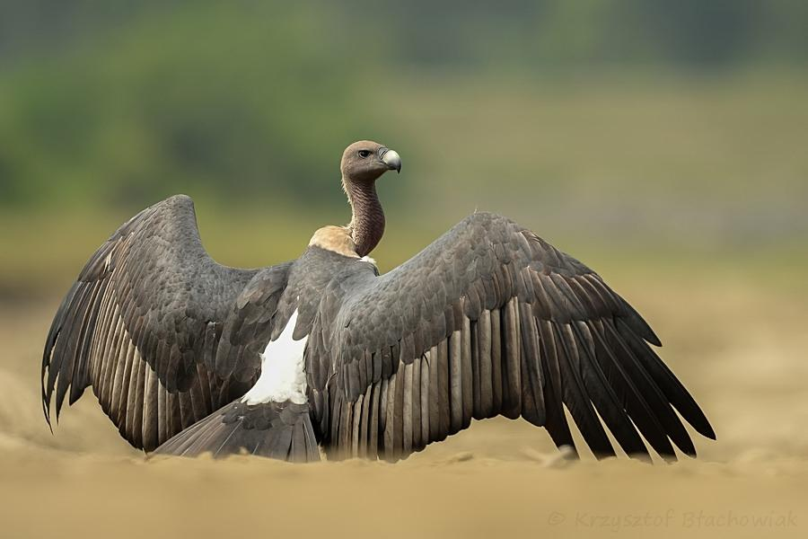



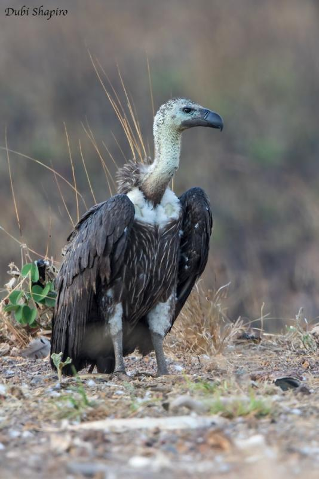



text



* 体长：76-93 cm
* 体重：3500-6000 g

轮廓，姿态，体貌特征。（头-背面-腹面）基本羽雄鸟；替换羽雄鸟。基本羽雌鸟，替换羽雌鸟。大裸皮；眼-喙-蜡膜-足-爪。  
亚成鸟。裸部。

#### 飞行

WIP

#### 叫声

叫声描述：



* 生境：
* 食物：
* 天敌：不详



#### 黑冠鹃隼 _Aviceda leuphotes_

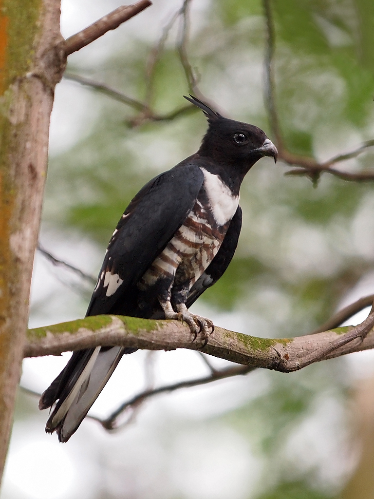

text



* 体长：28-35 cm
* 体重：168-224 g

轮廓，姿态，体貌特征。（头-背面-腹面）基本羽雄鸟；替换羽雄鸟。基本羽雌鸟，替换羽雌鸟。大裸皮；眼-喙-蜡膜-足-爪。  
亚成鸟基本同成鸟，仅颜色略黯淡，且喉部有白色纵纹。

#### 飞行

WIP

#### 叫声

叫声描述：



* 生境：常绿或落叶林、竹林的林缘和开阔地，尤其是低山丘陵与溪流附近。
* 食物：大型昆虫、蜥蜴、树蛙；偶尔捕捉蝙蝠、小型地栖息哺乳类、小鸟。
* 天敌：。

黄昏或阴天活动。守株待兔，有时进行短暂的悬停，然后落到地面或在空中攫取猎物，亦在植被间穿梭捕猎。有时协同捕猎。



#### 丽鹰雕 _Spizaetus ornatus_



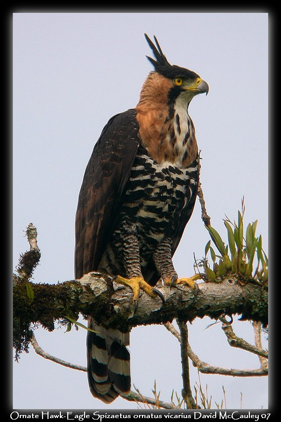



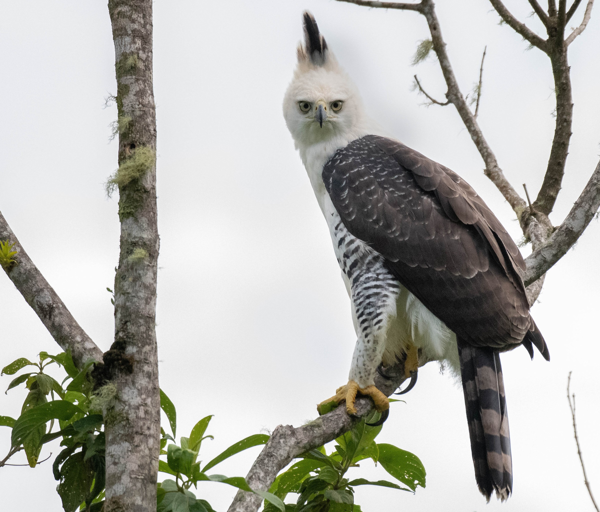



丽鹰雕一度生活在哈兰那的西南一隅，WIP



* 体长：56-67 cm
* 体重：♂906-1132 g；♀1200-1738 g

轮廓，姿态，体貌特征。（头-背面-腹面）基本羽雄鸟；替换羽雄鸟。基本羽雌鸟，替换羽雌鸟。大裸皮；眼-喙-蜡膜-足-爪。  
亚成鸟。

#### 飞行

WIP

#### 叫声

叫声描述：



* 生境：高大的热带、亚热带湿润森林，尤其是原生林；部分地区偏好林缘、河畔等空地。偶尔在较为低矮的沼泽森林。
* 食物：大型动物，主要为大型鸟类，亦包括哺乳类、大型蜥蜴等。
* 天敌：不详

在林间捕猎。一般守株待兔，在树枝间短距离切换，或隐藏在树冠下，俯冲捕猎地面或树上的猎物，或在树枝间追猎。



#### 林雕 _Ictinaetus malaiensis_



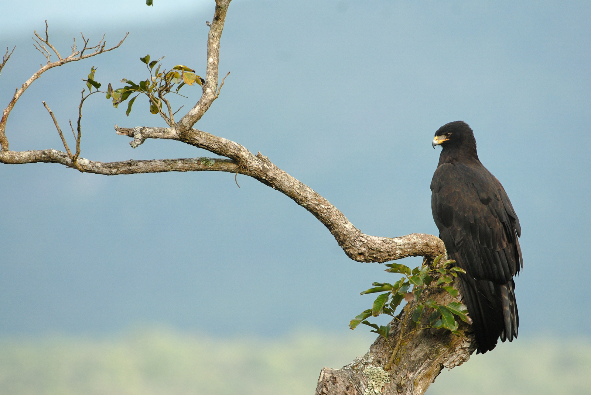







林雕是哈兰那王国古老的统治者，可考的历史就长达数百年——甚至有传言说他们是这片土地千年前就命定的君主。然而，命定的君主并非仁慈的君主。WIP



* 体长：65-80 cm
* 体重：1000-1600 g

。

#### 飞行

剪影似鸢。翼远端宽于近端。

#### 叫声

叫声描述：



* 生境：低山与高山的常绿林与湿润落叶林，尤其是森林河谷。
* 食物：特化的劫巢者，取食巢中的卵、幼鸟和亲鸟，也捕食鸟类、小哺乳类、蜥蜴、蛙、大型昆虫。
* 天敌：不详

配偶常成对捕猎。在接近树冠或草地或山洞洞口的空中缓慢翱翔盘旋，俯冲入植被或到地面，有时在树枝上攀援。时常将整个巢攫走取食。



#### 凤头鹰 _Accipiter trivirgatus_



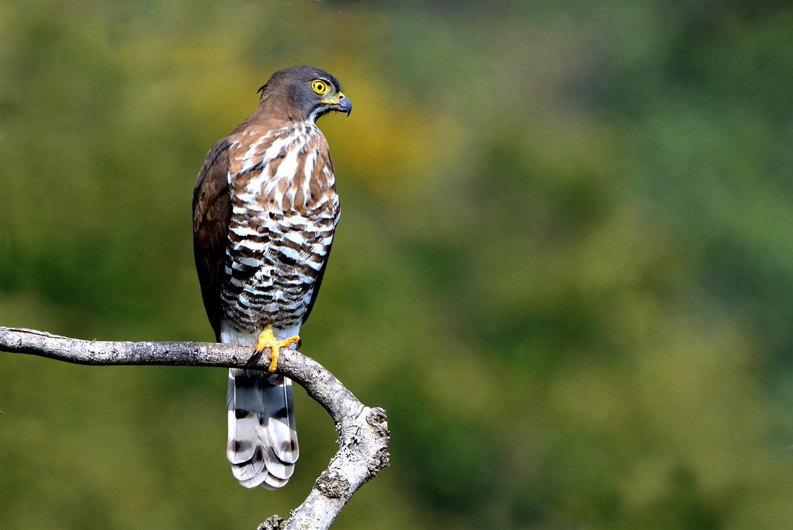







哈兰那……



* 体长：30-46 cm
* 体重：224-450 g

。

#### 飞行

似鸢。WIP

#### 叫声

叫声描述：



* 生境：常绿或落叶林，包括湿润低地、低山与高山，偏好驳杂开阔地的林地。一般分布于海平面至1800米，偶尔达2400米。
* 食物：主要为小型鸟类、蜥蜴、小型哺乳类，亦有蛙、大型昆虫等，取决于个体大小。
* 天敌：不详

从隐蔽的栖枝上守株待兔，俯冲至地面或树枝捕猎，或在空中追逐。有时袭击洞穴蝙蝠。



#### 赤腹鹰 _Accipiter soloensis_



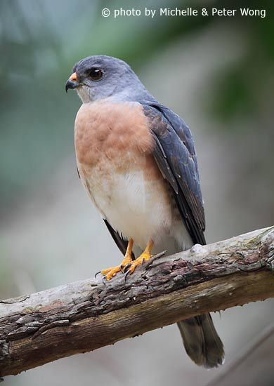



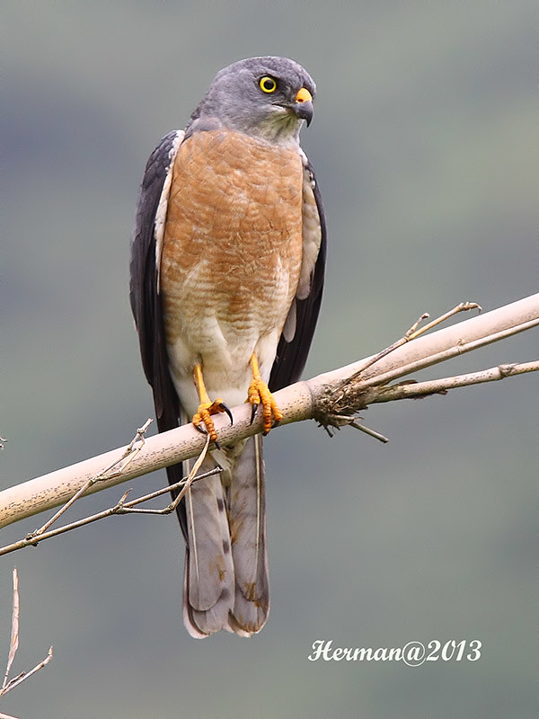



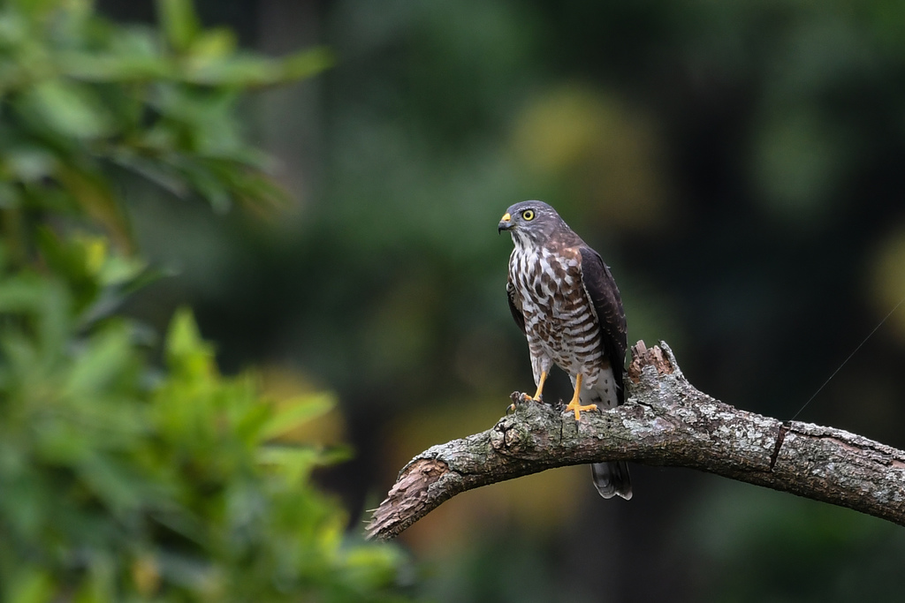



赤腹鹰体型娇小，text



* 体长：25-35 cm
* 体重：♂106-140；♀125-204 g

。

#### 飞行

WIP

#### 叫声

叫声描述：



* 生境：主要为低地和低山的开阔森林、林地，甚至灌丛，通常靠近沼泽。海平面至1500米，一般低于1000米。
* 食物：繁殖期以蛙类为主，越冬期以大型昆虫和小型鸟类为主。其他如蜥蜴，偶有小型哺乳动物、小鱼、虾蟹。
* 天敌：不详

主要在栖枝上守株待兔，在地面或浅水中捕杀猎物；也在湿地或开阔林地的低空飞行、滑翔或盘旋寻找猎物。偶尔悬停。



#### 苍鹰 _Accipiter gentilis_


您可以创建美洲苍鹰 _A. \(g.\) atricapillus_




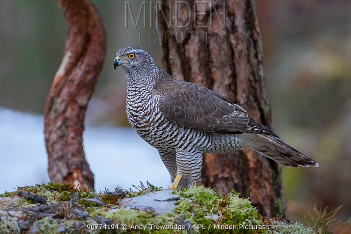



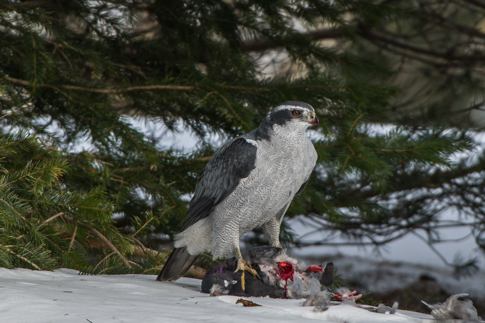



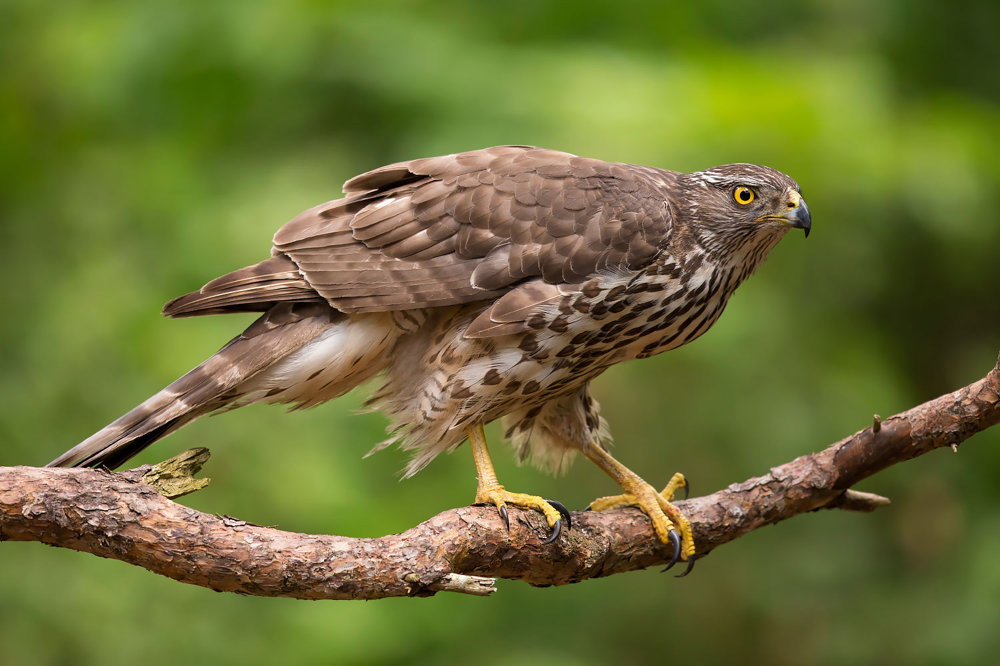



WIP



* 体长：46-63 cm
* 体重：♂517-1110 g；♀758-2200 g

大型鹰，体态粗壮，翅长圆，跗跖与足强壮。有白色眉纹，耳羽纯色或有细纹；背面灰褐色至灰白色至蓝黑色，腹面灰白色有深色细横纹，有时间杂深色羽轴形成的纵纹。美洲种群腹面横纹常细腻如蠕纹。眼浅黄色至暗红色。喙铅灰色，远端黑色；蜡膜中黄色。足中黄色，爪黑色。  
亚成鸟wip。

#### 飞行

飞行时可见森林猛禽典型的圆翼。WIP

#### 叫声

叫声描述：



* 生境：高大森林或林地，主要是针叶林，亦包括混交林、阔叶林；偏好林缘、空地、溪流等开阔地带，或破碎化森林、有树木的温带草原。冬季亚成鸟常出现于开阔灌丛。海平面至3000米，常垂直迁徙。
* 食物：主要为中型鸟类和哺乳动物，包括其他猛禽；有时捕食蜥蜴。罕有甲虫、腐肉。
* 天敌：

从隐蔽的栖枝守株待兔；或沿着林缘等较为隐蔽的地带巡航，追踪猎物后追逐捕猎。或在高处翱翔、滑翔，随后俯冲。可在空中、地面或树上猎杀猎物。



* 求偶：
* 繁殖周期：1年1次
* 巢：
* 窝卵数：
* 孵化期：
* 丰羽期：



#### 雀鹰 _Accipiter nisus_



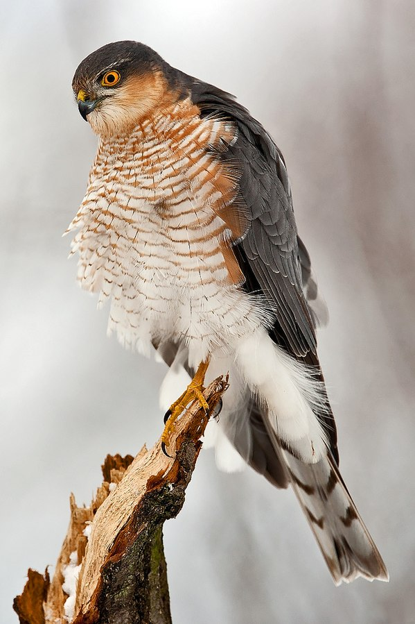



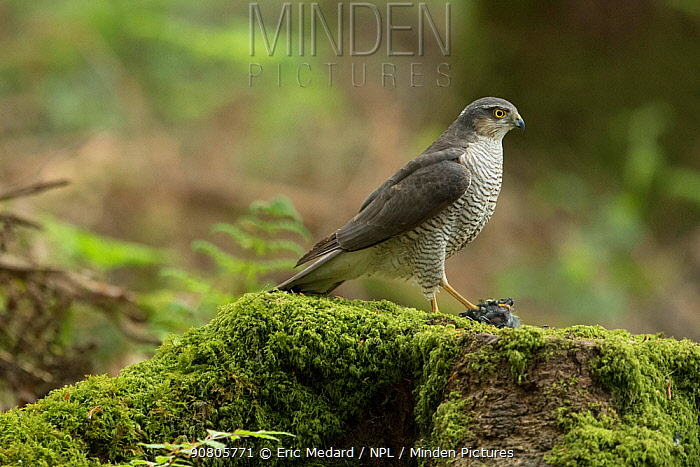



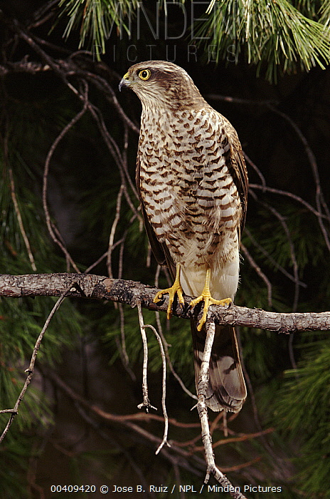



text



* 体长：28-40 cm
* 体重：♂105-196 g；♀185-350 g



* 生境：各种类型的林地，偏好针叶或混交林，周边需要有可供捕猎的开阔地。常在溪流边。海平面至4500米。
* 食物：几乎完全为小型鸟类，尤其是地面觅食的群居鸟类，田鼠丰富时亦大量捕食田鼠；其他食物类型则极为罕见，如小型哺乳类、蜥蜴、昆虫、腐肉。有时捕捉群飞的鞘翅目昆虫。
* 天敌：WIP

在一连串隐蔽的栖枝间守株待兔偷袭，或沿灌丛、溪流低空巡航，伸爪攫取沿途栖止或惊飞的小鸟。亦在空中、树丛或地面追捕小鸟。偶尔翱翔后俯冲捕猎。常反复造访猎物丰富的地点。



#### 白腹海雕



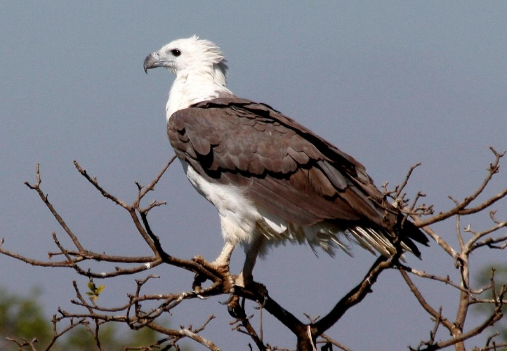



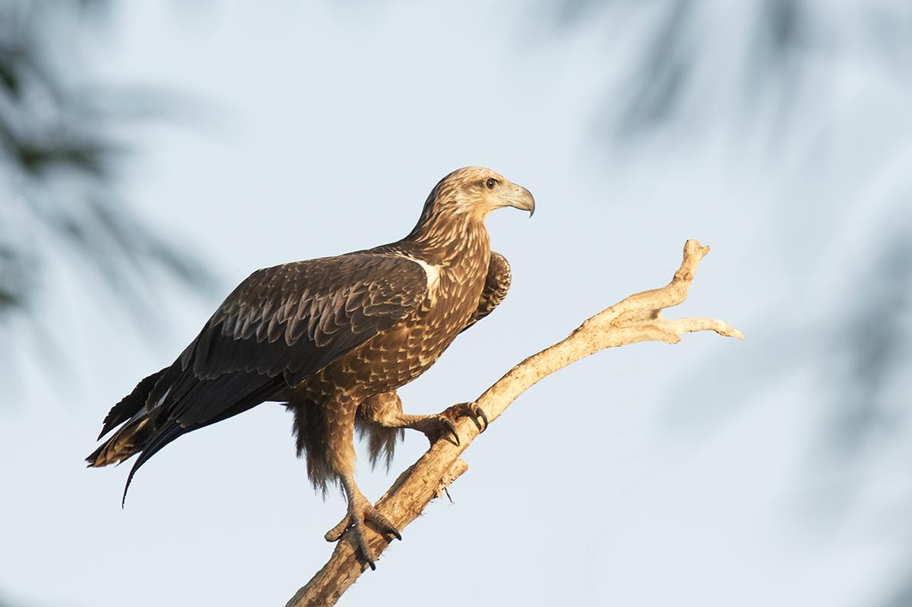





* 体长：70-85 cm
* 体重：







#### 玉带海雕 _Haliaeetus leucoryphus_



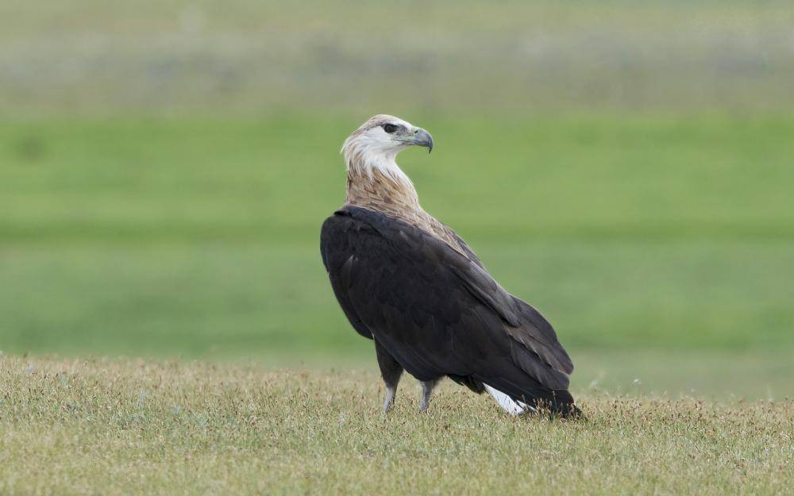



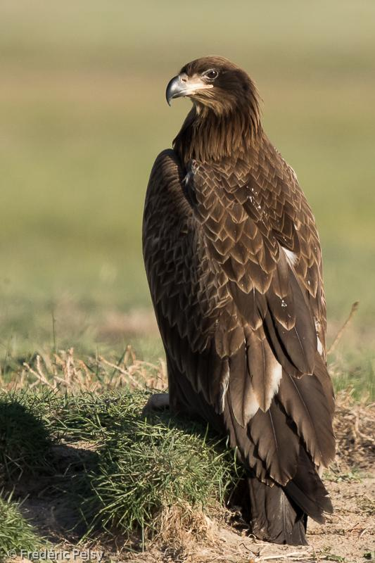



我们不知道哈兰那的玉带海雕从何而来。有传言说，他们其实是很久以前伊苏尔的遗民。

伊苏尔的玉带海雕WIP

年龄和计算公式。



* 体长：72-84 cm
* 体重：♂ 2000-3300 g，♀ 2100-3700 g

大而纤细的海雕，喙相对其他海雕略短，颈部有披针形羽。常挺直站立。头颈米黄色，背面略沾黄棕色，向腹面逐渐过渡为深色。背中褐色，向翼侧逐渐变深；腹面棕色，向后逐渐变深。翼、尾黑褐色，尾近基部贯穿一条宽阔白色横带。眼褐色至黄灰色。喙铅灰色，远端灰黑色；蜡膜淡灰色，偶沾黄色。足灰白色至淡黄色，爪黑色。  
第一年通体褐色，羽缘黄褐色。翼下大覆羽、腋羽米黄色，形成强烈的浅色对角线，初级飞羽近端有甚大的米黄色窗。尾无横带。眼暗褐色。其余似成鸟。随年龄增长，头颈颜色逐渐变浅（尤其喉部），与暗褐色的颊形成强烈反差，尾羽逐渐出现带杂色的白色横带。5-6年彻底换为成羽。

#### 飞行

飞行时可见雕典型的“门板”翼，但相对略窄。飞行轻盈灵活；翱翔时双翼平举。尾扇形略长。

#### 叫声

嘶哑尖锐的kyow-kyow-kyow或kok kok kok；似鸡的有节奏咯咯声。



* 生境：位于干旱地区或温带草原的淡水生境，如大小湖泊、河流、各类湿地，很少见于海岸。一般生活于低地，迁徙时可穿越6000米的高山。
* 食物：以大型鱼类和水鸟为主，亦有旱獭等兽类、两栖爬行类，以及腐肉。
* 天敌：不详。

在水面附近攫取鱼类，不钻入水中。冲入水鸟群中将其驱散，选择其中一只，反复俯冲逼迫其潜入水中，或将其踩入水下，使其力竭或窒息。狩猎成功后携带猎物飞走，常能携带比自身更重的猎物。常盗寄生其他掠食性鸟类，如鹗、白尾鹞、鸥类等，追逐、抢夺其猎物，甚至盗寄生鳄鱼。



* 求偶：极为吵闹。其余不详。
* 繁殖周期：1年1次
* 巢：一般在15-35  m的树上营巢，偶尔利用石缝、芦苇丛，离水较近。用树枝构筑巨型鸟巢，内衬绿色植物。反复利用旧巢。
* 窝卵数：2-3
* 孵化期：约40天
* 丰羽期：70-105天

留鸟、候鸟均有，冬季水域冻结时则向南迁徙，无游荡性。幼鸟离巢后扩散。



#### 灰脸鵟鹰 _Butastur indicus_



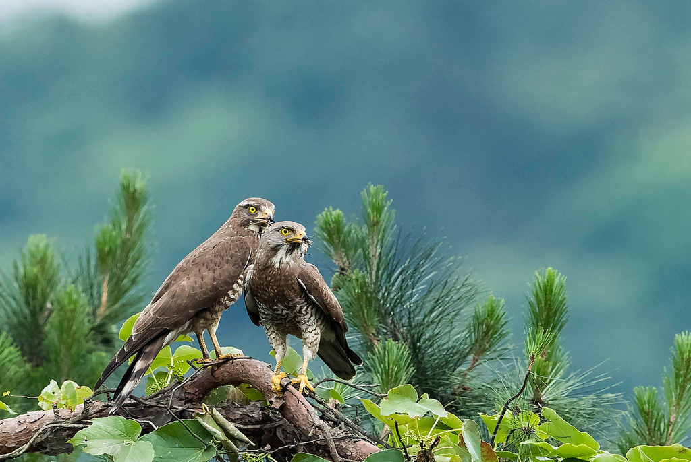



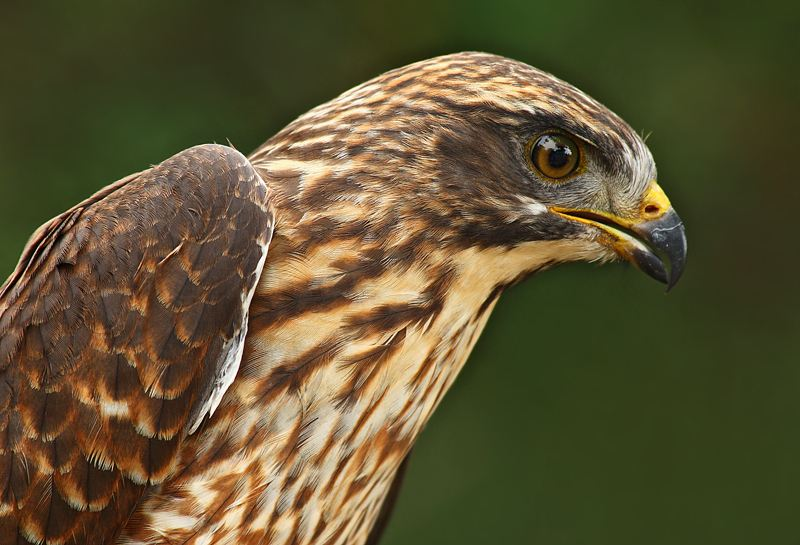





* 体长：39-48 cm
* 体重：♂375-433 g






