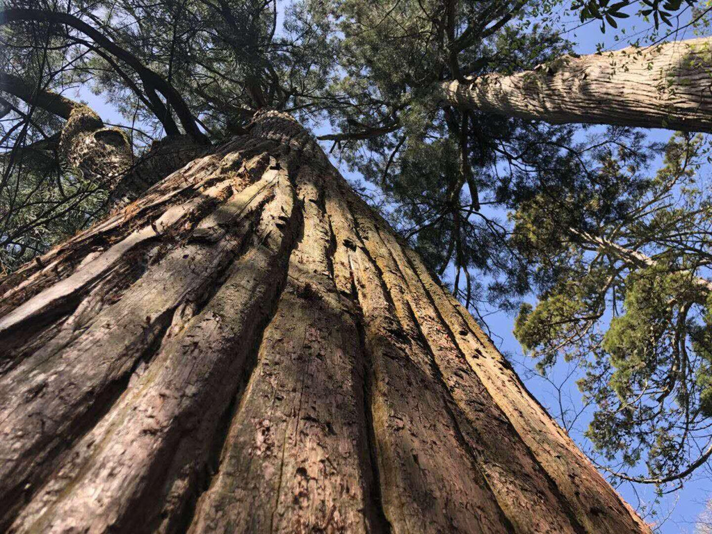
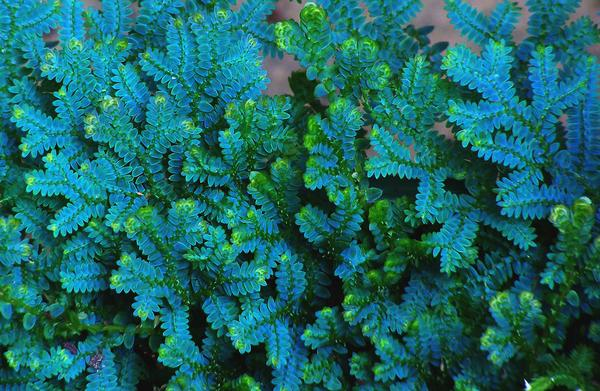

# 阿克那

阿克那得名于南北两座阿克那湖。山地平缓，绿树成荫。在南部的卡利戈河沿岸，坐落着几座大城市。阿克那的居民主要从事狩猎、养殖业、制造业，与周围各行省的居民都有所往来，生活富裕。

## 气候与地理

季风控制下的亚热带落叶林。夏季湿热，均温约25-27℃，冬季均温约5℃；海拔较高的山地气温普遍更低一些。

阿克那境内遍布连绵起伏的平缓山峦和丘陵，约占全境的80%，海拔基本在1500米以下，仅有几座山峰约2000米。山间溪流纵横，形成大大小小的激流和瀑布，溪水清澈见底，当地居民修建的大小水库点缀其间。较大的河流在上游勾画出山谷，到了下游则被平原环抱。

## 植被

阿克那遍布茂密、层次丰富的森林，主要为针阔混交林，海拔较高的地区则分布着针叶林。森林树种繁多，使得森林冠层呈现出深浅不一的绿色。柳杉 _Cryptomeria japonica_、杉木 _Cunninghamia lanceolata_、臭椿 _Ailanthus altissima_ 是这里的优势树种。山中有不少胸径超过两米的巨型柳杉，当地居民视其为守护神。银杏 _Ginkgo biloba_ 和杜仲 _Eucommia ulmoides_ 是不少草药的重要来源。树干上常常盖满了地衣和苔藓，还附着着瓦韦 _Lepisorus thunbergianus_、薜荔 _Ficus pumila_ 等附生植物。

林下生长着茂密的中低层植被，如两型豆 Amphicarpaea edgeworthii、鸭儿芹 _Cryptotaenia japonica_、野桐 _Mallotus tenuifolius_等等。蕺菜 _Houttuynia cordata_ 散发出浓烈的鱼腥味，九头狮子草 _Peristrophe japonica_ 吐出紫色的花朵，南赤瓟 _Thladiantha nudiflora_ 结出有趣的红色圆瓜。秋海棠 _Begonia grandis_ 粉嫩可爱，反瓣虾脊兰 _Calanthe reflexa_ 与大花无柱兰 _Amitostigma pinguicula_ 姿态妖娆。山莓 _Rubus corchorifolius_、蓬蘽 _Rubus hirsutus_、鹰爪枫 _Holboellia coriacea_ 的果实可以食用，虽然说不上有多么美味。大蝎子草 _Girardinia diversifolia_ 浑身披着毒刺，被它蜇到要疼好几天。最惹人注目的是林荫里的翠云草 _Selaginella uncinata_，泛着不真实的金属蓝色，仿佛是异世界的造物。

不过，阿克那最著名的植被类型，一定是一望无际的竹海。原生的毛竹 _Phyllostachys edulis_ 被当地居民广泛栽种，已经成为了当地居民生活中不可或缺的一部分：可以搭建建筑、可以制作工具，还能用作竹鼠、竹象的饲料。

在树林和竹林间，零星地分布着裸露的断崖和开阔的草地，生长着香薷 _Elsholtzia ciliata_ 和野胡萝卜 _Daucus carota_.

## 地标

### 南北阿克那湖

坐落于阿克那南部的南北两座湖泊，为阿克那的居民们提供了丰富的鱼类。湖泊面积不算大，但吸引了大量越冬水鸟，尤其是色彩斑斓的雁鸭类。

### 埃利斯

阿克那的首府，也是最大最繁华的城市。

### 卡利戈河

阿克那南部的河流，流向自西向东。

## 居民

### 可扮演鸟类



* 凤头鹰 _Accipiter trivirgatus_
* 赤腹鹰 _Accipiter soloensis_
* 仓鸮 _Tyto alba_
* 斑头鸺鹠 _Glaucidium cuculoides_
* 东方角鸮 _Otus sunia_
* 领角鸮 _Otus lettia_
* 长耳鸮 _Asio otus_
* 红嘴蓝鹊 _Urocissa erythroryncha_



* 鹗 _Pandion haliaetus_
* 黑冠鹃隼 _Aviceda leuphotes_
* 蛇雕 _Spilornis cheela_
* 游隼 _Falco peregrinus_
* 喜鹊 _Pica pica_
* 白颈鸦 _Corvus torquatus_
* 大嘴乌鸦 _Corvus macrorhynchos_



* 雕鸮 _Bubo bubo_
* 黄脚渔鸮 _Ketupa flavipes_
* 灰林鸮 _Strix nivicolum_
* 白腿小隼 _Microhierax melanoleucos_



### 其他动物



**鸳鸯** _**Aix galericulata**_  
冬候鸟。极为醒目的鸭类，雄鸟的色彩和形态极为夸张华丽，雌鸟则大体为褐灰色。善于攀援树木，或是在林间飞行穿梭。分布于阿克那湖。

**鳞胁秋沙鸭** _**Mergus squamatus**_  
冬候鸟。大型潜水鸭类，喙如鸬鹚，边缘有齿状结构。两胁有黑白鳞状斑纹。分布于阿克那湖。

**灰喉山椒鸟** _**Pericrocotus solaris**_  
留鸟。色彩艳丽的林鸟，雄鸟橘红与灰黑色驳杂，雌鸟则是柠檬黄与灰黑色。一般成群活动。海拔较高的山区偶见。

**黑短脚鹎** _**Hypsipetes leucocephalus**_  
留鸟。极为常见的林鸟。阿克那的黑短脚鹎头颈白色，其余通体黑色，喙、脚橘色。山区森林随处可见松散的小群。

**短尾鸦雀** _**Neosuthora davidiana**_  
留鸟。体型极小，体态浑圆。成群活动。

**画眉** _**Garrulax canorus**_  
留鸟。眼周有一圈醒目的白色，并向眼尾延长，因此得名。鸣声极为嘹亮，华丽多变。常在隐蔽的林下灌丛或草丛中活动。

**靛冠噪鹛** _**Pterorhinus courtoisi**_  
留鸟。分布于卡利戈河上游。

**红尾水鸲** _**Phoenicurus fuliginosus**_  
留鸟。溪流附近极为常见。雄鸟通体蓝黑色，尾部赭红色；雌鸟斑驳蓝灰色，尾黑白色。在水边或水中的岩石上奔走，并不断上下抖尾。

**山麻雀** _**Passer rutilans**_  
留鸟。山区开阔地常见。



**刺猬（**_**Erinaceus amurensis**_**）**  
常见的小兽。昼伏夜出。

**穿山甲（**_**Manis pentadactyla**_**）**

**小麂** _**Muntiacus reevesi**_

**鬣羚（**_**Capricornis milneedwardsii**_**）**  
长着马鬃般长鬣的奇特有蹄类。

**黑腹绒鼠** _**Eothenomys melanogaster**_

**北社鼠** _**Niviventer confucianus**_  
腹部白色的树栖鼠。极为常见。

**针毛鼠** _**Niviventer fulvescens**_

**野兔（**_**Lepus sinensis**_**）**  
十分常见。当地居民的主食之一。



**大树蛙** _**Zhangixalus dennysi**_  
常见蛙类。通体碧绿色。

**阿克那臭蛙（**_**Odorrana tianmuii**_**）**  
常见蛙类。绿色的皮肤上披着褐色的花斑。

**北草蜥** _**Takydromus septentrionalis**_

**烙铁头（**_**Ovophis makazayazaya**_**）**

**竹叶青（**_**Trimeresurus stejnegeri**_**）**  
常见毒蛇。

**广斧螳** _**Hierodula patellifera**_  
常见的浅绿色大型螳螂。

**斑透翅蝉** _**Hyalessa maculaticollis**_  
夏季发出独特的“呜英呜英呜英哇——”的鸣声。

**幸运深山锹甲** _**Lucanida fortunei**_  
常见甲虫，雄性有一对大钳状的上颚。昆虫收藏家寻觅的对象之一。

**双叉犀金龟** _**Trypoxylus dichotomus**_  
“独角仙”，雄性的头顶伸出一只分为两叉的独角。昆虫收藏家寻觅的对象之一。

**南虎凤蝶（**_**Luehdorfia chinensis**_**）**  
罕见的蝴蝶，通体黑黄相间。只有每年初春才能见到。

**箭环蝶** _**Stichophthalma howqua**_  
非常巨大的蝴蝶。在竹林间活动，飞行灵巧迅速。

**二尾蛱蝶** _**Polyura narcaea**_  
极为常见的中型蝴蝶。

**绿弄蝶** _**Choaspes benjaminii**_  
绿色的小型蝴蝶。

**南樗蚕（**_**Samia wangi**_**）**   
大型飞蛾。

**长尾天蚕蛾** _**Actias dubernardi**_  
有着极长尾突的飞蛾。



