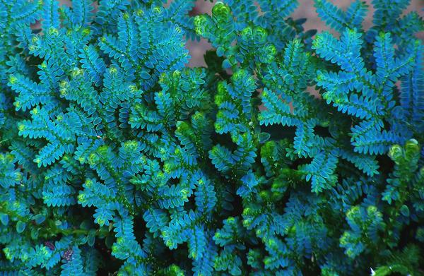

# 阿克那

文字文字

## 气候

季风控制下的亚热带落叶林、亚高山气候。夏季多雨，平均高温25℃；冬季平均低温-3℃。WIP

## 地形

1500 m以下的亚高山、丘陵。地形复杂，多溪流。

## 植被

以混交林为主，林下带茂密。山崖、草地。

柳杉、臭椿。瓦韦，翠云草。

## 居民

### 可扮演鸟类



* 凤头鹰 _Accipiter trivirgatus_
* 赤腹鹰 _Accipiter soloensis_
* 领角鸮 _Otus lettia_
* 斑头鸺鹠 _Glaucidium cuculoides_
* 红嘴蓝鹊 _Urocissa erythroryncha_



* 黑冠鹃隼 _Aviceda leuphotes_
* 蛇雕 _Spilornis cheela_
* 林雕 _Ictinaetus malaiensis_



* 白腿小隼 _Microhierax melanoleucos_
* 黄脚渔鸮 _Ketupa flavipes_



### 其他动物















\*\*\*\*



