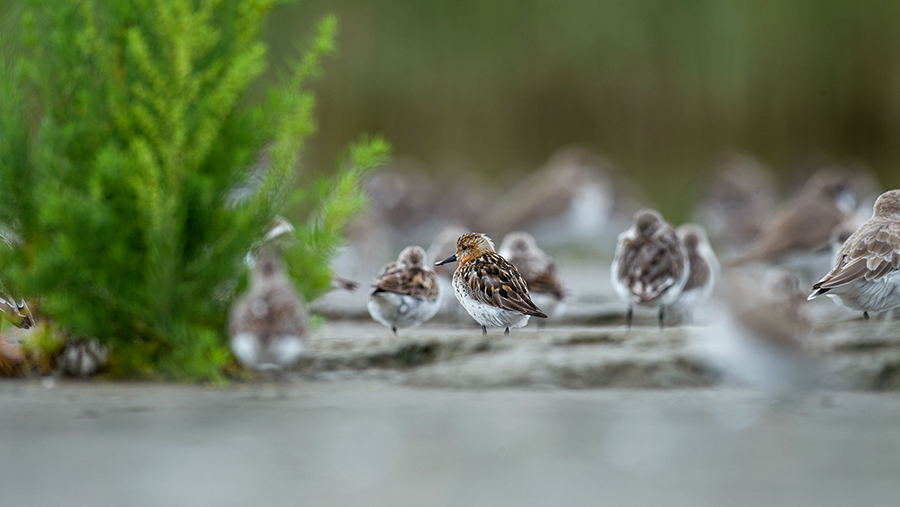

# 安纳荷拉

## 气候与地理  

受季风控制的亚热带湿润气候。夏季多雨，冬季寒冷。降雪不常见。

‌安纳荷拉大部分区域为平原，零星散布着几座低矮的丘陵，向南方、西方边界逐渐过渡为山地。西方的高山发源的无数河流流经安纳荷拉，创造着大大小小的湖泊、沼泽。东方的海岸线均为泥质，形成了广袤的沼泽和盐滩。

## 植被 

安纳荷拉的森林主要由枫香 _Liquidambar formosana_、朴 _Celtis sinensis_、樟 _Cinnamomum camphora_构成。

滩涂潮间带生长着海三棱藨草 _Scirpus_ × _mariqueter_，向陆地逐渐过渡为芦苇 _Phragmites australis_

## 居民 

### 可扮演鸟类 



* 鹗 Pandion haliaetus
* 黑翅鸢 Elanus caeruleus
* 白背兀鹫 Gyps bengalensis
* 凤头鹰 Accipiter trivirgatus
* 赤腹鹰 Accipiter soloensis
* 赤鸢 Milvus milvus
* 仓鸮 Tyto alba
* 东方草鸮 Tyto longimembris
* 领角鸮 Otus lettia
* 东方角鸮 Otus sunia
* 斑头鸺鹠 Glaucidium cuculoides
* 短耳鸮 Asio flammeus
* 长耳鸮 Asio otus
* 红隼 Falco tinnunculus
* 红嘴蓝鹊 Urocissa erythroryncha
* 喜鹊 Pica pica
* 小嘴乌鸦 Corvus corone
* 白颈鸦 Corvus torquatus
* 大嘴乌鸦 Corvus macrorhynchos



* 纵纹腹小鸮 Athene noctua
* 游隼 Falco peregrinus
* 渡鸦 Corvus corax



* 雕鸮 Bubo bubo



### 其他动物 















