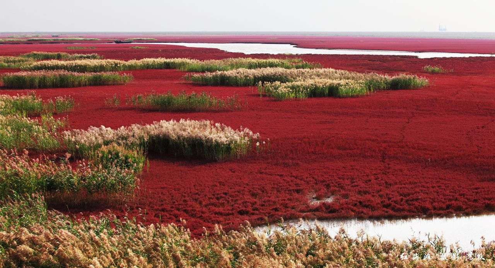

# 伊苏里亚

文字文字‌

## 气候与地理 

受季风控制的亚热带大陆气候。

‌辽阔的伊苏里亚以西方的【】山脉和南方的【】山脉为界，几乎完全为平原。

## 植被 

盐地碱蓬、橿子栎、椴树、红桦、鹅耳枥

## 居民 

### 可扮演鸟类 



* 鹗 Pandion haliaetus
* 黑翅鸢 Elanus caeruleus
* 白背兀鹫 Gyps bengalensis
* 苍鹰 Accipiter gentilis
* 雀鹰 Accipiter nisus
* 白尾鹞 Circus cyaneus
* 赤鸢 Milvus milvus
* 白尾海雕 Haliaeetus albicilla
* 灰脸鵟鹰 Butastur indicus
* 仓鸮 Tyto alba
* 东方草鸮 Tyto longimembris
* 领角鸮 Otus lettia
* 东方角鸮 Otus sunia
* 雕鸮 Bubo bubo
* 灰林鸮 Strix nivicolum
* 花头鸺鹠 Glaucidium passerinum
* 纵纹腹小鸮 Athene noctua
* 短耳鸮 Asio flammeus
* 长耳鸮 Asio otus
* 红隼 Falco tinnunculus
* 燕隼 Falco subbuteo
* 游隼 Falco peregrinus
* 红嘴蓝鹊 Urocissa erythroryncha
* 喜鹊 Pica pica
* 寒鸦 Coloeus monedula
* 小嘴乌鸦 Corvus corone
* 大嘴乌鸦 Corvus macrorhynchos
* 渡鸦 Corvus corax











### 其他动物

