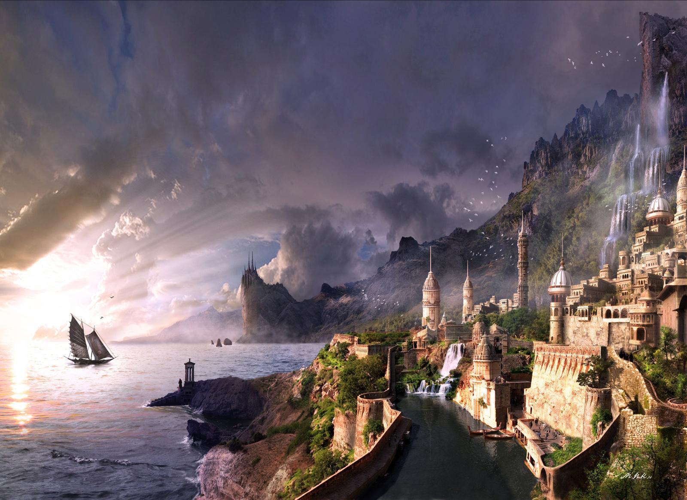

# 勒瓦

勒瓦，哈兰那帝国最繁华的行省。哈兰那的首府就坐落于此。这里有许多大大小小的城市，也有成片的乡村牧场，居民从事各行各业。不少勒瓦的居民是来自其他行省的移民，特地来大城市谋求更好的生活。

## 气候与地理 

‌勒瓦四季分明，夏季炎热潮湿，均温25-28℃，冬季多雨而寒冷，均温3-6℃。

勒瓦境内主要以平缓的山地丘陵为主，在东南部形成盆地。哈兰那帝国的首都哈兰那塔即坐落于盆地之中。

## 植被 

以樟 _Cinnamomum camphora_、枫香 _Liquidambar formosana_、朴 _Celtis sinensis_构成的林地为主。

## 地标

### 勒瓦盆地

勒瓦东南部的盆地。

### 哈兰那塔

哈兰那帝国的首都，坐落于勒瓦盆地中央，依山傍水。哈兰那塔也是整个哈兰那帝国最繁华的城市。

## 居民 

### 可扮演鸟类 



* 鹗 _Pandion haliaetus_
* 黑翅鸢 _Elanus caeruleus_
* 凤头鹰 _Accipiter trivirgatus_ 
* 赤腹鹰 _Accipiter soloensis_ 
* 赤鸢 _Milvus milvus_ 
* 仓鸮 _Tyto alba_
* 东方草鸮 _Tyto longimembris_
* 斑头鸺鹠 _Glaucidium cuculoides_
* 东方角鸮 _Otus sunia_
* 领角鸮 _Otus lettia_ 
* 长耳鸮 _Asio otus_ 
* 短耳鸮 _Asio flammeus_ 
* 红隼 _Falco tinnunculus_ 
* 食蝠隼 _Falco rufigularis_ 
* 游隼 _Falco peregrinus_ 
* 红嘴蓝鹊 _Urocissa erythroryncha_ 
* 喜鹊 _Pica pica_
* 小嘴乌鸦 _Corvus corone_
* 白颈鸦 _Corvus torquatus_
* 大嘴乌鸦 _Corvus macrorhynchos_ 



* 黑冠鹃隼 _Aviceda leuphotes_ 
* 蛇雕 _Spilornis cheela_ 
* 林雕 _Ictinaetus malaiensis_
* 白腹海雕 _Haliaeetus leucogaster_
* 乌草鸮 _Tyto tenebri_cosa
* 雕鸮 _Bubo bubo_
* 灰林鸮 _Strix nivicolum_
* 渡鸦 _Corvus corax_



* 丽鹰雕 _Spizaetus ornatus_
* 玉带海雕 _Haliaeetus leucoryphus_
* 黄脚渔鸮 _Ketupa flavipes_
* 白腿小隼 _Microhierax melanoleucos_



### 其他动物 















