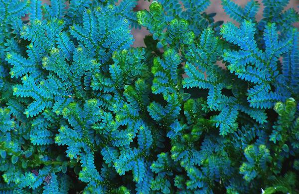

# 阿克那（模板）

WIP

## 气候与地理

季风控制下的亚热带落叶林、亚高山气候。夏季湿热，均温约27-30℃，山上则凉爽许多；冬季均温约5℃。在夏季，阿克那偶尔会受到沿海台风的影响，但相对海边受影响较小。

阿克那境内遍布连绵起伏的平缓山峦和丘陵，约占全境的80%，海拔基本在1500米以下，仅有几座山峰约2000米。山间溪流纵横，形成大大小小的激流和瀑布，溪水清澈见底，当地居民修建的大小水库点缀其间。较大的河流在上游勾画出山谷，到了下游则被平原环抱。

## 植被

阿克那遍布茂密的森林，主要为针阔混交林，海拔较高的地区则分布着针叶林。森林树种繁多，使得森林冠层呈现出深浅不一的绿色。柳杉 _Cryptomeria japonica_、杉木 _Cunninghamia lanceolata_、臭椿 _Ailanthus altissima_是这里的优势树种。山中有不少胸径超过两米的巨型柳杉，当地居民视其为守护神。银杏 _Ginkgo biloba_和杜仲 _Eucommia ulmoides_是不少草药的重要来源。大树的树干上常常盖满了地衣和苔藓，还附着着瓦韦 _Lepisorus thunbergianus_、薜荔 _Ficus pumila_等附生植物。

林下生长着茂密的中低层植被，如两型豆 Amphicarpaea edgeworthii、鸭儿芹 _Cryptotaenia japonica_、野桐 _Mallotus tenuifolius_等等。蕺菜 _Houttuynia cordata_散发出浓烈的鱼腥味，九头狮子草 _Peristrophe japonica_吐出紫色的花朵，南赤瓟 _Thladiantha nudiflora_结出有趣的红色圆瓜。秋海棠 _Begonia grandis_粉嫩可爱，反瓣虾脊兰 _Calanthe reflexa_姿态妖娆。山莓 _Rubus corchorifolius_、蓬蘽 _Rubus hirsutus_、鹰爪枫 _Holboellia coriacea_的果实可以食用，虽然说不上有多么美味。大蝎子草 _Girardinia diversifolia_浑身披着毒刺，被它蜇到要疼好几天。最惹人注目的是林荫里的翠云草 _Selaginella uncinata_，泛着不真实的金属蓝色，仿佛是异世界的造物。

不过，说到阿克那最著名的植被类型，一定是一望无际的竹海。原生的毛竹 _Phyllostachys edulis_被当地居民广泛栽种，已经成为了当地居民生活中不可或缺的一部分：可以搭建建筑、可以制作工具，还能用作竹鼠、竹象的饲料。

在树林和竹林间，零星地分布着裸露的断崖和开阔的草地，生长着香薷 _Elsholtzia ciliata_和野胡萝卜 _Daucus carota_.

## 居民

### 可扮演鸟类



* 黑冠鹃隼 _Aviceda leuphotes_
* 凤头鹰 _Accipiter trivirgatus_
* 赤腹鹰 _Accipiter soloensis_
* 领角鸮 _Otus lettia_
* 斑头鸺鹠 _Glaucidium cuculoides_
* 长耳鸮 _Asio otus_
* 红隼 _Falco tinnunculus_
* 红嘴蓝鹊 _Urocissa erythroryncha_



* 黑翅鸢 _Elanus caeruleus_
* 蛇雕 _Spilornis cheela_
* 林雕 _Ictinaetus malaiensis_
* 仓鸮 _Tyto alba_
* 短耳鸮 _Asio flammeus_
* 喜鹊 _Pica pica_



* 雕鸮 _Bubo bubo_
* 黄脚渔鸮 _Ketupa flavipes_
* 白腿小隼 _Microhierax melanoleucos_



### 其他动物



鳞胁秋沙鸭 Mergus squamatus

三宝鸟 Eurystomus orientalis

斑鱼狗 Ceryle rudis

灰喉山椒鸟 Pericrocotus solaris

虎纹伯劳 Lanius tigrinus

黑短脚鹎 Hypsipetes leucocephalus

烟腹毛脚燕 Delichon dasypus

棕脸鹟莺 Abroscopus albogularis

靛冠噪鹛 Pterorhinus courtoisi

棕噪鹛 Pterorhinus berthemyi

短尾鸦雀 Neosuthora davidiana

丝光椋鸟 Spodiopsar sericeus

白额燕尾 Enicurus leschenaulti

红尾水鸲 Rhyacornis fuliginosa

山麻雀 Passer rutilans











\*\*\*\*



