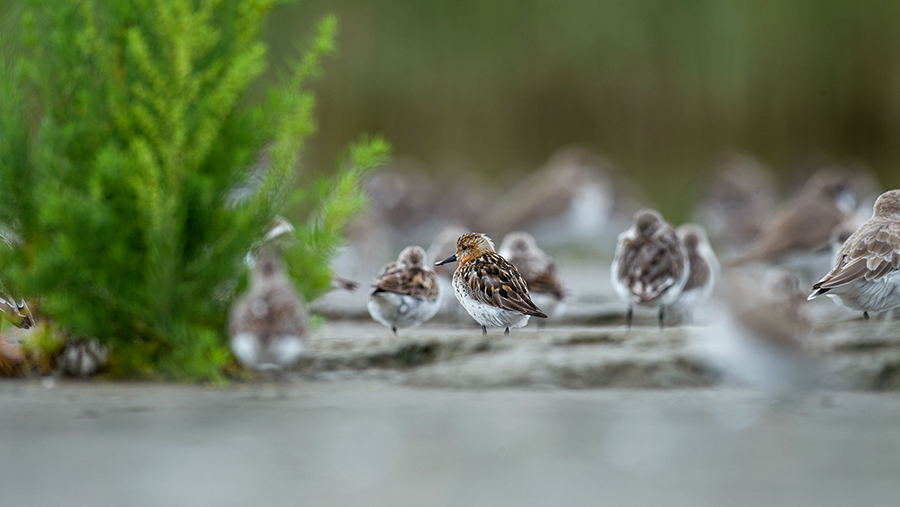

# 安纳荷拉

海岸线绵延不绝， 远处是无边无际的灰色海面，海水向陆地侵袭，阵地就形成了泥质滩涂。 流水粗浅地分割开一丛丛茂密高耸的水生植物，像河流一样，在滩涂中蜿蜒、分散开来，遍布整个地界，好似滩涂的血管，为各个位置送去微咸的水。各类水鸟悠游于水路与水生植物之间，偶然还会成群上天巡游一番，景象蔚为壮观。

## 气候与地理  

受季风控制的亚热带湿润气候。夏季多雨，冬季寒冷。降雪不常见。

‌安纳荷拉大部分区域为平原，零星散布着几座低矮的丘陵，向南方、西方边界逐渐过渡为山地。西方的高山发源的无数河流流经安纳荷拉，创造着大大小小的湖泊、沼泽。东方的海岸线均为泥质，形成了广袤的沼泽和盐滩。

## 植被 

滩涂潮间带主要生长着海三棱藨草 _Scirpus_ × _mariqueter_，向陆地逐渐过渡为芦苇 _Phragmites australis_

森林：枫香 _Liquidambar formosana_、朴 _Celtis sinensis_、樟 _Cinnamomum camphora_

## 居民 

### 可扮演鸟类 

### 其他动物 

