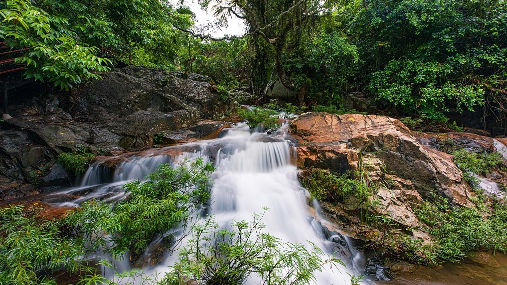

# 弗洛西亚

伸入大海的弗洛西亚半岛气候炎热潮湿，

## 气候与地理 

热带季风

‌山地、高原。岩岸、沙岸、红树林。

## 植被 

母生

## 居民 

### 可扮演鸟类 



* 鹗
* 黑翅鸢
* 蛇雕
* 凤头鹰
* 赤腹鹰
* 赤鸢
* 仓鸮
* 东方草鸮
* 领角鸮
* 黄脚渔鸮
* 斑头鸺鹠
* 红隼
* 食蝠隼
* 白颈鸦



* 白腹海雕
* 乌草鸮
* 游隼



* 林雕
* 丽鹰雕
* 玉带海雕



